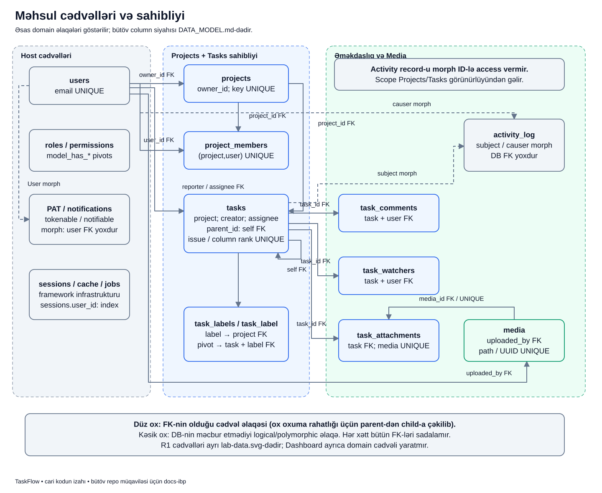
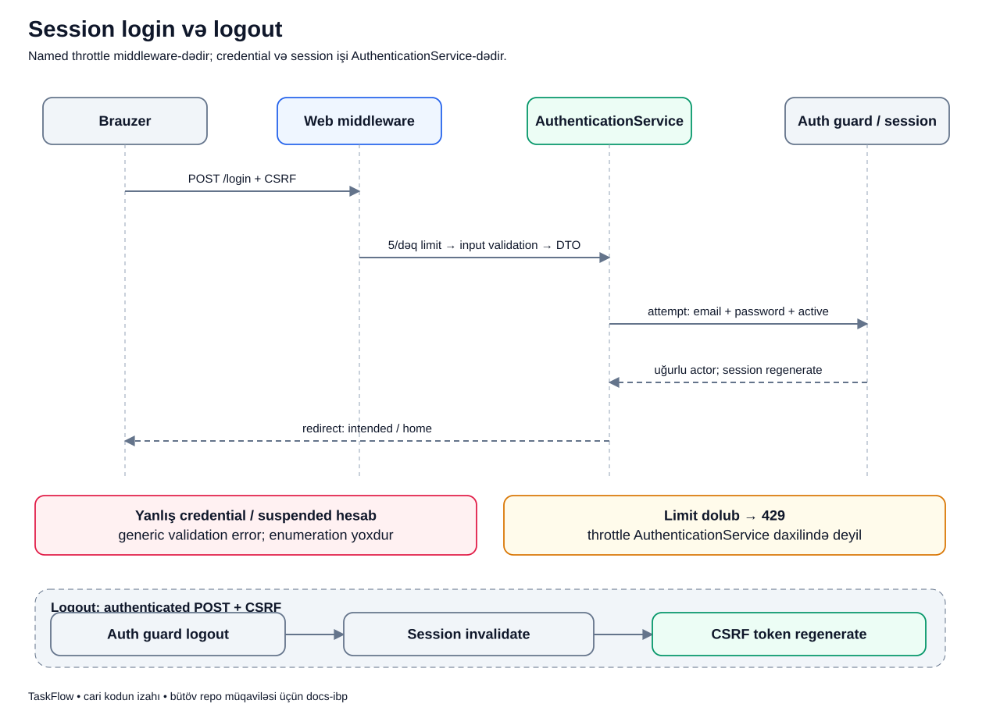
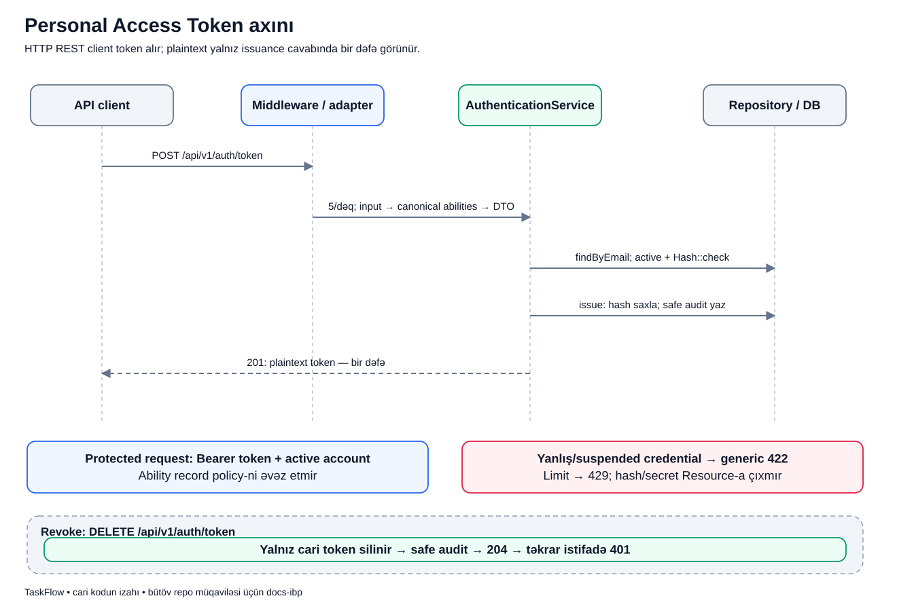
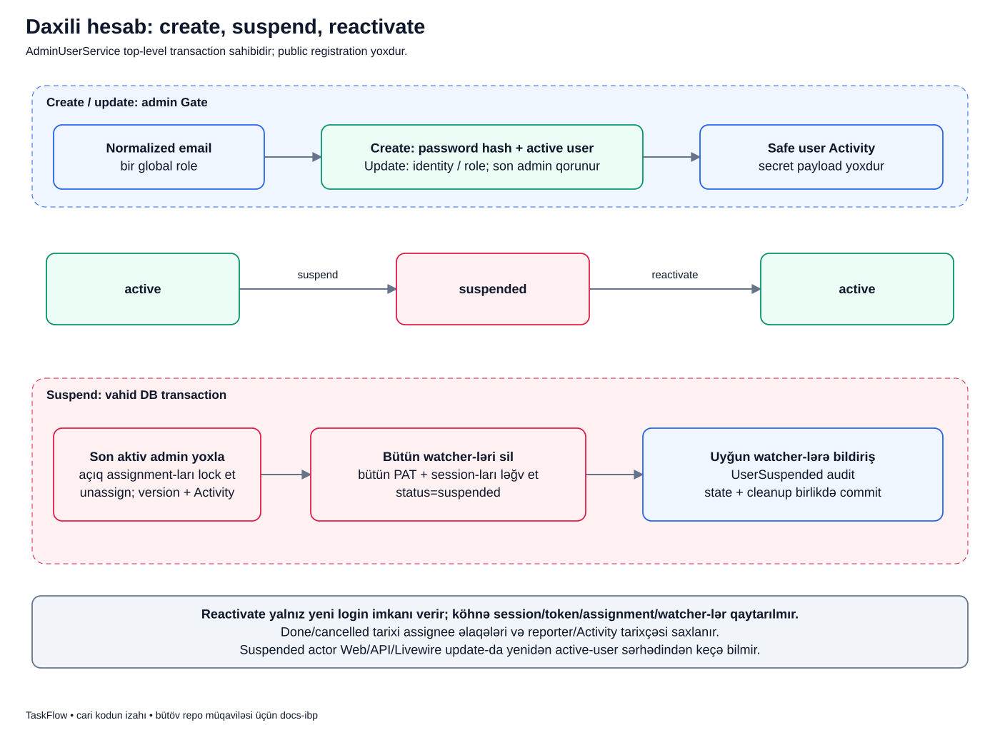

# TaskFlow-u şəkil və nümunələrlə öyrən

Bu qovluq TaskFlow-da işlərin necə getdiyini öyrənmək üçündür.
Diagram — sistemin və ya əməliyyatın şəkilli xəritəsidir.
Hər şəklin ayrıca Markdown izahı var: əvvəl məqsədi və yeni sözləri öyrənirsən, sonra bir ssenarini addım-addım izləyirsən.

İzah səhifələrində real koddan kiçik parçalar, həmin sətirlərin mənası, DB-də və ekranda nəticə, xəta halları və özünü yoxlama sualları var.
Ssenarilərdəki insan adları və nümunə məlumatlar izah üçündür; real istifadəçi məlumatı deyil.

## Haradan başlayım?

1. İlk dəfə oxuyursansa [sistem xəritəsi](system/context.md) ilə başla: tətbiqin əsas hissələri kimlərdir?
2. Sonra [asılılıqlar](system/dependencies.md), [request yolu](system/request-layers.md) və [məlumat əlaqələri](system/production-data.md) səhifələrini oxu.
3. İstifadəçi kimi bir işi izləmək üçün aşağıdakı indeksdən mövzu seç. Məsələn [task yaratmaq](flows/task-create.md), [status dəyişmək](flows/status.md) və ya [fayl əlavə etmək](flows/media-upload.md).
4. Əvvəl sadə izahı oxu, sonra şəkilə qayıt və hər oxun nə etdiyini öz sözlərinlə de. Axırdakı suallarla özünü yoxla.
5. Kod və test linklərinə daha sonra keç. Test faylına link verilməsi həmin testin bu sənəd işi zamanı yenidən işlədildiyi demək deyil.

R1 laboratoriyasını əsas məhsuldan ayrı öyrən.
[Public API](labs/public-feed.md) və [event](labs/publish.md) orada praktikadır; bütün məhsul modulları həmin üsulla yenidən qurulmayıb.
Qəbul edilmiş qaydalar [biznes](../business/BUSINESS_RULES.md), [arxitektura](../technical/ARCHITECTURE.md) və [məlumat modeli](../technical/DATA_MODEL.md) sənədlərində qalır.
Tarixli test run-ları [RELEASE_BASELINE](../technical/RELEASE_BASELINE.md)-da saxlanır.

## Şəkillərdə işarələr nə deməkdir?

- **Qutu** bir iştirakçını, addımı və ya vəziyyəti göstərir. Qutunun yazısını oxu; rəng təkbaşına qayda deyil.
- **Ox** göstərilən istiqamətdə çağırışı, addım sırasını və ya əlaqəni bildirir. Hansı mənada olduğu hər mövzuda izah olunur.
- **Kəsik xətt** ayrıca izah olunan əlaqə və ya sərhəddir. Öz-özünə “queue işləyir” demək deyil.
- **Mavi və yaşıl** əsas iş addımlarını və uğurlu nəticələri ayırmağa kömək edir.
- **Boz** adətən host, framework və oxuma nəticəsidir. **Bənövşəyi** ayrıca R1 laboratoriyasıdır.
- **Sarı** diqqət tələb edən şərti, **qırmızı** rədd, geri alma və ya failure yolunu göstərir.
- Asılılıq şəklində ox **istifadə edəndən istifadə olunana** gedir. Məlumat şəklində ox **parent-dən child-a** oxunur; ID-ni saxlayan foreign key child cədvəldədir.

Bunlar endpoint siyahısını əvəz etmir; Web/API/Livewire eyni işi görürsə bir axında izah edilə bilər.
Dəqiq HTTP endpoint-ləri [API sənədində](../technical/API.md) qalır.
Queue broker, Outbox, Inbox və microservice gələcək mövzu kimi oxuna bilər, amma bu şəkillərdə tətbiq edilmiş hissə kimi göstərilmir.

## Sadə izahların indeksi

Hər keçid ayrıca öyrədici səhifə açır. Həmin səhifənin içində uyğun SVG də var.

| Qrup | Ayrı-ayrı mövzular |
|---|---|
| Sistemi tanıyaq | [Sistem xəritəsi](system/context.md) · [Modulların əlaqəsi](system/dependencies.md) · [Request-in yolu](system/request-layers.md) · [DB cədvəllərinin əlaqəsi](system/production-data.md) |
| Giriş və access | [Brauzer session-u](flows/session.md) · [API token](flows/pat.md) · [İcazə yoxlamaları](flows/authorization.md) |
| Project və task | [Project və üzvlük](flows/project.md) · [Task yaratmaq](flows/task-create.md) · [Məsul şəxs təyin etmək](flows/assignment.md) · [Status və version](flows/status.md) · [Board sırası](flows/reorder.md) · [Subtask](flows/subtask.md) |
| Birlikdə işləmək | [Watcher, comment və bildiriş](flows/collaboration.md) · [Activity tarixçəsi](flows/activity.md) · [Dashboard](flows/dashboard.md) |
| Fayllar | [Upload və geri təmizləmə](flows/media-upload.md) · [Preview və download](flows/media-stream.md) · [Fayl əlaqəsini silmək](flows/media-delete.md) |
| Hesab və test | [Hesab yaratmaq/dayandırmaq](flows/account-admin.md) · [Parol dəyişmək/reset](flows/password.md) · [Test mühitlərinin ayrılması](flows/test-isolation.md) |
| R1 laboratoriyası | [Modul public API-si](labs/public-feed.md) · [Publish və commit](labs/publish.md) · [Duplicate və idempotency](labs/duplicate.md) · [Rebuild](labs/rebuild.md) · [Lab məlumat əlaqələri](labs/lab-data.md) |

Aşağıda eyni şəkillər qısa texniki qeydlər və kod/test mənbələri ilə saxlanılıb.
İlk oxunuşda yuxarıdakı sadə izahlardan başlamaq daha rahatdır.

## Sistem xəritələri

### Sistem konteksti

[Bu mövzunun sadə, addım-addım izahı](system/context.md)

TaskFlow bir Laravel tətbiqi, bir deploy vahidi və bir database istifadə edir. Beş məhsul modulundan ayrı göstərilən iki Learning modulu R1 laboratoriyasıdır; UI və REST endpoint əlavə etmir. Private binary-ni yalnız Media idarə edir.

Uğurlu məhsul axını Web və ya API adapterindən gəlir. Lab modullarının olması ümumi sistemin event-driven refaktor edilməsi demək deyil.

Kod: [Arxitektura](../technical/ARCHITECTURE.md), [Modul registration](../../modules_statuses.json).

Test: [R1 izolyasiya testi](../../tests/Architecture/R1LearningBoundaryTest.php).

### Məhsul modul asılılıqları

[Bu mövzunun sadə, addım-addım izahı](system/dependencies.md)

Ox istifadə edən tərəfdən istifadə olunan modul tərəfə gedir. İki uclu ox iki istiqamətli asılılığı göstərir. Projects, Tasks və Activity arasındakı dövrlər hazırkı məhsulda açıq şəkildə qəbul edilib; qraf onları gizlətmir.

Bu qraf dependency injection və class/query əlaqəsini göstərir, asynchronous message axınını yox. Media → host əlaqəsi User modelindən istifadəni də əhatə edir.

Kod: [Cari asılılıq müqaviləsi](../technical/ARCHITECTURE.md), [Projects service](../../Modules/Projects/app/Services/ProjectService.php), [Activity repository](../../Modules/Activity/app/Repositories/Eloquent/EloquentActivityRepository.php).

Test: [Production boundary guard](../../tests/Architecture/ControllerBoundaryGuardTest.php).

### Runtime sıra və application qatları

[Bu mövzunun sadə, addım-addım izahı](system/request-layers.md)

Solda qorunan API mutation üçün middleware → binding → input validation → controller authorization sırası göstərilir. Sağda isə qatların məsuliyyəti var: adapter bir application boundary çağırır, service use case-i, repository persistence-i idarə edir.

Logical qat modeli bütün Laravel request-lərinin dəqiq runtime sırası kimi oxunmamalıdır. Web, GET və Livewire girişlərinin detalları fərqlənir; ability isə Web session axınının hissəsi deyil.

Kod: [Middleware priority](../../bootstrap/app.php), [Task API controller](../../Modules/Tasks/app/Http/Controllers/Api/V1/TaskController.php), [Status request](../../Modules/Tasks/app/Http/Requests/ChangeTaskStatusRequest.php).

Test: [Request boundary security](../../tests/Feature/Security/RequestBoundarySecurityTest.php), [Controller guard](../../tests/Architecture/ControllerBoundaryGuardTest.php).

### Məhsul məlumat modeli və table ownership

[Bu mövzunun sadə, addım-addım izahı](system/production-data.md)

Bu, əsas domain cədvəllərinin oxuna bilən əlaqə xəritəsidir; bütün column və infrastrukturu eyni böyük ERD-yə sıxışdırmır. FK olan əsas əlaqələr düz, DB FK olmayan polymorphic/logical əlaqələr kəsik xətlə ayrılır. Oxlar parent-dən child-a oxuma rahatlığı üçün çəkilib; foreign key child cədvəldədir.

Activity subject/causer və PAT/notification morph əlaqəsi DB FK deyil. sessions.user_id də index-dir, məcburi users FK-si deyil. Production-da cross-module FK qəbul edilir; R1 lab-ın FK-siz qaydası bura şamil olunmur. task_attachments-in köhnə binary column-ları final migration-da çıxarılıb.

Kod: [Tam data müqaviləsi](../technical/DATA_MODEL.md), [Final attachment ownership migration](../../Modules/Tasks/database/migrations/2026_09_07_110000_finalize_task_attachment_media_ownership.php), [Host migrations](../../database/migrations).

Test: [Migration rollback](../../tests/Feature/MigrationRollbackTest.php), [Attachment migration](../../Modules/Tasks/tests/Feature/TaskAttachmentMediaMigrationTest.php).

## Məhsul axınları

### Session login və logout

[Bu mövzunun sadə, addım-addım izahı](flows/session.md)

Login route-u named throttle middleware-dən keçir; Form Request input-u, AuthenticationService isə credential attempt və session-u idarə edir. Uğurda session ID yenilənir. Logout guard logout, session invalidate və CSRF token regenerate edir.

AuthenticationService rate limiter-in sahibi deyil. Yanlış credential və suspended hesab eyni təhlükəsiz validation nəticəsi verir; limit ayrıca 429-dur.

Kod: [Web routes](../../routes/web.php), [AuthenticationService](../../app/Services/AuthenticationService.php), [Named limiter-lər](../../app/Providers/AppServiceProvider.php).

Test: [SessionAuthenticationTest](../../tests/Feature/Auth/SessionAuthenticationTest.php).

### Sanctum PAT issuance və revoke

[Bu mövzunun sadə, addım-addım izahı](flows/pat.md)

Token endpoint-i canonical ability-lər, aktiv hesab və password hash yoxlaması ilə token yaradır. Plaintext yalnız 201 cavabında bir dəfə göstərilir; DB hash saxlayır. Revoke yalnız request-i authenticate edən cari token-i ləğv edir.

Ability record authorization deyil. Yanlış/suspended credential generic 422, limit 429 alır; revoked token ilə qorunan API request-i 401 alır.

Kod: [Auth API routes](../../routes/api.php), [AuthenticationService](../../app/Services/AuthenticationService.php), [PAT repository](../../app/Repositories/Eloquent/EloquentPersonalAccessTokenRepository.php).

Test: [CredentialTokenApiTest](../../tests/Feature/Auth/CredentialTokenApiTest.php), [Auth security audit](../../tests/Feature/Auth/AuthAdminSecurityAuditTest.php).

### Çoxqatlı authorization

[Bu mövzunun sadə, addım-addım izahı](flows/authorization.md)

Account və API ability əvvəl yoxlanır, sonra actor-visible və parent-scoped record resolve edilir. Controller Policy/Gate access qərarı verir; service state invariantlarını direct caller üçün də qoruyur.

403 ability denial record binding-dən əvvəldir. Hidden/missing/wrong-parent record eyni safe 404 verir. Input 422 və generic opaque 500 bu access qərarları ilə qarışdırılmamalıdır.

Kod: [Middleware / exception mapping](../../bootstrap/app.php), [Tasks provider: binding](../../Modules/Tasks/app/Providers/TasksServiceProvider.php), [TaskPolicy](../../Modules/Tasks/app/Policies/TaskPolicy.php).

Test: [AuthorizationMatrixTest](../../Modules/Tasks/tests/Feature/AuthorizationMatrixTest.php), [RequestBoundarySecurityTest](../../tests/Feature/Security/RequestBoundarySecurityTest.php).

### Project lifecycle və üzvlük hazırlığı

[Bu mövzunun sadə, addım-addım izahı](flows/project.md)

Create project-i draft yaradır və owner-i manager membership ilə eyni transaction-da qeyd edir. Draft-da project detail və membership hazırlana bilər; task, label, watcher, comment və media məhsul mutasiyaları active tələb edir.

Completed-də detail/member mutasiyası dayanır, amma explicit lifecycle ilə active və ya archived keçidi mümkündür. Archived terminaldır. Açıq assignment-lı member removal 409 verir; owner silinmir və demote edilmir.

Kod: [ProjectService](../../Modules/Projects/app/Services/ProjectService.php), [ProjectMemberService](../../Modules/Projects/app/Services/ProjectMemberService.php), [ProjectStatus](../../Modules/Projects/app/Enums/ProjectStatus.php).

Test: [ProjectLifecycleAndKeyTest](../../Modules/Projects/tests/Feature/ProjectLifecycleAndKeyTest.php), [ProjectMemberIntegrityTest](../../Modules/Projects/tests/Feature/ProjectMemberIntegrityTest.php).

### Task yaratma, issue sequence və auto-watch

[Bu mövzunun sadə, addım-addım izahı](flows/task-create.md)

TaskService active project/actor, membership, assignee və parent-i yoxlayır. Project row lock altında local issue sequence ayrılır; server backlog, version 1 və column-end rank yazır. Eyni transaction labels, auto-watch, Activity və uyğun assignment notification-u əhatə edir.

Client ilkin status/rank/reporter/issue sequence seçmir. Hər hansı domain/write failure transaction-u rollback edir. QuickTaskCreate ayrıca zəif create yolu yaratmır.

Kod: [TaskService](../../Modules/Tasks/app/Services/TaskService.php), [Issue allocation](../../Modules/Projects/app/Services/ProjectService.php), [QuickTaskCreateService](../../Modules/Tasks/app/Services/QuickTaskCreateService.php).

Test: [ProjectLocalIssueAllocationTest](../../Modules/Tasks/tests/Feature/ProjectLocalIssueAllocationTest.php), [QuickTaskCreateLivewireTest](../../Modules/Dashboard/tests/Feature/QuickTaskCreateLivewireTest.php).

### Assignment və watcher side-effect-i

[Bu mövzunun sadə, addım-addım izahı](flows/assignment.md)

Task bir assignee və ya null saxlayır. Manager başqasına assign/unassign edə bilər; adi üzv yalnız özünə assign edir. Yeni assignee active project member olmalıdır. Dəyişiklik version-u artırır, yeni assignee-ni watcher edir, Activity və bildiriş yaradır.

Eyni assignee no-op-dur. Unassign əvvəlki watcher subscription-unu avtomatik silmir. Assignment visibility vermir; status/rank endpoint-lərinin expected_version input müqaviləsi assignment-a köçürülməməlidir.

Kod: [TaskAssignmentService](../../Modules/Tasks/app/Services/TaskAssignmentService.php), [TaskPolicy.assign](../../Modules/Tasks/app/Policies/TaskPolicy.php).

Test: [TaskAssignmentRulesTest](../../Modules/Tasks/tests/Feature/TaskAssignmentRulesTest.php).

### Workflow, timestamps və concurrency

[Bu mövzunun sadə, addım-addım izahı](flows/status.md)

Yuxarı hissə exact icazəli status keçidlərini, aşağı hissə service transaction-unu göstərir. Project/task lock-dan sonra expected_version və child/transition qaydaları yoxlanır; version artır, task target column sonuna keçir, audit və notification yazılır.

Stale version və qadağan transition 409-dur. Assignee done/cancelled-dən reopen edə bilmir; manager edə bilir. Açıq subtask parent-in done olmasını bloklayır. started_at tarixi saxlanır, completed_at reopen-da təmizlənir.

Kod: [TaskStatusService](../../Modules/Tasks/app/Services/TaskStatusService.php), [TaskStatus keçidləri](../../Modules/Tasks/app/Enums/TaskStatus.php), [TaskTransitionRules](../../Modules/Tasks/app/Support/TaskTransitionRules.php), [TaskStatusTimestamps](../../Modules/Tasks/app/Support/TaskStatusTimestamps.php).

Test: [TaskWorkflowTest](../../Modules/Tasks/tests/Feature/TaskWorkflowTest.php), [TaskStatusSelectorLivewireTest](../../Modules/Tasks/tests/Feature/TaskStatusSelectorLivewireTest.php).

### Reorder intent və collision-safe rank

[Bu mövzunun sadə, addım-addım izahı](flows/reorder.md)

Nümunədə B, A və C arasına yerləşdirilir: before_task_id A-nın, after_task_id C-nin ID-sidir. Client raw rank göndərmir. Repository eyni project/status və bitişik qonşuları yoxlayır, temporary rank-lardan final rank-lara keçir.

Nümunədə rezerv rank yoxdur; real rebalance soft-deleted row rank-larını qoruyur. Stale version, wrong-column və non-adjacent neighbor rədd edilir. Açıq reorder manager-only-dir; assignee status move yalnız append edir.

Kod: [TaskRankService](../../Modules/Tasks/app/Services/TaskRankService.php), [Rank repository](../../Modules/Tasks/app/Repositories/Eloquent/EloquentTaskRepository.php), [TaskRankSequence](../../Modules/Tasks/app/Support/TaskRankSequence.php).

Test: [TaskRankTest](../../Modules/Tasks/tests/Feature/TaskRankTest.php), [TaskBoardTest](../../Modules/Tasks/tests/Feature/TaskBoardTest.php).

### Subtask hierarchy

[Bu mövzunun sadə, addım-addım izahı](flows/subtask.md)

Subtask eyni project-də task/bug/story parent tələb edir. Parent və child-in assignee-ləri fərqli ola bilər. İkinci hierarchy səviyyəsi, self-parent, cycle və cross-project parent qəbul edilmir.

TaskService create/update parent-i yoxlayır. TaskStatusService parent-i done etməzdən əvvəl done/cancelled xaric child olub-olmadığını yoxlayır; varsa 409 qaytarılır.

Kod: [TaskService.validateParent](../../Modules/Tasks/app/Services/TaskService.php), [TaskStatusService](../../Modules/Tasks/app/Services/TaskStatusService.php), [hasOpenSubtasks query](../../Modules/Tasks/app/Repositories/Eloquent/EloquentTaskRepository.php).

Test: [TaskTypeAndSubtaskTest](../../Modules/Tasks/tests/Feature/TaskTypeAndSubtaskTest.php).

### Watch, comment və Web notification inbox

[Bu mövzunun sadə, addım-addım izahı](flows/collaboration.md)

Watch toggle subscription və Activity dəyişir, özü notification yaratmır. Comment create comment, audit və notification-u bir transaction-da edir. Status/assignment da eyni recipient service-dən istifadə edir; actor öz action-ına bildiriş almır.

Recipient aktiv və uyğun watcher/member olmalıdır. Inbox link-ləri visibleByIds ilə batch yenidən həll edir; access itibsə URL göstərilmir. Comment delete soft-delete-dir; silinmiş body audit payload-a yazılmır. API inbox yoxdur.

Kod: [Watcher service](../../Modules/Tasks/app/Services/TaskWatcherService.php), [Comment service](../../Modules/Tasks/app/Services/TaskCommentService.php), [Notification recipient service](../../Modules/Tasks/app/Services/TaskWatcherNotificationService.php), [NotificationCenterService](../../app/Services/NotificationCenterService.php).

Test: [TaskWatcherNotificationTest](../../Modules/Tasks/tests/Feature/TaskWatcherNotificationTest.php), [TaskCommentFlowTest](../../Modules/Tasks/tests/Feature/TaskCommentFlowTest.php), [NotificationCenterTest](../../tests/Feature/NotificationCenterTest.php).

### Canonical audit və scoped Activity read

[Bu mövzunun sadə, addım-addım izahı](flows/activity.md)

Use-case service ActivityEvent enum-u ilə actor/subject və safe properties verir. Recorder recursive sanitizer-dan sonra schema_version əlavə edib Spatie activity_log-a yazır. Oxu service/repository-si Projects/Tasks visibility-ni tətbiq edir.

Morph ID authorization deyil. Hidden/nonexistent filter ID fərqi metadata oracle yaratmır. ActivityEvent audit enum-unu Laravel event dispatcher ilə qarışdırmayaq; R1 LearningEntryPublished ayrı mexanizmdir.

Kod: [ActivityRecorder](../../Modules/Activity/app/Services/ActivityRecorder.php), [ActivitySanitizer](../../Modules/Activity/app/Support/ActivitySanitizer.php), [Activity repository](../../Modules/Activity/app/Repositories/Eloquent/EloquentActivityRepository.php).

Test: [ActivityCanonicalFlowTest](../../Modules/Activity/tests/Feature/ActivityCanonicalFlowTest.php), [ActivityFilterParityTest](../../Modules/Activity/tests/Feature/ActivityFilterParityTest.php).

### Upload batch və kompensasiya

[Bu mövzunun sadə, addım-addım izahı](flows/media-upload.md)

Tasks authorization-dan sonra Media bütün faylları əvvəl validate edir, sonra private storage-a yazır. DB transaction Media metadata, Task association və Activity-ni birlikdə saxlayır.

Validation failure storage write-dan əvvəldir. Storage/DB failure-də stored-item ledger ilə physical cleanup edilir. Cleanup da fail edərsə active metadata retention və pending-cleanup error var; retention da fail edərsə critical log yazılır. Bu, automatic retry worker deyil.

Kod: [TaskAttachmentService.uploadMany](../../Modules/Tasks/app/Services/TaskAttachmentService.php), [MediaStorageService](../../Modules/Media/app/Services/MediaStorageService.php), [MediaMetadataService](../../Modules/Media/app/Services/MediaMetadataService.php).

Test: [TaskAttachmentFailureSafetyTest](../../Modules/Tasks/tests/Feature/TaskAttachmentFailureSafetyTest.php), [MediaStorageServiceTest](../../Modules/Media/tests/Feature/MediaStorageServiceTest.php).

### Private stream, preview və download fallback

[Bu mövzunun sadə, addım-addım izahı](flows/media-stream.md)

Task parent authorization və association resolve edir. Media mövcud private binary-ni safe headers ilə stream edir. Previewable image/PDF inline açılır; başqa allowlist tipində preview request download-a düşür.

Public URL yoxdur. Range/206 dəstəklənmir. Missing stored binary generic storage failure-dir; wrong parent isə safe 404-dür. Completed/archived read-only olsa da authorized media read mümkündür.

Kod: [Task attachment adapter](../../Modules/Tasks/app/Http/Controllers/Api/V1/TaskAttachmentController.php), [TaskAttachmentService](../../Modules/Tasks/app/Services/TaskAttachmentService.php), [MediaStorageService.preview/stream](../../Modules/Media/app/Services/MediaStorageService.php).

Test: [TaskMediaFlowTest](../../Modules/Tasks/tests/Feature/TaskMediaFlowTest.php), [MediaStorageServiceTest](../../Modules/Media/tests/Feature/MediaStorageServiceTest.php).

### Association commit-dən sonra physical delete

[Bu mövzunun sadə, addım-addım izahı](flows/media-delete.md)

Tasks əvvəl attachment association və AttachmentDeleted auditini DB transaction-da commit edir. Sonra Media binary-ni silir; physical cleanup uğurlu olandan sonra metadata soft-delete edilir.

Physical delete fail edərsə association bərpa olunmur, Media metadata active qalır və safe UUID ilə pending-cleanup error/log yaranır. Metadata delete physical cleanup-dan sonra fail edərsə binary artıq yoxdur, metadata isə qalır. Mövcud automatic cleanup command/worker vədi verilmir.

Kod: [TaskAttachmentService.delete](../../Modules/Tasks/app/Services/TaskAttachmentService.php), [MediaStorageService.delete](../../Modules/Media/app/Services/MediaStorageService.php), [MediaCleanupPendingException](../../Modules/Media/app/Exceptions/MediaCleanupPendingException.php).

Test: [TaskAttachmentFailureSafetyTest](../../Modules/Tasks/tests/Feature/TaskAttachmentFailureSafetyTest.php), [MediaStorageServiceTest](../../Modules/Media/tests/Feature/MediaStorageServiceTest.php).

### Daxili account lifecycle

[Bu mövzunun sadə, addım-addım izahı](flows/account-admin.md)

Admin Gate daxili hesab idarəsini qoruyur. Create normal email, password hash, active status və bir global role yazır. Suspend top-level transaction-da açıq işi unassign, watcher-ləri sil, token/session-ları revoke, status və audit yaz addımlarını birləşdirir.

Son active admin demote/suspend edilmir. Reactivate köhnə session/token/assignment/watcher-ləri qaytarmır. Closed işlərdə tarixi assignee, reporter və Activity qorunur.

Kod: [AdminUserService](../../app/Services/AdminUserService.php), [ManageUsers Gate](../../app/Providers/AppServiceProvider.php), [EnsureActiveUser](../../app/Http/Middleware/EnsureActiveUser.php).

Test: [InternalUserLifecycleTest](../../tests/Feature/Admin/InternalUserLifecycleTest.php), [SuspensionHistoryTest](../../tests/Feature/Admin/SuspensionHistoryTest.php), [LivewireActiveUserBoundaryTest](../../tests/Feature/LivewireActiveUserBoundaryTest.php).

### Self password change və admin reset

[Bu mövzunun sadə, addım-addım izahı](flows/password.md)

Self-service cari parolu Form Request current_password:web qaydası ilə təsdiqləyir; yeni hash/remember token yazır, bütün PAT və digər session-ları ləğv edir. Sonra controller cari session-u regenerate edir. Admin reset target-in bütün session/PAT-lərini ləğv edir.

Admin reset target-in köhnə parolunu tələb etmir; admin Gate tələb edir. Yanlış current password write başlamadan validation error verir. Audit payload-da hash və plaintext parol yoxdur.

Kod: [ChangeOwnPasswordRequest](../../app/Http/Requests/Auth/ChangeOwnPasswordRequest.php), [PasswordController](../../app/Http/Controllers/Auth/PasswordController.php), [AdminUserService password use case-ləri](../../app/Services/AdminUserService.php).

Test: [InternalUserLifecycleTest](../../tests/Feature/Admin/InternalUserLifecycleTest.php), [AuthAdminSecurityAuditTest](../../tests/Feature/Auth/AuthAdminSecurityAuditTest.php).

### Dashboard read orchestration

[Bu mövzunun sadə, addım-addım izahı](flows/dashboard.md)

DashboardService actor-visible Projects/Tasks repository və ActivityQueryService nəticələrini birləşdirir. Summary readonly DTO, queue-lar isə presentation-ready row-lardır; view/Resource query qurmur.

Hidden project aggregate/filter vasitəsilə görünməməlidir. Zero enum keys qorunur. QuickTaskCreate dashboard state yazısı deyil: ayrıca TaskService create mutation yoluna keçir.

Kod: [DashboardService](../../Modules/Dashboard/app/Services/DashboardService.php), [DashboardSummaryData](../../Modules/Dashboard/app/Data/DashboardSummaryData.php), [QuickTaskCreateService](../../Modules/Tasks/app/Services/QuickTaskCreateService.php).

Test: [DashboardMetricsTest](../../Modules/Dashboard/tests/Feature/DashboardMetricsTest.php), [QueryBoundaryTest](../../tests/Feature/QueryBoundaryTest.php).

### SQLite, Herd MySQL və browser test izolyasiyası

[Bu mövzunun sadə, addım-addım izahı](flows/test-isolation.md)

SQLite :memory: defaultdur. MySQL bootstrap yalnız prefiksli dedicated connection açarlarını istifadə edir və taskflow_test / taskflow_test_suffix adı tələb edir. Test temp/cache/storage profil və repository hash-i ilə ayrılır. Playwright database.sqlite fixture-ini OS temp altında temporaryRoot('e2e') içində saxlayır; bu, tests/e2e daxilindəki fayl deyil.

MySQL və E2E setup başlamazdan əvvəl inherited DB_URL boş olmalıdır; SQLite bootstrap və E2E serve bunu explicit sıfırlasa da MySQL bootstrap və E2E setup eyni override-u etmir. R1 real commit testləri DatabaseMigrations, Feature-lər RefreshDatabase istifadə edir. Browser real icra icazəsi ayrıca tələb olunur. Diagram test statusu deyil: cari qəbul nəticəsi tarixli RELEASE_BASELINE sənədindədir.

Kod: [SQLite bootstrap](../../tests/bootstrap/sqlite.php), [MySQL bootstrap](../../tests/bootstrap/mysql.php), [Temp isolation](../../tests/bootstrap/TestEnvironment.php), [Pest traits](../../tests/Pest.php), [Playwright config](../../playwright.config.js), [E2E setup](../../tests/e2e/setup.php).

Test: [TestInfrastructureTest](../../tests/Feature/TestInfrastructureTest.php), [R1LearningFlowTest](../../Modules/LearningInsights/tests/Integration/R1LearningFlowTest.php).

## R1 laboratoriya axınları

### Synchronous module public feed

[Bu mövzunun sadə, addım-addım izahı](labs/public-feed.md)

LearningInsights rebuild üçün PublishedLearningEntryFeed interface-ini çağırır. Catalog-un öz implementation/repository-si daxili model-ləri id üzrə sıralı readonly PublishedLearningEntryData list-inə çevirir. Consumer model/Builder almır.

Bu HTTP REST API deyil; eyni tətbiq daxilində typed PHP sərhədidir. Consumer üçün yalnız feed, read DTO və event publicdir; input DTO və bütün Data namespace-i public deyil. all() kiçik laboratoriya üçün seçilib.

Kod: [Public feed contract](../../Modules/LearningCatalog/app/Contracts/PublishedLearningEntryFeed.php), [Public read DTO](../../Modules/LearningCatalog/app/Data/PublishedLearningEntryData.php), [Feed implementation](../../Modules/LearningCatalog/app/Services/EloquentPublishedLearningEntryFeed.php).

Test: [Catalog specification](../../Modules/LearningCatalog/tests/Feature/LearningCatalogPublishSpecificationTest.php), [R1 boundary guard](../../tests/Architecture/R1LearningBoundaryTest.php).

### Local event və outer transaction

[Bu mövzunun sadə, addım-addım izahı](labs/publish.md)

Publish title-ı canonical edir, Catalog transaction-u entry yaradır və typed LearningEntryPublished dispatch edir. Event ShouldDispatchAfterCommit implementasiya etdiyi üçün outer transaction varsa onu gözləyir; outer rollback listener-i çağırmır.

Listener synchronous-dur. Listener olmadıqda Catalog işləyir; listener fail edəndə caller exception ala bilər, Catalog isə committed qalır. Kor publish retry əvəzinə missing projection rebuild edilir. Commit-dispatch process crash riskinə Outbox olmadığı üçün zəmanət verilmir.

Kod: [LearningEntryService](../../Modules/LearningCatalog/app/Services/LearningEntryService.php), [After-commit event](../../Modules/LearningCatalog/app/Events/LearningEntryPublished.php), [Listener registration](../../Modules/LearningInsights/app/Providers/LearningInsightsServiceProvider.php).

Test: [Real outer commit / rollback testləri](../../Modules/LearningInsights/tests/Integration/R1LearningFlowTest.php).

### Projection idempotency, duplicate və conflict

[Bu mövzunun sadə, addım-addım izahı](labs/duplicate.md)

Nümunə E1/entry 7 identity-ləri izah üçündür, real data deyil. Repository entry_id üzrə firstOrCreate edir; eyni entry təkrar gələndə ilk metadata qorunur. Rebuild-dən yaranan sətirdə source_event_id null qala bilər.

E1 artıq entry 7 üçün saxlanılıbsa eyni E1-in entry 8 üçün istifadəsi UNIQUE conflict-dir; normal duplicate adı ilə udulmur. source_event_id tam Inbox ledger-i deyil; event delivery exactly-once sayılmır.

Kod: [Insights repository](../../Modules/LearningInsights/app/Repositories/Eloquent/EloquentLearningInsightRepository.php), [Unique constraint-lər](../../Modules/LearningInsights/database/migrations/2026_10_03_000001_create_r1_learning_insight_entries_table.php).

Test: [Projection specification](../../Modules/LearningInsights/tests/Feature/LearningInsightsProjectionSpecificationTest.php).

### Missing-only rebuild və atomik yeni write-lar

[Bu mövzunun sadə, addım-addım izahı](labs/rebuild.md)

Rebuild əvvəl public feed-i oxuyur; feed failure-də write başlamır. Sonra Insights transaction-u hər DTO üçün yalnız missing row yaradır. Bir write fail edərsə həmin rebuild-in yeni write-ları rollback olunur; əvvəlki row-lar qalır.

Rebuild mövcud yanlış title/date-i düzəltmir, artıq row-u silmir və yeni event yaratmır. Bu, full snapshot reconciliation deyil. Yenidən çağırmaq idempotentdir, lakin automatic worker/retry mövcud deyil.

Kod: [RebuildLearningInsightsService](../../Modules/LearningInsights/app/Services/RebuildLearningInsightsService.php), [Missing-only repository](../../Modules/LearningInsights/app/Repositories/Eloquent/EloquentLearningInsightRepository.php).

Test: [Real failure + recovery integration](../../Modules/LearningInsights/tests/Integration/R1LearningFlowTest.php), [Projection specification](../../Modules/LearningInsights/tests/Feature/LearningInsightsProjectionSpecificationTest.php).

### R1 cədvəlləri və məntiqi identity

[Bu mövzunun sadə, addım-addım izahı](labs/lab-data.md)

Catalog source of truth, Insights onun create-only projection-udur. r1_learning_entries və r1_learning_insight_entries eyni database-də ayrı module ownership ilə saxlanır. entry_id logical əlaqədir, Catalog FK-si yoxdur.

İki lab cədvəlinin məhsul user/project/task cədvəllərinə FK-si yoxdur. entry_id UNIQUE və nullable source_event_id UNIQUE duplicate projection-a qarşı DB qorumasını tamamlayır. Create-only laboratoriya update/delete reconciliation vədi vermir.

Kod: [Catalog migration](../../Modules/LearningCatalog/database/migrations/2026_10_03_000000_create_r1_learning_entries_table.php), [Insights migration](../../Modules/LearningInsights/database/migrations/2026_10_03_000001_create_r1_learning_insight_entries_table.php).

Test: [Lab migration/rollback integration](../../Modules/LearningInsights/tests/Integration/R1LearningFlowTest.php).

## Diagram dəyişikliyinin yoxlanması

SVG-lər self-contained, editable source fayllarıdır: remote asset, JavaScript və foreignObject yoxdur. Hər birində Azərbaycan dili, title və desc metadata-sı var. Dəyişiklik zamanı yalnız XML parse keçməsi kifayət deyil: label/ox uyğunluğu, text overflow, success/failure yolları və browser render də yoxlanmalıdır.

Source və test yolu dəyişərsə linki, davranış dəyişərsə diagramı və caption-ı eyni işdə yenilə. Rəng tək məlumat daşıyıcısı deyil: hər failure/commit/state label ilə də göstərilir.
