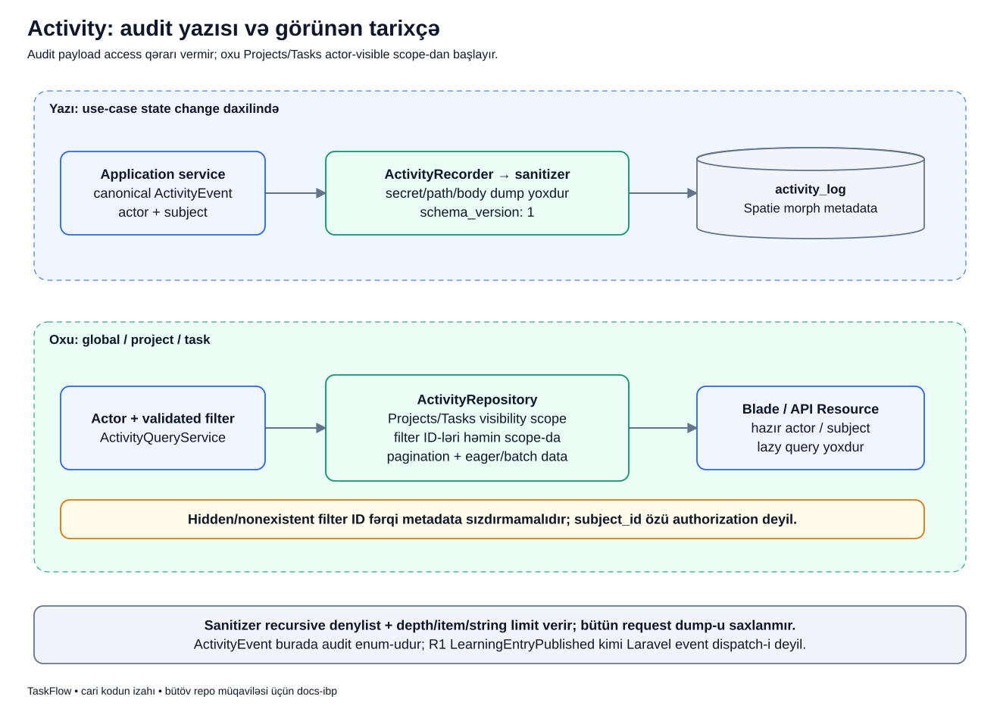

# Activity: kim nə etdi və bunu kim görə bilər?

## Məqsəd — sistemin yaddaşı

Təsəvvür et ki, dünən bir iş `todo` idi, bu gün `in_progress` görünür. «Kim dəyişdi? Nə vaxt? Əvvəl nə idi?» suallarını cavablandırmaq üçün Activity var. Activity işi dəyişən mexanizm deyil; baş vermiş əməliyyatın təhlükəsiz tarixçə qeydidir.

Adi texniki log «diskə yazmaq alınmadı» deyə bilər. Activity isə «Lalə bu işin statusunu dəyişdi» kimi məhsul tarixçəsidir. Bildiriş də başqa şeydir: istifadəçiyə yenilik olduğunu göstərir. Tarixçə yazılması avtomatik bildiriş göndərilməsi demək deyil.

## Şəkildən əvvəl sözləri açaq

| Termin | Gündəlik dildə mənası | Nümunədə |
|---|---|---|
| Actor | Əməliyyatı edən şəxs | Lalə |
| Subject | Əməliyyatın haqqında olduğu obyekt | `PAY-42` işi |
| Event | Əməliyyatın sistemdəki sabit adı | `task.status_changed` |
| Properties | Hadisəni anlamaq üçün əlavə məlumat | Köhnə/yeni status, project və task ID-si |
| Sanitizer | Auditə verilməməli məlumatı süzən köməkçi | `password` açarını atır |
| `schema_version` | Audit payload formasının versiyası | Hazırda `1` |
| Morph əlaqəsi | «Hansı növ obyekt + hansı ID?» cütü | Task class-ı + task ID-si |
| Scope | Oxuya biləcəyimiz sətirləri məhdudlaşdıran query | Lalənin görə bildiyi layihələrin Activity-si |
| Transaction | Birlikdə tamamlanan DB əməliyyatları | Status yazısı və onun auditi |

Actor ilə subject-i qarışdırma: Lalə actor-dur, amma dəyişdirilən iş subject-dir. Hesab suspend ediləndə isə actor administrator, subject başqa User ola bilər. Eyni audit cədvəli müxtəlif obyekt növlərini buna görə saxlaya bilir.

## Konkret həyat ssenarisi

Bu, izah üçün uydurulmuş nümunədir; real istifadəçi məlumatı deyil. Lalə `PAY` layihəsinin üzvü və `PAY-42` işinin assignee-sidir. İş `todo`, versiyası `3`-dür. Lalə statusu `in_progress` edir. Nigar eyni layihənin üzvüdür, Samir isə deyil.

Uğurdan sonra həm Lalə, həm Nigar icazəli tarixçə ekranında bu dəyişikliyi görə bilər. Samir task ID-sini təxmin etsə belə onun tarixçəsini görməməlidir. Auditdə `subject_id` olması Samirə giriş hüququ vermir.

## Diagramı oxuyaq



Diagramın solu **yazı**, sağı **oxu** yoludur. Oxlar «bu iş baş verəndən sonra növbəti addım nədir?» sualına cavab verir; queue və ya ayrı server göstərmir.

### Sol tərəf: qeyd necə yaranır?

1. **Application service** — nümunədə `TaskStatusService` status və versiya qaydalarını yoxlayır. Activity controller-də «sonradan yadımıza düşən» ayrıca write deyil.
2. **Canonical `ActivityEvent`** — service `TaskStatusChanged` enum dəyərini seçir. Hər developer eyni əməliyyata təsadüfi fərqli ad yazmır.
3. **Actor + subject** — service Laləni və dəyişən Task modelini recorder-a açıq verir. Recorder onları request-dən təxmin etmir.
4. **Properties** — service yalnız lazım olan `project_id`, `task_id`, `old`, `new` məlumatını verir. Bütün request və ya model dump edilmir.
5. **Sanitizer** — həssas açarlar və uyğun olmayan dəyərlər çıxarılır, ölçü limitləri tətbiq edilir.
6. **`schema_version: 1`** — saxlanılan əlavə məlumatın formatına versiya işarəsi qoyulur. Bu, task-ın `version`-ı deyil.
7. **`activity_log`** — Spatie Activitylog actor/subject əlaqələrini və safe properties-ni DB sətrinə çevirir.

### Sağ tərəf: tarixçə necə görünür?

1. **Actor + validated filter** — oxuyan istifadəçi və `project_id`, tarix, event kimi yoxlanmış filter-lər müəyyən olunur.
2. **`ActivityQueryService`** — controller üçün hazır nəticə sifariş edir; Blade query qurmur.
3. **Repository + görünürlük** — global siyahı admin üçün genişdir; digər actor üçün onun layihə əlaqələrinə uyğun sətirlər seçilir. Öz User hesabı ilə bağlı bəzi audit qeydləri də ayrıca qayda ilə görünə bilər.
4. **Filter həmin scope-da tətbiq olunur** — gizli ID-ni yazmaq yeni icazə qazandırmır. Project/task detail tarixçəsinə keçmək üçün həmin parent konteksti əvvəl authorize edilir.
5. **Pagination və eager loading** — səhifəlik nəticə və actor/subject məlumatı əvvəl hazırlanır. Hər audit sətri render ediləndə ayrıca query açmaq məqsəd deyil.
6. **Blade / API Resource** — hazır nəticəni göstərir. Subject ID-si təkbaşına authorization qaydası sayılmır.

## Kodun kiçik hissəsi

Aşağıdakılar `ActivityRecorder::record()` metodunun real sətirləridir:

```php
$properties = $this->sanitize($properties);
$properties['schema_version'] = 1;
activity($event->value)->causedBy($actor)->performedOn($subject)->withProperties($properties)->event($event->value)->log($event->value);
```

Sətirbəsətir mənası:

- Birinci sətir əvvəl verilən əlavə məlumatı süzgəcdən keçirir.
- İkinci sətir audit payload formatının hazırkı versiyasını yazır.
- `activity($event->value)` istifadə olunan audit adını seçir.
- `causedBy($actor)` «kim etdi?» əlaqəsini yazır; DB-də `causer_type` və `causer_id` ilə təmsil olunur.
- `performedOn($subject)` «hansı obyektə edildi?» əlaqəsini yazır; `subject_type` və `subject_id` istifadə olunur.
- `withProperties(...)` yalnız süzülmüş əlavə məlumatı verir.
- `event(...)` sabit əməliyyat adını, `log(...)` isə audit qeydinin yazılmasını müəyyən edir.

Bu chain Laravel `event(...)` dispatcher çağırışı deyil. Buradakı `->event(...)` audit builder-in metodudur; adların oxşarlığı funksiyalarının eyni olması demək deyil.

## Morph niyə iki sütun tələb edir?

Tək `subject_id=42` kifayət deyil: həm Task, həm Project cədvəlində `42` ola bilər. `subject_type` hansı model növündən danışıldığını bildirir, `subject_id` həmin növdəki ID-ni saxlayır. `causer` də eyni type+ID yanaşmasıdır.

Bu morph sütunları bütün mümkün subject cədvəllərinə DB foreign key yaratmır. Onlar model əlaqəsini həll etməyə yarayır. Obyektin növünü və ID-sini bilmək onu görmək hüququ vermir; görünürlük qaydası ayrıca tətbiq edilir.

## Sanitizer nəyə zəmanət verir, nəyə yox?

Hazırkı sanitizer recursive işləyir: iç-içə array-lara da baxır. Həssas hissələri olan açarları atır, dərinliyi 8, array elementlərini 100, mətn ölçüsünü 500 byte ilə məhdudlaşdırır. Etibarsız UTF-8, control-byte mətn və generic obyektləri qəbul etmir. Safe `_changed` boolean və `_count` integer summary-ləri qala bilər.

Məsələn, audit üçün `description` mətnini saxlamaq əvəzinə `description_changed: true` kifayət edə bilər. Şərh silinəndə onun bütün body-sini auditə kopyalamaq lazım deyil; comment ID-si hadisəni göstərir.

Amma sanitizer «istənilən mətnin içindəki secret-i tanıyan ağıllı skaner» deyil. Developer parolu `title` kimi adi açarın altına qoysa, onu avtomatik tanıdığı fərz edilməməlidir. İlk müdafiə caller-ın yalnız təhlükəsiz sahələr göndərməsidir.

## Uğur və xəta sonrası vəziyyət

Lalənin status dəyişmə use case-i DB transaction-dadır. Uğurda task `in_progress`, versiyası `4` olur; auditdə köhnə/yeni state saxlanır. Uyğun watcher-lər üçün bildiriş ayrıca notification service-i ilə yarana bilər.

Bu use case daxilində audit write-ı xəta atsa transaction rollback olur: task dəyişib auditi itmiş vəziyyət uğur kimi qəbul edilmir. Bunun səbəbi recorder-ın hər çağırışa avtomatik transaction açması deyil; transaction-u status service-inin idarə etməsidir. Başqa caller-ın sərhədini ayrıca oxumaq lazımdır.

Samir gizli task tarixçəsini istəyəndə təhlükəsiz authorization/scope nəticəsi alır; audit sətirlərinin properties-si ona məlumat sızdırmamalıdır. Nigar layihədən çıxarılsa əvvəlki görünürlüyü sonrakı request-lərə daşınmır.

## Tez qarışan suallar

**Audit yazılıbsa notification mütləq yaranır?** Xeyr. Notification ayrı recipient qaydaları və ayrıca çağırışdır.

**`ActivityEvent` R1-dəki `LearningEntryPublished` kimidir?** Xeyr. Birincisi audit enum-u, ikincisi Laravel dispatcher-ə ötürülən real event obyektidir.

**`schema_version=1` ilə task `version=4` ziddir?** Xeyr. Biri payload formatını, digəri task dəyişiklik sayını göstərir.

**Properties-də `project_id` varsa access artıq hazırdır?** Xeyr. Oxuyan actor həmin layihəyə görünürlük qazanmalıdır; filter bunu bypass etmir.

## Özünü yoxla

1. Lalə işi dəyişəndə actor və subject kimdir? **Lalə actor, Task subject-dir.**
2. Niyə subject ID-si ilə yanaşı type var? **Fərqli model növlərinin eyni ID-si ola bilər.**
3. Sanitizer caller-ın safe payload seçməsini əvəz edirmi? **Xeyr.**
4. Status transaction-ında audit write fail etsə nə olur? **Status və eyni transaction-dakı yazılar rollback olur.**
5. Audit `->event(...)` çağırışı listener dispatch edirmi? **Xeyr.**

## Kod və testlə davam et

- [ActivityRecorder](../../../Modules/Activity/app/Services/ActivityRecorder.php), [ActivitySanitizer](../../../Modules/Activity/app/Support/ActivitySanitizer.php), [ActivityEvent](../../../Modules/Activity/app/Enums/ActivityEvent.php).
- [Activity repository və scope](../../../Modules/Activity/app/Repositories/Eloquent/EloquentActivityRepository.php), [Activity schema/morph sütunları](../../../database/migrations/2026_08_12_082553_create_activity_log_table.php).
- [Canonical axın testləri](../../../Modules/Activity/tests/Feature/ActivityCanonicalFlowTest.php), [filter/görünürlük testləri](../../../Modules/Activity/tests/Feature/ActivityFilterParityTest.php), [sanitizer testləri](../../../Modules/Activity/tests/Unit/ActivitySanitizerTest.php).
- Əsas müqavilə: [Activity modulu](../../modules/ACTIVITY.md), [təhlükəsizlik](../../technical/SECURITY.md), [transaction və xətalar](../../technical/TRANSACTIONS_AND_FAILURES.md).
- [Diagram atlasına qayıt](../README.md).
