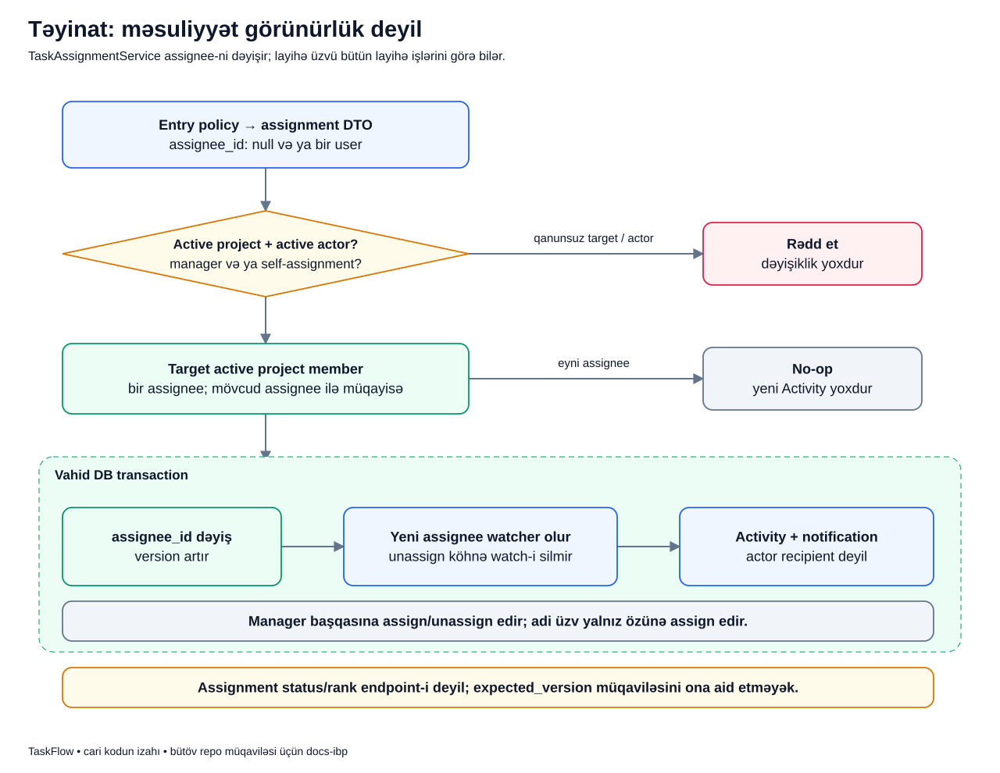

# Assignment: işi kim görəcək?

## Məqsəd

Assignment «bu işə kim cavabdehdir?» sualını cavablandırır. «Bu işi kim görə bilər?» sualının cavabı deyil. TaskFlow-da görünürlük layihə üzvlüyündən, məsuliyyət isə assignee-dən gəlir.

## Əvvəl terminlər

- **Assignee:** işin hazırkı cavabdehi; bir nəfər və ya boş.
- **Unassign:** assignee sahəsini boşaltmaq.
- **Actor:** təyinatı dəyişən istifadəçi.
- **Self-assignment:** istifadəçinin işi özünə götürməsi.
- **Watcher:** yenilikləri izləyən şəxs; assignee ilə eyni rol deyil.
- **No-op:** istək gəlib, amma real dəyişiklik yoxdur.
- **Version:** task state-i dəyişəndə arta bilən versiya sayğacı.

## Nümunə

Bu, uydurulmuş nümunədir. Aysel layihə manager-idir. `PAY-42` işi boş assignee ilə yaradılıb. Aysel onu Laləyə verir. Eyni layihə üzvü Murad da işi görür, amma məsul şəxs Lalədir.

Lalə artıq işə başladıqdan sonra Aysel səhvən yenə «Laləyə assign et» göndərir. Sistem bunu ikinci yeni təyinat kimi qeydə almamalıdır.

## Diagram



## Qutuları izləyək

1. **Entry policy + DTO:** request `assignee_id` olaraq bir ID və ya null daşıyır. İki assignee siyahısı qəbul edilmir.
2. **Active project/actor:** layihə active, actor aktiv olmalıdır. Read-only layihədə adi assignment yoxdur.
3. **Manager və ya self:** manager başqasına assign/unassign edə bilər. Adi üzv yalnız aktiv üzv kimi işi özünə götürə bilər; başqasına verə və unassign edə bilməz.
4. **Target active project member:** assignee olan şəxs aktiv olmalı və layihə üzvlüyünə malik olmalıdır. Qlobal rol təkbaşına target membership-in yerini tutmur.
5. **Mövcud assignee ilə müqayisə:** hazırkı və istənən ID eynidirsə no-op budağı seçilir.
6. **No-op:** yeni assignment Activity-si, versiya artımı və notification yaranmır.
7. **Eyni DB transaction-da yazı:** real fərq varsa `assignee_id` dəyişir və `version` artır. Transaction yalnız bu addımda başlamır; service-də əvvəlki actor/target/state/no-op yoxlamalarını da əhatə edir.
8. **Yeni assignee watcher:** Lalə işi izləyənlərə də əlavə edilir. Bu, bütün köhnə watcher-lərin silinməsi deyil.
9. **Activity + notification:** təyinatın köhnə/yeni məlumatı auditə yazılır, uyğun watcher recipient-lərindən actor çıxarılır.

Diagramdakı rədd budağı «heç bir write etmə» deməkdir. Formda istifadəçinin adı görünür deyə onu valid assignee saymaq olmaz; service target-i yenidən yoxlayır.

## Kiçik real kod

`TaskAssignmentService::assign()` real dəyişiklik hissəsində bunları edir:

```php
$oldAssignee = $task->assignee;
if ($oldAssignee?->id === $assignee?->id) {
    return $task;
}
$task->assignee_id = $assignee?->id;
$task->version++;
$task = $this->tasks->save($task);
```

- Birinci sətir əvvəlki məsul şəxsi götürür.
- `?->` assignee boş olduqda null nəticə verir; boş təyinat da müqayisə olunur.
- Eyni ID-də `return` sonrakı write və side-effect-lərə çatmağa imkan vermir.
- Yeni ID və ya null task-a yazılır.
- Versiya artır, sonra repository task-ı saxlayır.
- Auto-watch, audit və notification bu hissədən sonra gəlir və eyni use case-in davamıdır.

## Uğurdan sonra nə görünür?

Task detail-də Lalə assignee görünür, versiya əvvəlkindən bir artıqdır. Lalə watcher siyahısına daxil olur; artıq watcher idisə ikinci əlaqə yaradılmır. İşin statusu və rank-ı assignment endpoint-in işi deyil, dəyişdirilmir.

Muradın browse access-i Laləyə assignment səbəbilə itmir. Lalə assignee olmaqla digər bütün layihələrə access qazanmır.

## Unassign zamanı nə qalır?

Manager assignee-ni null edəndə əvvəlki assignee avtomatik watcher-lərdən silinmir. «Məsuliyyət artıq məndə deyil» ilə «bu işi izləmək istəmirəm» ayrı qərardır. Unwatch ayrıca əməliyyatdır.

Account suspend cleanup-ı isə başqa use case-dir: açıq assignment-ları və istifadəçinin watcher-lərini xüsusi təhlükəsizlik qaydası ilə təmizləyir. Adi assignment axını ilə qarışdırılmamalıdır.

## Xəta nümunələri

- Lalə suspended-dirsə target qəbul edilmir.
- Aysel başqa layihənin üzvünü seçirsə target invariantı rədd edir.
- Adi üzv işi başqa adama vermək istəyirsə policy/service authority sərhədi buna icazə vermir.
- Transaction içində audit/notification DB mərhələsi xəta atırsa real assignment write-ı da rollback olur.

HTTP adapterin hansı yoxlamada dayandığına görə authorization denial və domain validation nəticəsi fərqli ola bilər. Bütün rədd hallarına eyni status kodunu yapışdırmaq olmaz.

## Tez suallar

**Assignment üçün `expected_version` göndəririk?** Cari müqavilədə məcburi compare status və rank yazılarındadır. Assignment versiyanı artırır, amma ona universal optimistic-lock müqaviləsi əlavə edilmiş sayılmır.

**Notification yalnız yeni assignee-yə gedir?** Service uyğun watcher-ləri seçir, actor-u çıxarır. Yeni assignee auto-watch olur, amma recipient siyahısı yalnız ondan ibarət olmaq məcburiyyətində deyil.

**Watcher olmaq status dəyişmək hüququ verirmi?** Xeyr; ordinary status authority assignee/manager qaydasından gəlir.

## Özünü yoxla

1. Eyni assignee yenidən seçilsə versiya artırmı? **Xeyr, no-op-dur.**
2. Unassign köhnə watcher-i silirmi? **Xeyr.**
3. Adi üzv başqasına assignment edə bilərmi? **Xeyr.**
4. Təyinat visibility mexanizmidir? **Xeyr.**

## Mənbələr

- [TaskAssignmentService](../../../Modules/Tasks/app/Services/TaskAssignmentService.php), [TaskPolicy](../../../Modules/Tasks/app/Policies/TaskPolicy.php), [watcher notification service](../../../Modules/Tasks/app/Services/TaskWatcherNotificationService.php).
- [Assignment qayda testləri](../../../Modules/Tasks/tests/Feature/TaskAssignmentRulesTest.php), [watcher/bildiriş testləri](../../../Modules/Tasks/tests/Feature/TaskWatcherNotificationTest.php).
- Əsas sənədlər: [Tasks](../../modules/TASKS.md), [rollar](../../business/ROLES_AND_PERMISSIONS.md), [reporter/assignee/watcher müqayisəsi](../../extended/reporter-assignee-watcher.md).
- [Diagram atlasına qayıt](../README.md).
