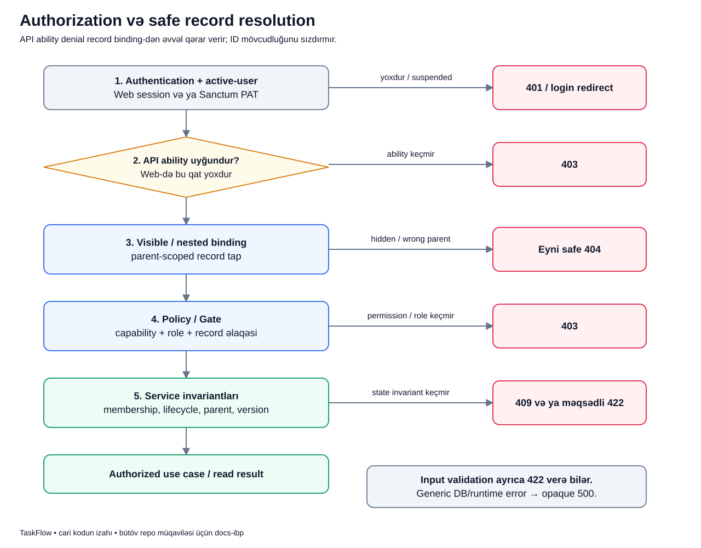

# “Daxil olub” ilə “bunu edə bilər” niyə ayrı suallardır?

[Diagram atlasına qayıt](../README.md) · [Request qatları](../system/request-layers.md)

## Bu axının məqsədi

Leyla TaskFlow-a daxil olub.
Bu, onun bütün project-ləri, bütün faylları və bütün administrator əməliyyatlarını görə bilməsi demək deyil.
Sistem hər request üçün həm istifadəçini tanımalı, həm də həmin konkret əməliyyata icazəsi olduğunu yoxlamalıdır.

Leyla, Murad və PAY project-i burada yalnız izah ssenarisidir.
Məqsəd düyməni UI-da gizlətməyin niyə kifayət etmədiyini anlamaqdır.
İstifadəçi URL-i özü yaza və ya API request-i özü qura bilər.

## Vacib terminlər

- **Authentication**: istifadəçinin kimliyini yoxlamaqdır.
- **Authorization**: həmin istifadəçinin həmin əməliyyatı edə biləcəyini yoxlamaqdır.
- **Actor**: hazırda əməliyyatı edən istifadəçidir.
- **Permission**: məsələn task oxumaq kimi capability-dir.
- **Global role**: hesabın sistem səviyyəsində roludur.
- **Project membership**: istifadəçinin konkret project-ə üzvlüyüdür; global role ilə eyni qeyd deyil.
- **Policy**: müəyyən model və əməliyyat üzrə access qərarını verən class-dır.
- **Gate**: müəyyən capability üçün access yoxlamasıdır; məsələn daxili user administration.
- **Binding**: URL-dəki ID-dən uyğun record-u tapıb controller-ə model kimi verməkdir.
- **Scope**: query-nin hansı qeydlərlə məhdudlaşdırılmasıdır.
- **Invariant**: heç bir caller-in pozmamalı olduğu vəziyyət qaydasıdır; məsələn archived project dəyişdirilməməlidir.

Bu fərqi belə yadda saxla:
authentication “kim gəlib?”, Policy “bu işi etməyə icazəsi var?”, service invariantı isə “bu vəziyyətdə bu iş ümumiyyətlə mümkündür?” deyir.

## Ssenari

Leyla PAY project-inin üzvüdür, Murad isə həmin project-in üzvü deyil.
Task Leylaya assign edilməsə də Leyla project üzvü kimi onu görə bilər.
Murad task ID-ni bilsə də bu bilik access hüququ vermir.

Leylanın API token-i task oxuma ability-sinə malik ola bilər.
Bu, Leylaya task dəyişmə ability-si vermir.
Ability uyğun olsa belə project tamamlanıbsa mutation service-i ayrıca read-only qaydasını qoruyur.

## Şəkildəki qutu və oxlar

Soldakı şaquli yol uğura doğru yoxlamalardır.
Sağa çıxan qırmızı nəticələr request-in müəyyən sərhəddə dayandığını göstərir.
Bu şəkil input validation-ın bütün Laravel request-lərindəki dəqiq yerləşmə xəritəsi deyil; onun üçün [request qatlarını](../system/request-layers.md) oxu.

1. **Authentication + active-user**: session və ya PAT etibarlıdırmı, hesab aktivdirmi? API-də uğursuzluq 401-dir; Web-də login-ə redirect ola bilər.
2. **API ability**: bu token route-un istədiyi ability-ni daşıyırmı? Uyğun deyilsə 403. Web session yolunda bu token qatı yoxdur.
3. **Visible / nested binding**: request edənə görünən record tapılır. Child record varsa göstərilən parent-ə aid olmalıdır.
4. **Policy / Gate**: həmin əməliyyata capability, rol və record əlaqəsi baxımından icazə verilirmi? Rədd 403-dür.
5. **Service invariantları**: project lifecycle, membership, parent/child və version kimi vəziyyət qaydaları qorunur.
6. **Use case / read nəticəsi**: yalnız keçən request əməliyyatı və ya uyğun read nəticəsini ala bilir.

Ability yoxlamasının binding-dən əvvəl gəlməsi vacibdir.
Lazımi ability-si olmayan client-ə müxtəlif task ID-ləri sınadıqca onların mövcudluğunu göstərmək istəmirik.

## Real kod: task görmə qaydasının əsası

[TaskPolicy](../../../Modules/Tasks/app/Policies/TaskPolicy.php)-də `view` qərarının return hissəsi belədir:

~~~php
return $user->isActive()
    && $user->hasPermissionTo(PermissionName::TasksView->value)
    && ($this->members->canManage($task->project, $user)
        || $this->members->isMember($task->project, $user));
~~~

- `isActive()` inactive hesabın bu qərarı keçməsinə imkan vermir.
- `hasPermissionTo(...)` task oxuma capability-sini yoxlayır.
- `&&` bütün əsas şərtlərin birlikdə doğru olmasını tələb edir.
- `canManage(...) || isMember(...)` project üzrə uyğun idarəetmə və ya üzvlük əlaqəsini qəbul edir.
- `$task->project` hansı project haqqında qərar verildiyini müəyyən edir.
- Burada `assignee_id === user_id` şərti yoxdur. Assignment məsuliyyətdir, bütün visibility müqaviləsi deyil.

`canManage` daxilində administrator, project owner və project manager qaydalarının necə qəbul edildiyini ProjectMemberService-də birlikdə oxu.
Bu kiçik parça bütün rol matrisi əvəzi deyil.

Binding də sadəcə istənilən task-ı ID ilə gətirmir.
[TasksServiceProvider](../../../Modules/Tasks/app/Providers/TasksServiceProvider.php) task tapılmasını repository-nin `findVisibleOrFail` metoduna verir.
Beləliklə controller-ə çatmazdan əvvəl actor-visible scope tətbiq olunur.

## Parent-scoped nə deməkdir?

Fərz et URL müəyyən task-ın comment-ini göstərir.
Comment ID-si mövcud olsa da başqa task-a aiddirsə onu həmin URL altında qaytarmaq olmaz.
Provider child comment-i həmin parent task üçün `findForTaskOrFail` ilə axtarır.

Media route-unda `{media}` parametri də çaşdırıcı ola bilər:
bu girişdə resolve edilən ID Tasks modulunun `TaskAttachment` association ID-sidir, xam Media record ID-si deyil.
Task-a aidlik və access bundan sonra Media binary/metadata axınını qoruyur.
“ID var, deməli faylı ver” düzgün yanaşma deyil.

## İstifadəçi və DB üçün nəticə

İcazə uğurludursa read nəticəsi yalnız həmin actor-un görə biləcəyi məlumatı verir.
Mutation uğurludursa service öz transaction və invariantları ilə dəyişiklik edir.
Rədd olunan request-in məqsədi qorunan əməliyyatı başlatmamaq və gizli metadata-nı sızdırmamaqdır.

Bu qraf DB row dəyişən ayrıca authorization transaction-u göstərmir.
Policy access qərarı verir, repository scope tətbiq edir, service business dəyişiklik edir.
Eyni qaydanı üç yerdə səbəbsiz kopyalamaq yox, fərqli məsuliyyətləri ayırmaq məqsədi var.

## Xəta kodlarını qarışdırmayaq

| Nəticə | Gündəlik mənası |
|---|---|
| 401 | Etibarlı giriş yoxdur və ya hesab aktiv deyil. |
| 403 | Giriş tanınır, amma tələb edilən access/ability verilmir. |
| Safe 404 | Record yoxdur, görünmür və ya göstərilən parent-ə aid deyil; gizli mövcudluq açıqlanmır. |
| 409 | Sənədləşdirilmiş vəziyyət və ya version konflikti var. |
| 422 | Input və ya məqsədli domain validation qəbul edilmir. |
| 500 | Gözlənilməz xəta; xam DB/runtime mesajı istifadəçiyə çıxarılmır. |

Form Request input-u controller metodu işləməzdən əvvəl yoxlaya bilər.
Ona görə “bütün input səhvlərində mütləq əvvəl Policy 403 gəlir” nəticəsi çıxarma.
403 ability yoxlamasının binding-dən əvvəlliyi isə ayrıca runtime qaydasıdır.

## Tez-tez qarışan suallar

**Frontend düyməni gizlədirsə backend Policy lazımdır?** Bəli. Client kodu access müqaviləsi deyil.

**Service invariantı varsa controller authorization lazım deyil?** Bəli, lazımdır. State qaydası access qərarını əvəz etmir.

**Service-i birbaşa çağıran kod hər icazəni bypass edə bilər?** Xeyr. Caller entry authorization-a cavabdehdir, service də bütün caller-lər üçün state invariantlarını qoruyur.

**Project üzvünün yalnız ona assign edilən task-ları görünür?** Xeyr. Üzvlər project-in işlərini görə bilir; assignment məsuliyyət bildirir.

**Safe 404 niyə gizli record-un varlığını demir?** Başqasına aid ID-lər üzərindən metadata toplamağın qarşısını almaq üçün.

## Özünü yoxla

1. PAT ability-si Policy-ni əvəz edir? **Xeyr, əlavə sərhəddir.**
2. Başqa task-ın comment ID-si doğru parent altında işləməlidir? **Xeyr, safe 404.**
3. “Task görünür” ilə “task dəyişdirilə bilər” eynidir? **Xeyr, əməliyyat və state fərqlidir.**
4. Completed project üçün doğru rol hər mutation-u açır? **Xeyr, service read-only qaydasını qoruyur.**

## Mənbə və testlər

- [Middleware prioriteti və exception mapping](../../../bootstrap/app.php).
- [Scoped binding](../../../Modules/Tasks/app/Providers/TasksServiceProvider.php), [TaskPolicy](../../../Modules/Tasks/app/Policies/TaskPolicy.php).
- [Project membership sərhədi](../../../Modules/Projects/app/Services/ProjectMemberService.php).
- [AuthorizationMatrixTest](../../../Modules/Tasks/tests/Feature/AuthorizationMatrixTest.php), [RequestBoundarySecurityTest](../../../tests/Feature/Security/RequestBoundarySecurityTest.php).
- [Rollar və icazələr](../../business/ROLES_AND_PERMISSIONS.md), [Security](../../technical/SECURITY.md).

