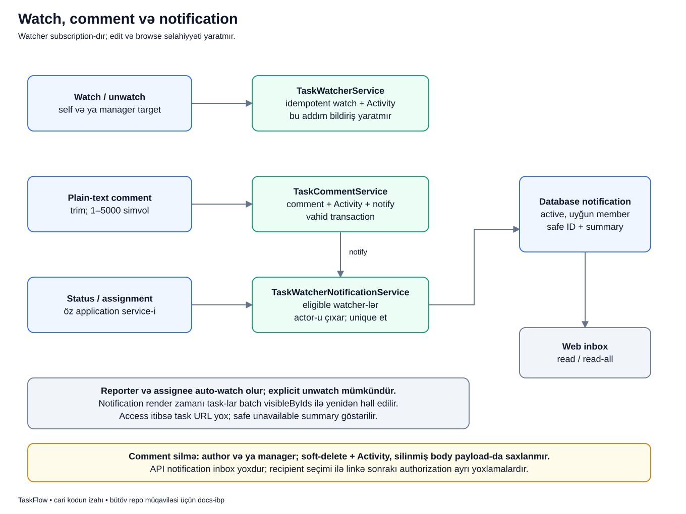

# Watcher, şərh və bildiriş birlikdə necə işləyir?

## Məqsəd

Bir işi görən bir nəfər ola bilər, amma nəticəsi ilə bir neçə nəfər maraqlana bilər. Watcher onları bir işin ətrafında toplamaq üçündür. Comment söhbəti saxlayır, notification isə uyğun şəxsə yenilik olduğunu göstərir.

Bu üç anlayışın heç biri öz-özlüyündə gizli layihəyə giriş hüququ yaratmır.

## Əvvəl terminlər

- **Watch:** işi izləməyə başlamaq.
- **Unwatch:** həmin subscription-dan çıxmaq.
- **Recipient:** bildirişi alan istifadəçi.
- **Actor:** yeniliyi edən istifadəçi.
- **Eligible watcher:** hazırda aktiv və layihə qaydalarına uyğun recipient.
- **Plain text:** HTML kimi icra edilməyən adi mətn.
- **Soft delete:** sətiri fiziki silmədən silinmiş kimi işarələmək.
- **Batch read:** əlaqəli məlumatı hər sətir üçün ayrı query yox, birlikdə almaq.

## Nümunə

Bu, uydurulmuş nümunədir. Lalə `PAY-42` üzərində işləyir. Murad onun nəticəsini gözlədiyi üçün işi watch edir. Aysel manager-dir və o da watcher-dir. Lalə «Düzəliş testə hazırdır» şərhini yazır.

Murad və Aysel aktiv uyğun watcher olduqları üçün notification ala bilər. Lalə öz yazdığı şərhə görə notification almamalıdır. Sonra Murad layihədən çıxarılırsa köhnə bildiriş ona task title/link vasitəsilə gizli məlumat göstərməməlidir.

## Diagram



Diagramın yuxarı hissəsində üç giriş var: watch/unwatch, comment və status/assignment. Onların hamısı eyni əməliyyat deyil; notification yoluna yalnız uyğun use case-lər gedir.

## Qutular və oxlar üzrə addımlar

1. **Watch/unwatch:** adi iştirakçı özünü, manager uyğun target-i idarə edir. `TaskWatcherService` active project/actor/target qaydalarını yoxlayır.
2. **İdempotent subscription:** user artıq watcher-dirsə təkrar watch ikinci əlaqə yaratmır. Artıq watcher deyilsə unwatch da yeni dəyişiklik yaratmır.
3. **Watcher Activity-si:** real əlavə/silmə auditə yazılır. Tək watch əməliyyatı bu flow-da notification yaratmır.
4. **Plain-text comment:** body trim edilir, boş olmamalı və maksimum 5 000 simvol olmalıdır.
5. **Comment transaction:** comment, audit və notification write-ları həmin use case-də birlikdə tamamlanır.
6. **Status/assignment:** bu use case-lər də öz uyğun hadisələri üçün notification service-i çağırır; comment service onların yerinə keçmir.
7. **Eligible watcher query:** aktiv və layihə əlaqəsi uyğun watcher-lər seçilir.
8. **Actor-u çıxar + unique:** əməliyyatı edən şəxs çıxarılır, eyni user təkrar recipient olmur.
9. **Database notification:** təhlükəsiz ID/summary məlumatı notification cədvəlinə yazılır.
10. **Web inbox:** user yalnız öz inbox-unu oxuyur, read/read-all edir. Bu məhsulda notification REST inbox-u yoxdur.

## Real kod: recipient seçimi

```php
return $this->watchers->eligibleWatchers($task)
    ->reject(fn (User $watcher): bool => $watcher->id === $actor->id)
    ->unique(fn (User $watcher): int|string => $watcher->getKey())
    ->values();
```

- `eligibleWatchers()` əvvəlcə hər watcher-in indiki uyğunluğunu repository-də yoxlayır.
- `reject(...)` actor-u siyahıdan çıxarır; Lalə öz comment-inə notification almır.
- `unique(...)` user ID-si üzrə təkrarı aradan qaldırır.
- `values()` nəticəni sıfırdan başlayan ardıcıl collection açarları ilə qaytarır.

Bu kod recipient seçir, authorization policy-sini bütün gələcək request-lər üçün dondurmur. İstifadəçi sonradan membership itirə bilər.

## Uğurdan sonra DB və ekran

Comment `task_comments` daxilində actor ilə bağlı saxlanır. Activity comment-in ID-sini qeyd edir, body-ni bütöv audit payload-ına kopyalamır. Uyğun recipient-lərin `notifications` qeydləri yaranır.

Watcher əlavə ediləndə yalnız subscription əlaqəsi və uyğun audit yaranır. Reporter və assignee create/assignment zamanı auto-watch ola bilər, amma sonra explicit unwatch mümkündür. Assignment dəyişəndə köhnə assignee-nin watch-i avtomatik silinmir.

## Köhnə notification niyə yenidən görünürlük yoxlayır?

`NotificationCenterService::paginate()` notification-lardakı task ID-lərini toplayır və `visibleByIdsFor()` ilə batch oxuyur. Hər notification sətrində ayrıca task query/policy dövrü qurmaq məqsəd deyil.

Murad artıq layihəni görə bilmirsə həmin task üçün URL verilmir, təhlükəsiz «yenilik artıq əlçatan deyil» summary-si göstərilir. Keçmişdə notification almaq bu gün task-a baxmaq hüququ deyil.

## Comment silinməsi

Müəllif öz şərhini, manager uyğun layihədə istənilən şərhi silə bilər. Layihə active olmalıdır. Silinmə soft-delete-dir və audit yalnız safe ID-ləri saxlayır; silinmiş body auditdə yenidən yayılmır.

Comment delete axını yeni-comment notification-u ilə eyni deyil. Mövcud kodda hər audit event-i üçün avtomatik notification istehsal edən ümumi bus yoxdur.

## Xəta nümunələri

- Boş/çox uzun comment: validation/domain xətası; yeni comment yazılmır.
- Başqasının comment-ini adi üzv silmək istəyir: authorization rədd edir.
- Completed layihədə watch/comment mutasiyası: state sərhədi bağlıdır.
- Başqa istifadəçinin notification-ını read etmək: notification ownership qorunur.
- Comment transaction-ında write fail: həmin transaction-dakı yeni comment/audit/notification nəticələri rollback olur.

## Tez suallar

**Watcher status dəyişə bilər?** Tək watcher olması buna icazə vermir; assignee/manager authority ayrıca lazımdır.

**Hər layihə üzvü hər yeniliyin bildirişini alır?** Xeyr. Uyğun watcher recipient qaydası tətbiq olunur.

**Read-all bütün komandanın notification-larını oxunmuş edir?** Xeyr, cari user-in inbox-u üçündür.

**Notification e-poçtdur?** Cari məhsulda database/in-app Web bildirişidir.

## Özünü yoxla

1. Actor özü notification alırmı? **Bu recipient qaydasında xeyr.**
2. Təkrar watch əlavə subscription yaradırmı? **Xeyr.**
3. Köhnə notification access-i qoruyurmu? **Xeyr, linked task yenidən görünürlükdən keçir.**
4. Comment body-si delete auditinə kopyalanırmı? **Xeyr.**

## Mənbələr

- [TaskWatcherService](../../../Modules/Tasks/app/Services/TaskWatcherService.php), [TaskCommentService](../../../Modules/Tasks/app/Services/TaskCommentService.php), [recipient service](../../../Modules/Tasks/app/Services/TaskWatcherNotificationService.php).
- [Eligible watcher repository](../../../Modules/Tasks/app/Repositories/Eloquent/EloquentTaskWatcherRepository.php), [NotificationCenterService](../../../app/Services/NotificationCenterService.php).
- [Watcher notification testləri](../../../Modules/Tasks/tests/Feature/TaskWatcherNotificationTest.php), [comment testləri](../../../Modules/Tasks/tests/Feature/TaskCommentFlowTest.php), [inbox testləri](../../../tests/Feature/NotificationCenterTest.php).
- Əsas sənədlər: [biznes qaydaları](../../business/BUSINESS_RULES.md), [Host tətbiq](../../modules/HOST_APPLICATION.md), [audit/notification/log fərqi](../../extended/audit-notification-operational-log.md).
- [Diagram atlasına qayıt](../README.md).
