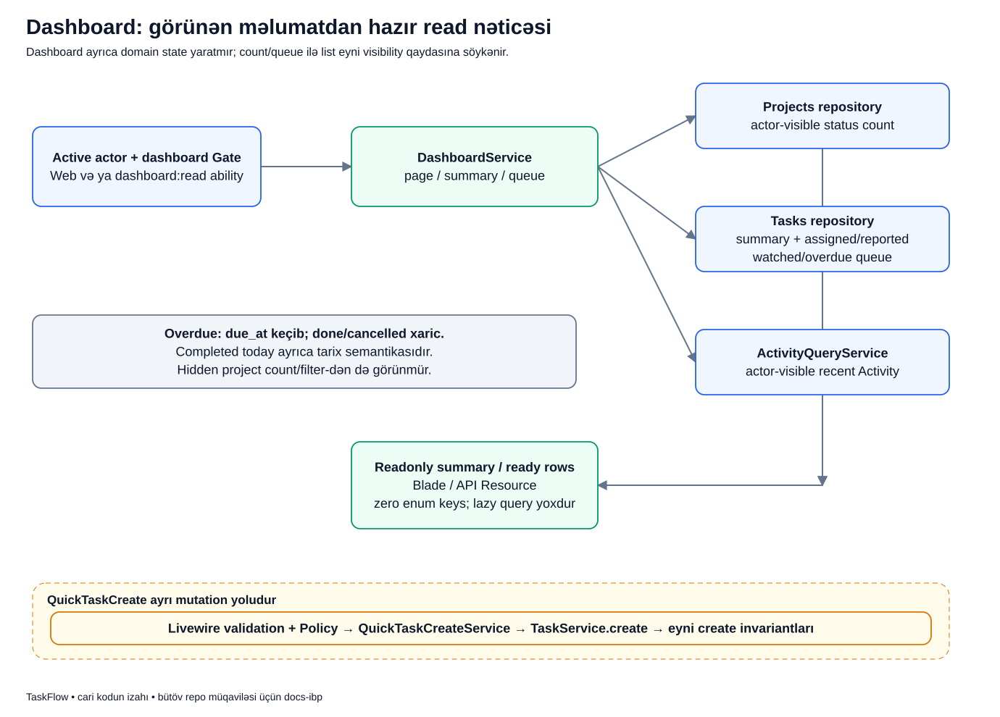

# Dashboard: müxtəlif məlumatı bir baxışda anlamaq

## Məqsəd

Dashboard yeni iş məlumatının əsas saxlandığı yer deyil. Layihələrdən, task-lardan və Activity-dən mövcud görünən məlumatı toplayıb «indi vəziyyət necədir?» sualına qısa cavab verir.

Bir task-ı Dashboard-da görməmək onun DB-dən silinməsi demək deyil. Ekrandakı queue limitli ola bilər, başqa filter/visibility qaydası tətbiq edilə bilər.

## Əvvəl terminlər

- **Summary/aggregate:** çox sətirdən hesablanan say və bölgü.
- **Queue:** müəyyən məqsədlə seçilmiş limitli iş siyahısı.
- **My Assigned:** assignee-si cari user olan işlər.
- **Reported by Me:** reporter-i cari user olan işlər.
- **My Watched:** cari user-in izlədiyi işlər.
- **Overdue:** deadline sərhədini keçmiş açıq işlər; cari sərhəd fərqini aşağıda oxu.
- **Distribution:** status/type üzrə sayların xəritəsi.
- **Readonly DTO:** hazırlanmış nəticəni dəyişməz data kimi daşıyan obyekt.
- **N+1:** hər göstərilən sətir üçün əlavə query açılıb sayın data ilə böyüməsi problemi.

## Nümunə

Bu, uydurulmuş hekayədir. Lalə yalnız PAY layihəsinin üzvüdür. Orada ona assign olunan 2 iş, öz yaratdığı 3 iş və watch etdiyi başqa iş var. HR layihəsinə üzv deyil.

Lalənin dashboard-u HR task-larını nə siyahıda, nə də gizli count içində göstərməlidir. Admin eyni ekranı açanda görünürlük daha geniş olduğu üçün saylar fərqli çıxa bilər; bu təkbaşına bug deyil.

## Diagram



Əsas oxlar read nəticəsinin hazırlanmasını göstərir. Aşağıdakı QuickTaskCreate yolu ayrıca mutation-dır; Dashboard summary query-si task yaratmır.

## Qutuları izləyək

1. **Active actor + Gate:** Web-də dashboard authorization-u, API-də əlavə `dashboard:read` ability-si tətbiq olunur. Token ability-si policy/Gate-i əvəz etmir.
2. **DashboardService:** page, summary və queue sorğularını uyğun sərhədlərdən yığır.
3. **Projects repository:** actor-visible layihələrin status saylarını hesablayır.
4. **Tasks repository:** total/workflow/type summary-si və assigned/reported/watched/overdue queue-larını hazırlayır.
5. **ActivityQueryService:** actor-visible son Activity-ləri alır; page üçün limit 8-dir.
6. **Readonly summary/hazır rows:** nəticə DTO və eager-loaded data ilə presentation-a gedir.
7. **Blade/API Resource:** artıq hazırlanmış sahələri göstərir; burada yeni persistence query-si açılmır.
8. **Zero enum keys:** məsələn cancelled sayı 0-dırsa status açarı yox olmur. UI/consumer eyni strukturla işləyə bilir.
9. **QuickTaskCreate:** ayrıca validation/policy → QuickTaskCreateService → TaskService create yoludur. Bütün create invariantları saxlanır.

## Real kod: summary mənbələri

```php
$projectSummary = $this->projects->dashboardStatusSummaryFor($user);
$taskSummary = $this->tasks->dashboardSummaryFor($user);
```

- Birinci sətir layihə saylarını Projects repository-sindən istəyir.
- İkinci sətir iş metriklərini Tasks repository-sindən istəyir.
- `$user` hər iki query üçün görünürlük context-idir; əvvəl global count alıb sonra UI-də gizlətmək yolu deyil.
- Sonrakı code bu iki nəticəni `DashboardSummaryData` obyektinə yerləşdirir.
- Service bunun üçün ayrıca Dashboard domain cədvəlinə copy-write etmir.

Bu, R1 LearningInsights projection write axını ilə eyni mexanizm deyil. Dashboard cari məhsulda query composition edir, lab isə öz projection cədvəlini yazır.

## Uğurdan sonra DB və ekran

Sadəcə dashboard oxumaq task statusu və ya assignment dəyişdirmir. Lalə öz görünən layihələrinin count-larını və limitli queue-larını görür. Queue helper-i hazırda ən çox 6 iş qaytarır; total sayı ilə card sayının bərabər olması tələb deyil.

Assigned/reported/watched olmaq üç ayrı əlaqədir; eyni task bir neçə queue-da görünə bilər. Bu queue-lar sadəcə «açıq işlər» filtri ilə eyni deyil; uyğun source query-lərini oxumaq lazımdır.

Project distribution `draft` açarını da saxlayır, amma ayrıca top-level active/completed/archived count-ları təqdim olunur. «Top-level draft card yoxdur» ilə «draft layihələr yoxdur» eyni nəticə deyil.

## Tarix sərhədləri: current fərqi gizlətməyək

Completed-today summary-si hazırda done olan və `completed_at` bugünkü gün intervalına düşən task-ları sayır. Reopen edilmiş işin completed_at-ı təmizləndiyinə görə onun mənası dəyişir.

Overdue üçün cari kodun iki sərhədi tam eyni deyil:

- Summary və ümumi task filter-i `due_at`-ı **bugünkü gündən əvvəl** yoxlayır.
- Dashboard overdue queue/API query-si `due_at < now()` istifadə edir. Queue prioritization hissəsi də `now()` istifadə edir.

`due_at` date-only olduğuna görə bugünkü deadline sərhədində summary ilə queue nəticəsi fərqlənə bilər. Bunu «hər yerdə eyni overdue hesabı var» kimi izah etmək doğru deyil. Bu sənəd mövcud fərqi göstərir, kodu dəyişmir və onu ideal design qərarı kimi təqdim etmir.

## Xəta və çatışmazlıq nümunələri

- Token-də yalnız `tasks:read` var: dashboard API ability sərhədi rədd edir.
- Ability var, amma dashboard permission/Gate keçmir: yenə access verilmir.
- Lalə HR task sayını gözləyir: görünürlük səbəbilə daxil edilməməsi düzgün davranışdır.
- 12 assigned iş var, card-da 6 görünür: limitli queue-dur, total-count bug-u deyil.
- Bugünkü deadline summary count ilə overdue queue-da fərqlənir: yuxarıdakı current sərhəd məhdudiyyəti araşdırılmalıdır.

Gözlənilməz query failure-da uydurma uğurlu count qaytarmaq düzgün deyil. Code path-in təhlükəsiz error davranışı saxlanmalıdır.

## N+1 niyə burada vacibdir?

Task sayı artdıqca hər card üçün ayrıca project/user query-si açılsa səhifə yavaşlayar. Repository relation-ları əvvəl hazırlayır, query-budget testi isə nəticə həcmi böyüyəndə query sayının idarə olunan qalmasını yoxlayır.

Sıfır lazy query iddiasını ekrana baxmaqla sübut etmək olmaz; source sərhədi və query testləri buna görə var.

## Tez suallar

**Dashboard state-in source of truth-udur?** Xeyr, Projects/Tasks/Activity mənbələrini oxuyur.

**Count və queue card sayı niyə fərqlənir?** Biri aggregate, digəri limitli siyahıdır; əlavə sərhədləri də yoxlamaq lazımdır.

**QuickTaskCreate bu read-only modulu pozur?** O, ayrıca mutation adapteridir; Tasks use case-i çağırır, Dashboard domain state yaratmır.

## Özünü yoxla

1. Hidden layihə count-a daxil edilirmi? **Cari actor-visible query-də yox.**
2. Bir task həm reported, həm watched ola bilər? **Bəli.**
3. Queue-dakı 6 card total work sayıdır? **Xeyr.**
4. Overdue sərhədi bütün query-lərdə eynidirmi? **Cari kodda xeyr; today/now fərqi var.**

## Mənbələr

- [DashboardService](../../../Modules/Dashboard/app/Services/DashboardService.php), [DashboardSummaryData](../../../Modules/Dashboard/app/Data/DashboardSummaryData.php), [Projects repository](../../../Modules/Projects/app/Repositories/Eloquent/EloquentProjectRepository.php).
- [Task metrics/queue source-u](../../../Modules/Tasks/app/Repositories/Eloquent/EloquentTaskRepository.php), [QuickTaskCreate](../../../Modules/Dashboard/app/Livewire/QuickTaskCreate.php).
- [Dashboard metric/görünürlük/query-budget testləri](../../../Modules/Dashboard/tests/Feature/DashboardMetricsTest.php), [QuickTaskCreate testləri](../../../Modules/Dashboard/tests/Feature/QuickTaskCreateLivewireTest.php).
- Əsas sənədlər: [Dashboard](../../modules/DASHBOARD.md), [biznes qaydaları](../../business/BUSINESS_RULES.md), [lazy/eager loading](../../extended/lazy-vs-eager-loading.md).
- [Diagram atlasına qayıt](../README.md).
