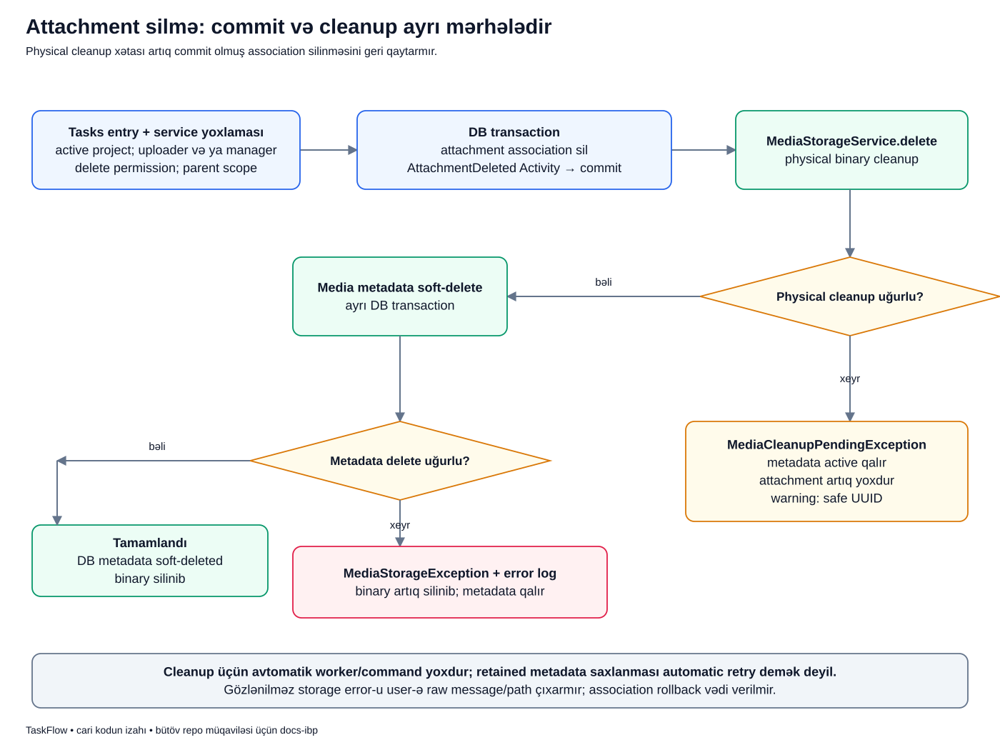

# Fayl silinərkən nəyin silindiyini ayıraq

## Məqsəd

Delete basıldıqda task-fayl əlaqəsi, Media metadata-sı və diskdəki binary eyni şey deyil. Cari kod bunları ayrı mərhələlərdə silir. Junior üçün vacib məqam: sonuncu mərhələ fail edəndə əvvəlki commit avtomatik geri qayıtmır.

## Əvvəl terminlər

- **Attachment association:** task ilə Media arasındakı `task_attachments` sətri.
- **Physical cleanup:** diskdəki real faylın silinməsi.
- **Metadata soft-delete:** Media sətrinin silinmiş kimi işarələnməsi.
- **Commit:** DB transaction-un tamamlanması.
- **Pending cleanup:** faylın silinməsi tamamlanmayıb, sonrakı internal retry lazım ola bilər.
- **Internal retry:** tətbiqin daxili Media service-i ilə təkrar cleanup cəhdi; user endpoint-ini kor-koranə təkrar çağırmaq deyil.

## Nümunə

Bu, uydurulmuş nümunədir. Lalə öz upload etdiyi screenshot-u active `PAY-42` işindən silir. Association və audit DB-də uğurla commit olur. Sonra disk delete əməliyyatı fail edir.

Ekranda attachment artıq görünməyə bilər, amma disk faylı hələ qalır. «Request xəta verdi, deməli heç nə silinmədi» də, «attachment görünmür, deməli binary mütləq silindi» də yanlış nəticədir.

## Diagram



Diagramın ortasındakı DB commit oxundan sonra disk mərhələsi başlayır. Qırmızı budaqlar əvvəlki association-u bərpa edən rollback oxları deyil.

## Addım-addım

1. **Entry/service yoxlaması:** active project, active/authorized actor, parent scope, delete permission yoxlanır.
2. **Uploader və ya manager:** uploader öz faylını, manager uyğun task attachment-ini silə bilər.
3. **Association DB transaction-u:** attachment əlaqəsi silinir və `AttachmentDeleted` audit qeydi yazılır.
4. **Commit:** həmin DB mərhələsi tamamlanır. Binary hələ silinməyə bilər.
5. **MediaStorageService.delete:** consuming Tasks fiziki disk əməliyyatını özü etmir, Media-ya verir.
6. **Physical cleanup uğurlu:** fayl silinir; sonra Media metadata soft-delete transaction-u başlayır.
7. **Physical cleanup fail:** safe warning və `MediaCleanupPendingException` yaranır; Media metadata aktiv qalır, attachment artıq yoxdur.
8. **Metadata delete uğurlu:** binary silinib, metadata soft-deleted-dir; normal uğurlu nəticə budur.
9. **Metadata delete fail:** binary artıq yoxdur, metadata qala bilər; storage exception və safe error log yaranır.

## Real kod: iki sərhədi gör

```php
DB::transaction(function () use ($attachment, $actor, $media) {
    $properties = ['project_id' => $attachment->task->project_id, 'task_id' => $attachment->task_id, 'attachment_id' => $attachment->id, 'media_uuid' => $media->uuid, 'filename' => $media->original_name];
    $this->attachments->delete($attachment);
    $this->activity->record(ActivityEvent::AttachmentDeleted, $actor, $attachment, $properties);
});
$this->storage->delete($media);
```

- `DB::transaction(...)` yalnız içindəki DB association/audit işlərini əhatə edir.
- Properties safe ID/UUID/filename summary-si hazırlayır; disk path-i buraya daxil deyil.
- Repository attachment əlaqəsini silir.
- Audit silmə əməliyyatını qeyd edir.
- `});` transaction callback-ının bitməsidir; bu adi top-level Web/API use case-də uğurlu return həmin DB transaction-ını commit edir.
- Son sətirdəki storage delete həmin blokdan **kənardadır**. Exception atsa əvvəl commit olmuş relation geri qaytarılmır.

Bu kod parçalanması «bütün delete əməliyyatı atomikdir» iddiasını verməyə imkan vermir.

Burada caller-in əlavə outer transaction açmadığı normal giriş izah olunur. Method-u başqa transaction-la əhatə etmək disk əməliyyatını da DB rollback-inə daxil etmir; belə caller üçün real commit sərhədini ayrıca araşdırmaq lazımdır. R1-də outer transaction-un təsiri [publish dərsində](../labs/publish.md) ayrıca göstərilir.

## Hallara görə DB və disk

| Hadisə | Attachment | Media metadata | Binary |
|---|---|---|---|
| Normal uğur | Silinib | Soft-deleted | Silinib |
| Association/audit transaction-u fail | Rollback ilə qalır | Dəyişməyib | Cleanup-a çatmayıb |
| Physical cleanup fail | Artıq silinib | Aktiv qalır | Qala bilər |
| Metadata delete fail | Artıq silinib | Qala bilər | Artıq silinib |

Pending vəziyyətdə «retry üçün aktiv metadata» saxlamaq faylı yenidən task-a bağlamaq demək deyil. Məqsəd daxili cleanup üçün izlənən record-u itirməməkdir.

## Retry niyə həmin URL ilə olmur?

Attachment artıq silinibsə parent binding onu tapmır və endpoint 404 verə bilər. Failure testində retry `MediaStorageService::delete($media)` internal çağırışı ilə göstərilir.

Fayl artıq yoxdursa physical delete hissəsi no-op ola bilər; sonra metadata soft-delete cəhdi davam edir. Cari kod ayrıca cleanup worker, command və admin cleanup UI təqdim etmir. Belə bir mexanizmi sənəddə varmış kimi göstərmək olmaz.

## Privacy niyə error yolunda da vacibdir?

Storage xətasında log safe əməliyyat növü, ID/UUID və error class saxlayır; private path, disk və checksum user output-a çıxarılmır. Recovery məlumatının mövcudluğu onu browser-ə bütöv göstərmək üçün səbəb deyil.

## Xəta nümunələri

- Adi üzv başqa uploader-in faylını silir: authority rədd edilir.
- Completed layihədə delete istəyir: active-only mutation sərhədi bağlıdır.
- Attachment başqa task-a aiddir: parent scope qəbul etmir.
- Disk delete false qaytarır: pending cleanup yolu seçilir, uğurlu 204 kimi göstərilmir.

## Tez suallar

**Delete audit-i binary-nin mütləq silindiyini sübut edir?** Xeyr. Cari sırada association audit-i disk cleanup-dan əvvəl commit olunur.

**DB rollback disk faylını geri gətirər?** Xeyr; DB və disk ayrı resurslardır.

**Pending exception automatic retry başladır?** Xeyr. Cari kod retry üçün məlumat saxlayır, worker başlatmır.

## Özünü yoxla

1. Əvvəl association silinir, yoxsa binary? **Association DB mərhələsi əvvəl tamamlanır.**
2. Disk fail olsa association geri qayıdır? **Xeyr.**
3. Metadata soft-delete hansı addımdan sonradır? **Uğurlu physical cleanup-dan sonra.**
4. Retry üçün public path vermək lazımdır? **Xeyr.**

## Mənbələr

- [TaskAttachmentService::delete](../../../Modules/Tasks/app/Services/TaskAttachmentService.php), [MediaStorageService::delete](../../../Modules/Media/app/Services/MediaStorageService.php), [MediaMetadataService](../../../Modules/Media/app/Services/MediaMetadataService.php).
- [Failure/cleanup retry testləri](../../../Modules/Tasks/tests/Feature/TaskAttachmentFailureSafetyTest.php), [Media storage testləri](../../../Modules/Media/tests/Feature/MediaStorageServiceTest.php).
- Əsas sənədlər: [Media](../../modules/MEDIA.md), [transaction/failure sərhədləri](../../technical/TRANSACTIONS_AND_FAILURES.md), [təhlükəsizlik](../../technical/SECURITY.md).
- [Diagram atlasına qayıt](../README.md).
