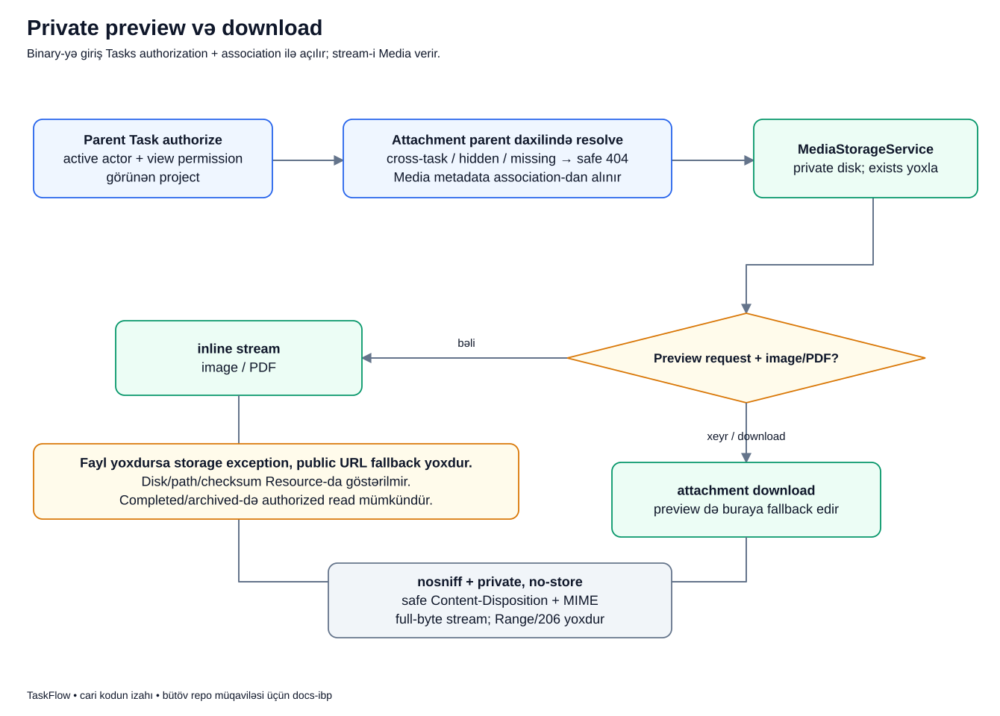

# Private faylı necə açırıq və endiririk?

## Məqsəd

Faylı upload etmək onun hamıya açıq linkinin yaranması demək deyil. TaskFlow attachment-i yalnız task-a baxmaq icazəsi olan istifadəçiyə verir. Faylın özü private storage-da qalır; backend icazəni yoxlayıb content-i stream edir.

## Əvvəl terminlər

- **Preview:** uyğun content-i browser daxilində göstərmək.
- **Download:** browser-ə fayl kimi endirmə cavabı vermək.
- **Stream:** binary-ni server cavabı ilə ötürmək; JSON-a base64 dump etmək deyil.
- **Parent scope:** child attachment-i məhz göstərilən task daxilində tapmaq.
- **Disposition:** browser-ə inline göstər və ya attachment kimi endir göstərişi.
- **Private cache:** content-in ümumi cache kimi paylaşılmaması üçün header qaydası.
- **Metadata:** faylın özündən fərqli təsviri DB məlumatı.

## Nümunə

Bu, uydurulmuş nümunədir. Lalə PAY layihəsində `PAY-42` task-ına screenshot əlavə edib. Murad həmin layihənin üzvüdür və preview açır. Samir isə layihə üzvü deyil, amma URL-dəki ID-ni təxmin edib açmağa çalışır.

Murad üçün icazəli content göstərilə bilər. Samirə faylın disk yolu və ya public link verilməməlidir. Həmçinin PAY-42 faylını başqa task URL-sinə bağlamaqla parent scope bypass edilməməlidir.

## Diagram



Diagramın iki son budağı eyni authorized oxu yolundan gəlir. Bir budaq inline, digəri download cavabıdır; download authorization-suz qısa yol deyil.

## Addım-addım

1. **Parent Task authorize:** actor aktiv olmalı, task view permission-u və layihə görünürlüyü olmalıdır.
2. **Attachment parent daxilində resolve:** URL child ID-si həmin task-a bağlı association içində tapılır. Wrong-parent, missing və hidden resource safe 404 ilə həll olunur.
3. **Media metadata association-dan alınır:** consuming Tasks raw storage path uydurmur, mövcud əlaqədəki Media record-u ötürür.
4. **MediaStorageService:** configured private diskdə faylın varlığını yoxlayır.
5. **Preview + image/PDF:** content image və ya PDF-dirsə inline stream qaytarılır.
6. **Başqa icazəli tip/download:** TXT kimi başqa qəbul edilmiş tipin preview request-i download fallback-ına keçir. Download request-i də bu yoldan gəlir.
7. **Header-lər:** safe filename/disposition, detected MIME, `nosniff`, `private, no-store` tətbiq olunur.
8. **Tam stream:** cari müqavilə tam byte response-dur; Range/206 hissəli streaming dəstəyi yoxdur.

## URL-dəki ID-ni qarışdırmayaq

`/api/v1/tasks/{task}/media/{media}/preview` yolundakı `{media}` raw Media model ID-si deyil. Provider onu həmin task daxilindəki `TaskAttachment` association ID-si kimi bind edir.

Attachment response-da ayrıca safe Media UUID-si də görünə bilər. Task ID, attachment ID, Media ID və UUID eyni anlayış deyil. Birini digərinin yerinə göndərmək düzgün əlaqə yaratmır.

## Real kod: preview fallback

```php
if (! MediaFilePolicy::isPreviewable($media->mime_type)) {
    return $this->download($media);
}
return $this->stream($media, true);
```

- Birinci sətir Media record-un server-detected MIME-sinə görə inline preview imkanını yoxlayır.
- Uyğun deyilsə faylı «göstərməyə» çalışmır, download response-u verir.
- Uyğundursa `stream(..., true)` inline istiqamətini seçir.
- Bu method-a qədər parent/actor authorization-u consuming Tasks sərhədində həll edilir.

Media service-də MIME yoxlaması user authorization-u ilə eyni şey deyil. Bir faylın PNG olması hər actor-un onu görə bilməsi demək deyil.

## Uğurdan sonra DB və ekran

Preview/download normalda yeni task və ya attachment sətri yaratmır. Browser inline image/PDF görə bilər və ya download başlada bilər. DB metadata-nı oxumaqla binary stream etmək fərqli mərhələlərdir.

Completed/archived layihədə authorized read mümkündür; mutation-un bağlı olması bütün fayl tarixçəsinin yox olması demək deyil. Aktiv olmayan actor isə əvvəlki read hüququnu saxlamır.

## Fayl diskdə yoxdursa?

Association/metadata olsa belə binary storage-da itmiş ola bilər. `MediaStorageService` fayl yoxdursa storage exception atır; public URL-yə keçərək problemi gizlətmir.

İstifadəçiyə raw disk/path/runtime mesajı çıxarılmamalıdır. Bu, sadəcə input validation xətası deyil; gözlənilməz storage vəziyyətidir. Backend source və təhlükəsiz log ilə araşdırılmalıdır.

## Xəta nümunələri

- Samir gizli task faylını istəyir: visibility sərhədi resource-u açmır.
- Lalə başqa task-a aid attachment ID-sini PAY-42 altında göndərir: parent mismatch qəbul edilmir.
- Storage faylı əlçatmazdır: stream uğur kimi qaytarılmır.
- TXT preview istənir: bu xəta deyil, download fallback-dır.
- Range header göndərilir: cari API üçün hissəli 206 zəmanəti yoxdur.

## Tez suallar

**Preview URL public URL-dir?** Xeyr, yenə protected endpoint-dir.

**Original filename faylın yerini göstərir?** Xeyr. Təhlükəsiz istifadəçi adı ilə private random path fərqlidir.

**Resource niyə checksum/path vermir?** UI-yə lazım olmayan private storage metadata-sını yaymamaq üçün.

**Read üçün layihə active olmalıdır?** Authorized read read-only layihələrdə də mümkündür; active şərti adi mutation-lara aiddir.

## Özünü yoxla

1. TXT preview nə qaytarır? **Download fallback.**
2. URL-də `{media}` hansı ID-dir? **TaskAttachment association ID-si.**
3. Faylın MIME-si icazəni əvəz edir? **Xeyr.**
4. Missing binary üçün public link fallback varmı? **Xeyr.**

## Mənbələr

- [TaskAttachmentService](../../../Modules/Tasks/app/Services/TaskAttachmentService.php), [parent binding](../../../Modules/Tasks/app/Providers/TasksServiceProvider.php), [attachment repository](../../../Modules/Tasks/app/Repositories/Eloquent/EloquentTaskAttachmentRepository.php).
- [MediaStorageService](../../../Modules/Media/app/Services/MediaStorageService.php), [TaskAttachmentResource](../../../Modules/Tasks/app/Http/Resources/TaskAttachmentResource.php).
- [Task media flow testləri](../../../Modules/Tasks/tests/Feature/TaskMediaFlowTest.php), [storage/preview testləri](../../../Modules/Media/tests/Feature/MediaStorageServiceTest.php).
- Əsas sənədlər: [Media](../../modules/MEDIA.md), [REST API](../../technical/API.md), [təhlükəsizlik](../../technical/SECURITY.md).
- [Diagram atlasına qayıt](../README.md).
