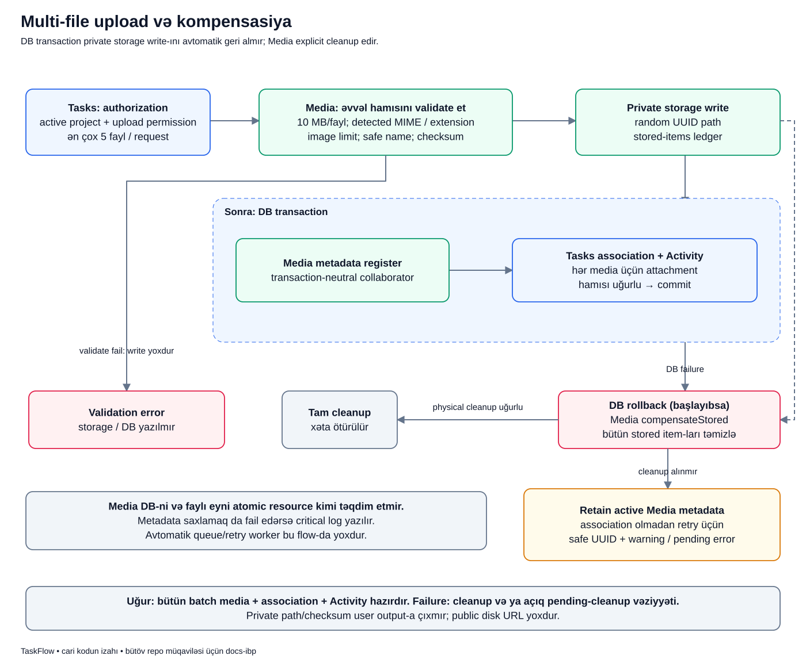

# Fayl yükləmək: DB və disk birlikdə necə idarə olunur?

## Məqsəd

İşə screenshot və ya sənəd əlavə edəndə iki fərqli şey saxlanır: faylın özü diskdə, onun haqqında məlumat və task əlaqəsi DB-də. Məqsəd həm təhlükəli faylı qəbul etməmək, həm də yarımçıq upload-u uğur kimi göstərməməkdir.

## Əvvəl terminlər

- **Binary:** faylın faktiki byte-ları.
- **Metadata:** ad, MIME, ölçü və digər təsviri məlumat.
- **MIME:** fayl content növü; məsələn image/png.
- **Extension:** filename sonluğu; məsələn `.png`.
- **Checksum:** content-in hesablanmış rəqəmsal izi; SHA-256.
- **Association:** task ilə Media arasındakı DB əlaqəsi.
- **Ledger:** bu request-də uğurla saxlanmış faylların siyahısı.
- **Compensation:** DB rollback-in silmədiyi xarici faylları ayrıca təmizləmək cəhdi.

## Nümunə

Bu, uydurulmuş nümunədir. Lalə aktiv `PAY-42` işinə `error.png` və `notes.txt` əlavə edir. Birinci fayl diskə yazılır, ikinci faylda storage failure yaranır.

DB transaction «diskə yazılmış error.png-ni özü siləcək» deyə düşünmək olmaz. Tətbiq əvvəlki write-ın izini saxlamalı və ayrıca cleanup etməlidir.

## Diagram



Şəkildə storage write DB transaction-dan **əvvəl** göstərilir. Bu sıra vacibdir. Aşağıdakı failure budaqları isə cleanup-ın özünün də uğursuz ola biləcəyini göstərir.

## Addımlar

1. **Tasks authorization:** actor task-a baxa bilir, layihə active-dır və upload permission-u var. Maksimum 5 fayl/request qəbul olunur.
2. **Hamısını validate et:** Media hər faylı write-dan əvvəl yoxlayır. Bir fayl invalid-dirsə digərini əvvəlcədən saxlamaqla yarımçıq batch yaratmır.
3. **Content yoxlaması:** client MIME/adına güvənilmir; server content MIME-sini, sonluq uyğunluğunu, 10 MB/fayl limitini və image hədlərini yoxlayır.
4. **Safe name/checksum:** ad təhlükəsizləşdirilir, checksum hesablanır. Original ad fiziki storage path-i seçmir.
5. **Private storage write:** hər fayl random UUID path-də saxlanır. Uğurlu write ledger-ə düşür.
6. **DB transaction:** yalnız storage mərhələsindən sonra Media metadata, Task attachment association və Activity yazılır.
7. **Commit:** bütün DB mərhələləri alınarsa batch uğurla tamamlanır.
8. **Validation failure:** storage/DB write başlamır.
9. **Storage/DB failure:** DB mərhələsi başlayıbsa rollback olur, ledger-dəki faylların cleanup-ı cəhd edilir.
10. **Cleanup uğurlu:** həmin request-in faylları silinir, ilkin failure caller-a ötürülür; upload uğur sayılmır.
11. **Cleanup fail:** əlaqəsiz aktiv Media metadata-sı saxlamaq cəhd edilir, safe UUID/log və pending exception yaranır.
12. **Metadata retention da fail:** critical log yaranır; «recovery record mütləq yazılıb» zəmanəti yoxdur.

## Real kod: əvvəl bütün batch-i hazırla

```php
$prepared = array_map(fn (UploadedFile $file): array => $this->prepare($file), $files);
$disk = (string) config('media.disk');
$metadata = [];
```

- `array_map` hər fayl üçün `prepare()` çağırır; bu mərhələ content/ölçü/ad/checksum yoxlamasıdır.
- Bir `prepare()` exception atsa sonrakı storage loop-una çatılmır.
- Disk client input-undan yox, Media konfiqurasiyasından seçilir; cari default `local`-dır.
- `$metadata` sonrakı uğurlu write-ların ledger-i üçün boş başlanır.

Bu üç sətir özü DB record yaratmır. Fiziki write loop-u və transaction sonrakı addımlardır.

## Uğurdan sonra nə var?

İki fayl uğurludursa private diskdə iki binary, `media` daxilində iki metadata sətri, `task_attachments` daxilində iki association və uyğun upload Activity-ləri olur. Task detail/API bunları safe ad/ölçü/MIME ilə təqdim edir.

Path, disk və checksum response-a kopyalanmır. Fayla getmək üçün public disk URL yox, authorized preview/download endpoint-i istifadə olunur.

## Failure zamanı nə qala bilər?

İkinci faylın storage write-ı fail etsə birinci ledger faylı üçün cleanup cəhdi edilir. DB write-ı fail etsə bütün həmin batch DB yazıları rollback olur, saxlanmış faylların cleanup-ına cəhd edilir.

Amma xarici disk əlçatmazdırsa cleanup alınmaya bilər. Tətbiq onu safe UUID metadata ilə izlənən saxlamağa çalışır. Bu vəziyyəti «hamısı silindi» kimi göstərmək yanlış olar. Hazırda avtomatik cleanup worker-i və UI-sı yoxdur.

İstifadəçi uğursuz request-dən sonra task-da yeni attachment görməyə bilər, amma əməliyyat tərəfdə pending cleanup qalması mümkündür. DB görünüşü ilə storage vəziyyətini eyni şey sayma.

## Təhlükəsizlik nümunələri

- Adı `invoice.pdf`, content-i adi mətn olan fayl MIME/extension uyğunsuzluğu ilə rədd edilir.
- SVG/HTML/script/executable qəbul edilmir; təhlükəsizlik allowlist-i var.
- Image tərəfi maksimum 8 000 piksel, ümumi maksimum 40 000 000 piksel ola bilər.
- `../../name.txt` kimi original ad storage qovluğunu seçmir; safe name və random path istifadə olunur.
- 6 fayllıq request və 10 MB-dan böyük fayl qəbul edilmir.

## Tez suallar

**DB transaction bütün disk write-larını rollback edirmi?** Xeyr; compensation buna görə var.

**All-or-nothing nə deməkdir?** DB batch atomikdir, xarici cleanup isə ayrıca cəhddir; tam disk+DB atomik transaction deyil.

**Docs-da SVG şəkli varsa niyə upload SVG qadağandır?** Repository sənədi ilə user-in private attachment upload səthi ayrı kontekstlərdir.

**Retention record-u varsa retry avtomatik gedir?** Xeyr; cari kodda avtomatik worker yoxdur.

## Özünü yoxla

1. Bütün validation storage-dan əvvəl olurmu? **Bəli.**
2. Original filename fiziki path seçirmi? **Xeyr.**
3. DB rollback disk faylını özü silirmi? **Xeyr.**
4. Cleanup da fail edə bilərmi? **Bəli, sənədləşdirilmiş pending vəziyyət var.**

## Mənbələr

- [TaskAttachmentService](../../../Modules/Tasks/app/Services/TaskAttachmentService.php), [MediaStorageService](../../../Modules/Media/app/Services/MediaStorageService.php), [MediaMetadataService](../../../Modules/Media/app/Services/MediaMetadataService.php), [file policy](../../../Modules/Media/app/Support/MediaFilePolicy.php).
- [Failure injection testləri](../../../Modules/Tasks/tests/Feature/TaskAttachmentFailureSafetyTest.php), [Media storage testləri](../../../Modules/Media/tests/Feature/MediaStorageServiceTest.php).
- Əsas sənədlər: [Media](../../modules/MEDIA.md), [transaction və failure](../../technical/TRANSACTIONS_AND_FAILURES.md), [transaction/compensation](../../extended/transaction-vs-compensation.md).
- [Diagram atlasına qayıt](../README.md).
