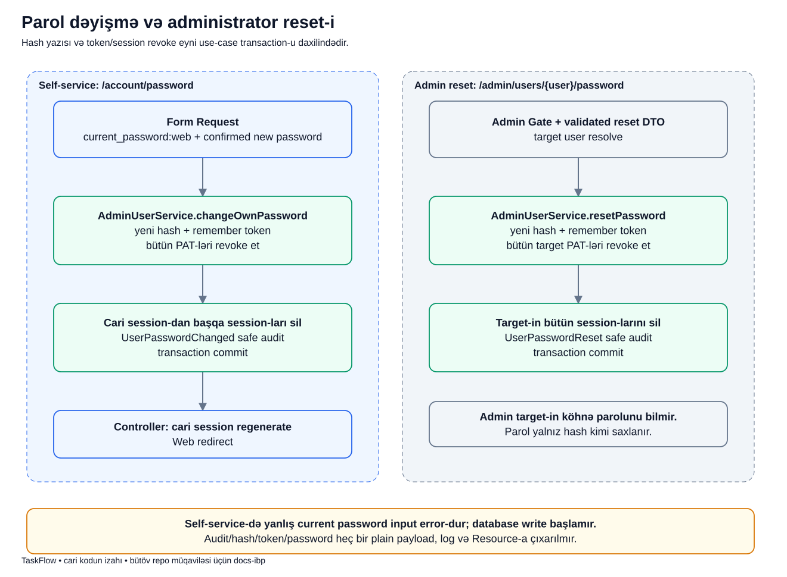

# Parolu özün dəyişmək və adminin reset etməsi

[Diagram atlasına qayıt](../README.md) · [Account suspend axını](account-admin.md)

## Bu iki axının məqsədi

İstifadəçi parolunu bildiyi halda onu özü dəyişə bilər.
Parolu unutduqda isə administrator həmin istifadəçi üçün yeni parol təyin edə bilər.
İkinci halda administrator köhnə parolu öyrənmir və onu DB-dən oxuyub göstərmir.

TaskFlow-da parol dəyişmək təkcə `users.password` yazısı deyil.
Əvvəlki giriş açarlarının da etibarı yenidən nəzərdən keçirilir.
Buna görə hash yazısı, PAT revoke, session təmizliyi və audit bir use case daxilindədir.

Buradakı Leyla və administrator Aysel yalnız izah ssenarisidir.
Real və ya tövsiyə olunan parol nümunəsi göstərilmir.

## Əvvəl terminlər

- **Hash**: parolun geri çevrilərək orijinalı alınmayan yoxlama təqdimatıdır.
- **Hash::make**: yeni parol üçün saxlanacaq hash yaradır.
- **Hash::check**: daxil edilən parolun saxlanmış hash-ə uyğunluğunu yoxlayır.
- **Self-service**: istifadəçinin öz hesabında etdiyi əməliyyatdır.
- **Admin reset**: səlahiyyətli adminin target istifadəçi üçün yeni parol təyin etməsidir.
- **Target**: üzərində əməliyyat edilən istifadəçidir; actor ilə eyni şəxs olmaya bilər.
- **Confirmed**: yeni parol və parol təkrarının eyni olmasını tələb edən validation qaydasıdır.
- **Remember token**: remember-me giriş mexanizminin token-idir; PAT və CSRF token deyil.
- **Transaction**: bu əməliyyatın DB yazılarının birlikdə commit və ya rollback edilməsidir.
- **Session regenerate**: cari brauzerin session ID-sini yeniləməkdir.

Hash-i “parolun şifrələnib sonra admin tərəfindən açılması” kimi düşünmə.
Məqsəd parolu geri oxumaq deyil, sonradan təqdim edilən parolu yoxlaya bilməkdir.

## Ssenari

Leyla hazırda bir brauzerdə daxil olub və hesabı üçün ayrıca API token-i də var.
O, account password formasında cari parolunu, yeni parolu və yeni parolun təkrarını göndərir.
Dəyişiklik uğurlu olanda cari Web girişi saxlanır və ID-si yenilənir.
Digər session-lar və bütün PAT-lər ləğv edilir.

Başqa ssenaridə Leyla parolunu unudub.
Aysel admin səhifəsindən Leylanın parolunu reset edir.
Bu dəfə Leylanın bütün session-ları silinir; target üçün cari session istisnası yoxdur.

## Şəkildə soldan və sağdan nə oxuyuruq?

Şəkildəki iki böyük sahə iki ayrı başlanğıcdır.
Soldakı axın öz parolunu dəyişmək, sağdakı isə admin reset-dir.
Oxlar “əvvəl bu addım, sonra bu addım” ardıcıllığını göstərir.

1. **Solda Form Request** cari parolu `current_password:web` ilə yoxlayır. Yeni parol required, confirmed və minimum səkkiz simvol olmalıdır.
2. **changeOwnPassword** service-i yeni hash və yeni remember token yazır.
3. **Bütün PAT-lər** revoke edilir. Cari Web session saxlanır deyə API token-lər də saxlanmış sayılmır.
4. **Digər session-lar** silinir; service cari session ID-sini istisna kimi alır.
5. **Safe audit + commit** `UserPasswordChanged` qeydini parolsuz saxlayır və DB transaction-u tamamlayır.
6. **Controller** cari session-u regenerate edir və Web redirect qaytarır.
7. **Sağda Admin Gate** target user üçün reset icazəsini qoruyur. Admin target-in cari parolunu təqdim etmir.
8. **resetPassword** yeni hash/remember token yazır, bütün target PAT-lərini və bütün target session-larını silir, `UserPasswordReset` auditini qeyd edir.

Reset adminin özünü avtomatik logout edən əməliyyat kimi başa düşülməməlidir.
Əsas silinən girişlər target istifadəçinin girişləridir.
Actor və target eyni şəxsdirsə, target-in bütün session-ları qaydası yenə nəzərə alınmalıdır.

## Real kod: cari parolu kim yoxlayır?

[ChangeOwnPasswordRequest](../../../app/Http/Requests/Auth/ChangeOwnPasswordRequest.php)-də:

~~~php
'current_password' => ['required', 'current_password:web'],
'password' => ['required', 'confirmed', Password::min(8)],
~~~

- `current_password` request-dəki köhnə parol sahəsidir.
- `required` həmin input-un boş buraxılmamasını tələb edir.
- `current_password:web` parolun hazırda Web guard ilə daxil olan istifadəçiyə uyğunluğunu yoxlayır.
- `password` yeni parol sahəsidir.
- `confirmed` uyğun `password_confirmation` dəyəri tələb edir.
- `Password::min(8)` minimum səkkiz simvol qaydasını tətbiq edir.

Bu yoxlama Form Request-dədir.
Service-in öz daxilində cari parolu təkrar yoxladığını iddia etmək olmaz.
HTTP adapter bu validated sərhədi keçərək DTO hazırlayır; gələcək direct caller bu entry validation məsuliyyətini unutmamalıdır.

## Real kod: hansı girişlər ləğv edilir?

[AdminUserService](../../../app/Services/AdminUserService.php)-də `changeOwnPassword` transaction-unun içində:

~~~php
$this->users->updatePassword($user, Hash::make($data->password), Str::random(60));
$this->tokens->revokeAllFor($user);
$this->sessions->deleteForUser($user, $currentSessionId);
$this->audit->record($user, $user, ActivityEvent::UserPasswordChanged, ['user_id' => $user->id]);
~~~

- `Hash::make(...)` DB üçün hash yaradır; plaintext saxlanması məqsədi yoxdur.
- `Str::random(60)` remember token-i də yeniləyir.
- `revokeAllFor(...)` bütün PAT-ləri ləğv edir.
- `deleteForUser(..., $currentSessionId)` digər session-ları silib cari ID-ni istisna edir.
- `record(...)` actor və subject olaraq istifadəçinin özünü qeyd edir.
- Audit property-də `user_id` var; parol, hash, token və session dəyəri yoxdur.

Admin reset-də session sətiri `$this->sessions->deleteForUser($user)` olur.
İkinci arqument olmadığı üçün target-in cari session-u da istisna edilmir.
Reset auditinin actor-u admin, subject-i isə target istifadəçidir.

## DB-də və ekranda nəticə

| Mövzu | Öz parolunu dəyişmək | Admin reset |
|---|---|---|
| Köhnə parol yoxlanır? | Bəli, Form Request-də | Target-in köhnə parolu tələb edilmir |
| Yeni hash yazılır? | Bəli | Bəli |
| Remember token yenilənir? | Bəli | Bəli |
| PAT-lər | Hamısı revoke edilir | Target-in hamısı revoke edilir |
| Session-lar | Cari session xaric təmizlənir, sonra cari ID yenilənir | Target-in hamısı təmizlənir |
| Audit | `UserPasswordChanged` | `UserPasswordReset` |

Parol dəyişmə watcher və assignment təmizliyi etmir.
O davranış suspend axınına aiddir.
Parol change/reset-də istifadəçinin task tarixçəsi silinmir.

## Nə uğursuz ola bilər?

- Cari parol səhvdirsə self-service validation dayanır; service-in DB yazısı başlamır.
- Yeni parol və təsdiqi fərqlidirsə validation error yaranır.
- Səlahiyyətsiz istifadəçi admin reset edə bilməz.
- DB transaction daxilində exception olarsa hash/revoke/audit kimi həmin transaction yazıları yarımçıq commit edilmir.
- Sonradan revoked PAT təqdim edilərsə qorunan API girişində 401 alınır.
- Silinmiş session ilə növbəti qorunan Web request artıq giriş tələb edir.

Web form xətası normalda formaya error ilə geri yönləndirilir.
İstifadəçiyə xam hash, storage və ya SQL error göstərmək bu axının hissəsi deyil.

## Tez-tez qarışan suallar

**Admin köhnə parolu görür?** Xeyr. Yeni parol təyin edir; hash-dən köhnə parol çıxarılmır.

**Yeni hash eyni mətn parol üçün mütləq eyni string olur?** Bunu müqavilə sayma. Parol yoxlaması hash string-lərini əl ilə bərabərləşdirmək yox, hash yoxlama mexanizmi ilə edilir.

**Cari session saxlanırsa token-lər niyə silinir?** Web session və PAT ayrı giriş vasitələridir. Cari Web rahatlığı API token-in etibarını saxlamır.

**Remember token ilə CSRF token eynidir?** Xeyr. Fərqli təhlükəsizlik mexanizmləridir.

## Özünü yoxla

1. Cari parolu hansı qat yoxlayır? **ChangeOwnPasswordRequest.**
2. Admin reset target-in bir session-unu saxlayır? **Xeyr, hamısını silir.**
3. Self-service PAT-ləri saxlayır? **Xeyr, hamısını revoke edir.**
4. Auditdə parol hash-i olmalıdır? **Xeyr.**

## Mənbə və testlər

- [ChangeOwnPasswordRequest](../../../app/Http/Requests/Auth/ChangeOwnPasswordRequest.php).
- [PasswordController](../../../app/Http/Controllers/Auth/PasswordController.php): service çağırışı, sonra session regenerate.
- [AdminUserService](../../../app/Services/AdminUserService.php): transaction, revoke və safe audit.
- [InternalUserLifecycleTest](../../../tests/Feature/Admin/InternalUserLifecycleTest.php), [AuthAdminSecurityAuditTest](../../../tests/Feature/Auth/AuthAdminSecurityAuditTest.php).
- [Security](../../technical/SECURITY.md), [Host application](../../modules/HOST_APPLICATION.md).

