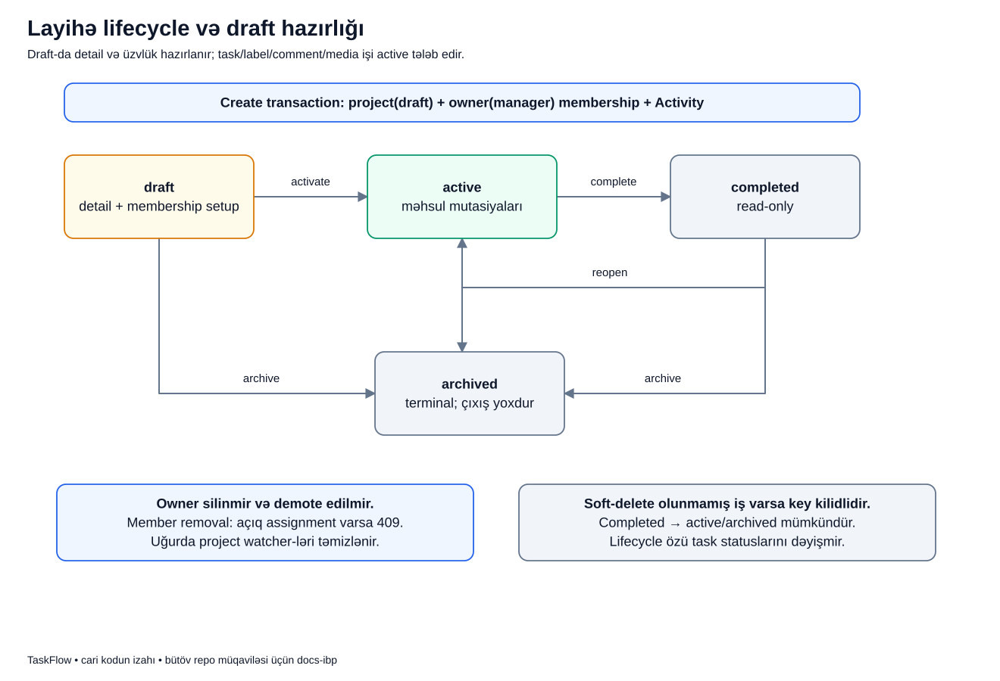

# Layihə necə hazırlanır, işləyir və bağlanır?

## Məqsəd

Layihə yalnız işlərin saxlandığı qovluq deyil. Onun komandası, sahibi və həyat dövrü var. Sistem «hələ hazırlayırıq», «işləyirik» və «artıq dəyişməyək» vəziyyətlərini ayırır ki, bağlanmış layihədə təsadüfi iş yaradılmasın.

## Əvvəl terminlər

- **Lifecycle:** layihənin keçə biləcəyi vəziyyətlər və keçidlər.
- **Draft:** layihə hazırlanır; detallar və komanda düzəldilə bilər.
- **Active:** iş və əməkdaşlıq əməliyyatları açıqdır.
- **Completed:** adi dəyişikliklər bağlıdır, amma layihə yenidən açıla bilər.
- **Archived:** terminal vəziyyətdir; geri keçid yoxdur.
- **Owner:** layihənin sahibi; layihədə manager qalmalıdır.
- **Membership:** istifadəçinin layihəyə üzvlük qeydi.
- **Transaction:** bir-birinə bağlı DB yazılarının birlikdə tamamlanması.

Qlobal `project_manager` rolu ilə konkret layihədəki `manager` rolu fərqlidir. Layihə yaratmaq imkanın olması bütün digər layihələri avtomatik idarə etmək demək deyil.

## Nümunə hekayə

Bu, uydurulmuş tədris ssenarisidir. Aysel `PAY` adlı ödəniş layihəsini yaradır. Hələ heç bir iş açmadan Muradı komandaya əlavə etmək, tarixləri və təsviri hazırlamaq istəyir. Sonra layihəni aktivləşdirir, komanda işə başlayır.

Bir ay sonra Aysel layihəni completed edir. Yeni bug tapılanda onu yenidən active edir. Layihə tam dayandırılacaqsa archived seçir; bu sonuncu addımı «sonra açarıq» kimi qəbul etməməlidir.

## Diagram



Şəkildə status qutuları var, oxlar isə icazəli keçidləri göstərir. Hər statusdan hər statusa ox yoxdur; dropdown-a bir dəyər göndərmək backend qaydasını dəyişmir.

## Qutular və oxlar üzrə addımlar

1. **Create transaction:** project `draft` yazılır, Aysel owner olur, owner-manager üzvlüyü və Activity yaranır. Bunlar vahid use case-dir.
2. **Draft qutusu:** Aysel detallar və üzvləri hazırlaya bilər. Task, label, comment, watcher və media mutasiyaları hələ bağlıdır.
3. **Activate oxu:** `draft -> active` keçidi komandanın məhsul işi görməsinə yol açır.
4. **Active qutusu:** adi layihə və iş əməliyyatları icazələr daxilində açıqdır. «Active» istənilən istifadəçinin hər şeyi edə bilməsi demək deyil.
5. **Complete oxu:** `active -> completed` detallar/üzvlər və adi task əməkdaşlıq yazılarını bağlayır.
6. **Reopen oxu:** səlahiyyətli manager `completed -> active` edə bilər. Completed buna görə archived ilə eyni deyil.
7. **Archive oxları:** draft, active və completed vəziyyətlərindən archived-a keçid var. Archived-dan çıxış oxu yoxdur.
8. **Member removal qeydi:** açıq assignment varsa üzvü çıxarmaq bloklanır. Uğurlu çıxarılma həmin layihədəki watcher subscription-larını da təmizləyir.
9. **Owner qeydi:** owner üzvlükdən silinmir və member roluna endirilmir.
10. **Key qeydi:** hazırkı guard soft-delete olunmamış işlərin varlığına baxır. Bu məhdudiyyəti aşağıda ayrıca izah edirik.

Lifecycle keçidi task-ların statuslarını avtomatik dəyişmir. Layihəni completed etmək bütün task-ları `done` etmir; bunlar ayrı vəziyyətlərdir.

## Kiçik real kod parçası

`ProjectMemberService` üzvlük dəyişməsinin layihə vəziyyətini belə qoruyur:

```php
if (in_array($project->status, [ProjectStatus::Completed, ProjectStatus::Archived], true)) {
    throw new ProjectReadOnly('Completed and archived projects are read-only.');
}
```

- `in_array(...)` cari statusun completed və ya archived olduğunu yoxlayır.
- `true` müqayisəni strict edir; enum-lar təsadüfi string müqayisəsinə çevrilmir.
- Şərt doğrudursa exception yaranır; membership write-a keçilmir.
- Draft bu siyahıda olmadığı üçün komanda hazırlığına icazə var. «Yalnız active-də üzv əlavə edilir» demək bu kod üçün yanlış olardı.

Bu state yoxlaması actor-un manager olmasını əvəz etmir. Giriş icazəsini Policy, state invariantını service qoruyur.

## DB-də və ekranda nə qalır?

Create uğurludursa `projects` və `project_members` əlaqəli qeydləri, həmçinin Activity yaranır. Daxili write fail etsə eyni transaction rollback olur; yarımçıq owner-siz layihə uğur kimi qaytarılmır.

Üzvlük çıxarılması uğurludursa üzv sonrakı request-də layihəyə əvvəlki browse access-i saxlamır. Onun keçmiş reporter və comment müəllifliyi tarixçədən silinmir.

Completed/archived layihə görünə bilər, amma adi mutation control-ları istifadəyə açıq deyil. Backend də bunu yoxlayır; sadəcə button gizlətmək kifayət deyil.

## Cari key məhdudiyyətini anlayaq

`ProjectService::update()` key dəyişikliyini `existsForProject()` ilə bloklayır. Repository bu yoxlamada soft-deleted task-ları saymır. Bütün işlər soft-delete olunarsa key yenidən dəyişdirilə bilər; köhnə persisted task display key-ləri yenidən yazılmır, sequence sıfırlanmır.

Bu, nümunə götürüləsi «ideal tarixi identity dizaynı» kimi təqdim edilmir; cari kodun açıq məhdudiyyətidir. «İlk işdən sonra key tarix boyu heç dəyişə bilməz» zəmanəti verməməliyik.

## Xəta nümunələri

- Muradın açıq assignment-ı var: removal `member_has_open_assignments` conflict yaradır; əvvəl unassign/reassign edilməlidir.
- Aysel archived layihəni active etmək istəyir: keçid cədvəlində yoxdur, rədd edilir.
- Başqa istifadəçi owner-i member etmək istəyir: owner invariantı buna icazə vermir.
- Actor manager deyil: giriş policy-si əməliyyatı service-dən əvvəl rədd edə bilər.

## Tez suallar

**Completed niyə tam «heç nə etmək olmaz» deyil?** Adi data yazıları bağlıdır, amma manager üçün icazəli lifecycle keçidləri qalır.

**Draft-da komanda qurmaq sistemi pozur?** Xeyr, cari kodda məqsədli hazırlıq yoludur.

**Suspend cleanup read-only layihədə işləyə bilər?** Bəli. Account təhlükəsizlik cleanup-ı adi task edit deyil; xüsusi host use case-dir.

## Özünü yoxla

1. Draft-da task yaratmaq olarmı? **Xeyr.**
2. Draft-da üzv əlavə etmək olarmı? **İcazəli manager üçün bəli.**
3. Completed-dan hansı keçidlər var? **Active və archived.**
4. Archived-dan reopen varmı? **Xeyr.**
5. Project complete task-ları done edirmi? **Xeyr.**

## Mənbələr

- [ProjectService](../../../Modules/Projects/app/Services/ProjectService.php), [ProjectMemberService](../../../Modules/Projects/app/Services/ProjectMemberService.php), [ProjectStatus](../../../Modules/Projects/app/Enums/ProjectStatus.php), [ProjectPolicy](../../../Modules/Projects/app/Policies/ProjectPolicy.php).
- [Lifecycle/key testləri](../../../Modules/Projects/tests/Feature/ProjectLifecycleAndKeyTest.php), [üzvlük bütövlüyü](../../../Modules/Projects/tests/Feature/ProjectMemberIntegrityTest.php).
- Əsas sənədlər: [Projects](../../modules/PROJECTS.md), [biznes qaydaları](../../business/BUSINESS_RULES.md), [rollar](../../business/ROLES_AND_PERMISSIONS.md).
- [Diagram atlasına qayıt](../README.md).
