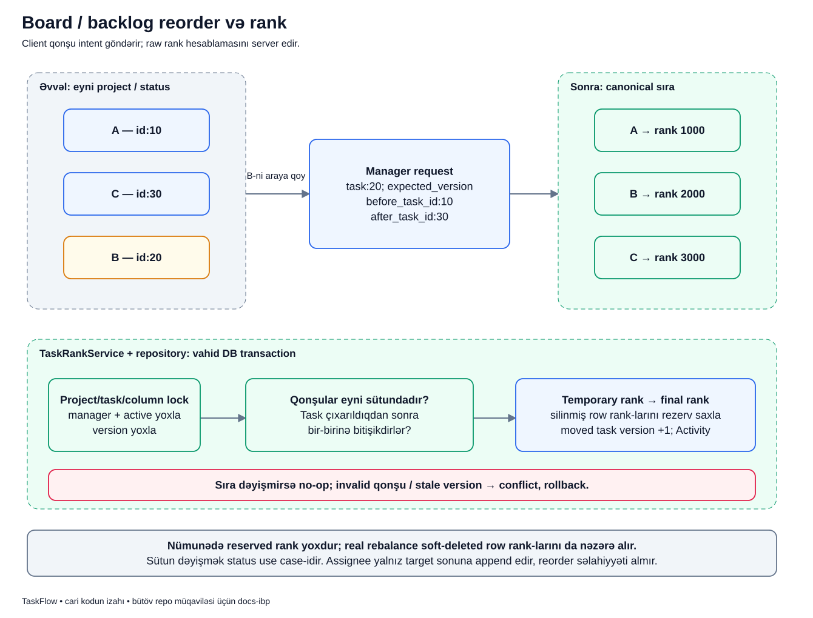

# Reorder: işi siyahıda başqa yerə qoymaq

## Məqsəd

Backlog-da bir işi daha əvvəl görmək istəyə bilərik. Bu onun priority-sini və ya statusunu dəyişmək deyil. Reorder eyni project/status sütununda işlərin sırasını dəyişir; server bütün siyahının uyğunluğunu qorumalıdır.

## Əvvəl terminlər

- **Rank:** DB-də saxlanılan sıralama dəyəri.
- **Priority:** low/medium/high/urgent vaciblik dərəcəsi; rank-dan ayrıdır.
- **Neighbor intent:** client-in rəqəm rank yox, qonşulara görə yer bildirməsi.
- **Rebalance:** serverin sıra üçün rank-ları yenidən paylaması.
- **Collision:** iki sətrin eyni unikal mövqeyə düşmə riski.
- **Reserved rank:** soft-deleted sətrin DB-də hələ tutduğu rank.
- **No-op:** istənən sıra artıq var; real dəyişiklik yoxdur.

## Nümunə

Bu, izah üçün nümunədir. Manager Aysel eyni backlog sütununda `A(id=10), C(id=30), B(id=20)` görür. B-ni A ilə C arasına qoymaq istəyir.

Client «rank=2000 yaz» demir. «Məndən əvvəl A, məndən sonra C olsun» bildirir. Digər request siyahını dəyişibsə server bu qonşuluğun hələ etibarlı olub-olmadığını yoxlayır.

## Diagram



Şəkildəki 1000/2000/3000 rəqəmləri rezerv rank olmayan sadə nümunədir. Real repository soft-deleted sətirləri də nəzərə aldığı üçün hər nəticənin bu üç rəqəmlə çıxacağı vəd edilmir.

## Qutular və oxlar

1. **Əvvəlki sıra:** task-lar eyni project/status sütunundadır. Başqa sütundakı task-ı bu endpoint-lə gizlicə gətirmək olmaz.
2. **Manager request:** task ID-si, expected version və iki qonşu ID-si göndərilir.
3. **Project/task/column lock:** server eyni sıra üzərində paralel yazıları idarə etmək üçün lock alır.
4. **Manager + active:** yalnız manager authority və active layihə açıq reorder edə bilər.
5. **Version:** daşınan task əvvəl oxunandan sonra dəyişibsə conflict yaranır.
6. **Qonşu yoxlaması:** task siyahıdan müvəqqəti çıxarılır; göstərilən qonşular qalan siyahıda olmalıdır. İki qonşu varsa yanaşı olmalıdırlar.
7. **Temporary rank:** bir neçə sətirin rank-ını dəyişərkən unikal constraint-ə ara mərhələdə toqquşmamaq üçün keçici dəyərlər istifadə edilir.
8. **Final rank:** server yeni canonical sıraya uyğun dəyərləri yazır; soft-deleted rank-lar rezerv hesablanır.
9. **Moved task version + Activity:** daşınan task-ın versiyası artır, reorder auditi yazılır. Sıra dəyişmirsə no-op olur.

## `before` və `after`-i düzgün oxu

```json
{
  "before_task_id": 10,
  "after_task_id": 30,
  "expected_version": 3
}
```

Burada `before_task_id` **daşınan task-dan əvvəl gələn** qonşudur. `after_task_id` isə **ondan sonra gələn** qonşudur. Nəticə `10 → 20 → 30`-dur.

Yalnız before varsa onun ardınca, yalnız after varsa onun qabağına qoyulur. İkisi də boşdursa sona yerləşir. Adlardan çıxardığın fərziyyəni repository davranışı ilə yoxlamaq vacibdir.

## Real koddan yerləşdirmə qaydası

```php
$insertAt = match (true) {
    $afterTaskId !== null => array_search($afterTaskId, $ids, true),
    $beforeTaskId !== null => array_search($beforeTaskId, $ids, true) + 1,
    default => count($ids),
};
array_splice($ids, $insertAt, 0, [$task->id]);
```

- `$ids` daşınan task çıxarıldıqdan sonra qalan sıralı ID-lərdir.
- Sonrakı qonşu varsa onun indeksi seçilir: yeni task onun qabağına düşəcək.
- Yalnız əvvəlki qonşu varsa onun indeksinə 1 əlavə edilir.
- Qonşu yoxdursa `count($ids)` siyahının sonunu göstərir.
- `array_splice` ID-ni həmin mövqeyə yerləşdirir; DB rank write-ları sonrakı mərhələdir.

## Uğurdan sonra nə dəyişir?

Ekran yenidən canonical sıranı göstərməlidir. Task eyni statusda qalır; bu əməliyyat status transition deyil. Daşınan task-ın versiyası artır və Activity yazılır.

Rebalance zamanı qonşuların rank-ı da dəyişə bilər, amma repository daşınmayan sətirlərin tarix/versiya davranışını ayrıca idarə edir. «Rank dəyişdi, deməli bütün task-lar istifadəçi tərəfindən edit edildi» nəticəsi çıxarmaq olmaz.

## Xəta və no-op nümunələri

- Qonşu başqa project/status-dadır: `invalid_task_rank_position` conflict.
- A və C artıq yanaşı deyil: client köhnə siyahıya əsaslanır, refresh lazımdır.
- Expected version köhnədir: `task_version_conflict`.
- Adi assignee reorder etməyə çalışır: manager-only qaydası rədd edir.
- Task artıq istənən yerdədir: əlavə reorder Activity-si və moved-version artımı yoxdur.

Write zamanı exception transaction-u rollback edir; yarımçıq temporary rank vəziyyəti uğur kimi saxlanmamalıdır.

## Tez suallar

**Urgent seçsəm task mütləq birinci olur?** Xeyr. Priority ilə rank ayrı anlayışlardır.

**Soft-deleted task niyə hesablanır?** Sətir DB-də qalır, unikal project/status/rank constraint-i onu da görür. Görünməyən rank-ı təkrar istifadə etmək collision yarada bilər.

**Drag/drop başqa sütuna atırsa bu reorder-dir?** Status dəyişməsi ayrıca use case-dir. Tək reorder intent-i ilə workflow bypass edilmir.

## Özünü yoxla

1. Client raw rank göndərirmi? **Xeyr.**
2. İki qonşu hansı vəziyyətdə olmalıdır? **Eyni sütunda, daşınan task çıxarıldıqdan sonra yanaşı.**
3. No-op yeni audit yaradırmı? **Xeyr.**
4. Reorder statusu dəyişirmi? **Xeyr.**

## Mənbələr

- [TaskRankService](../../../Modules/Tasks/app/Services/TaskRankService.php), [task repository](../../../Modules/Tasks/app/Repositories/Eloquent/EloquentTaskRepository.php), [TaskRankSequence](../../../Modules/Tasks/app/Support/TaskRankSequence.php).
- [Rank testləri](../../../Modules/Tasks/tests/Feature/TaskRankTest.php), [board testləri](../../../Modules/Tasks/tests/Feature/TaskBoardTest.php), [rank migration testləri](../../../Modules/Tasks/tests/Feature/TaskRankMigrationTest.php).
- Əsas sənədlər: [Tasks](../../modules/TASKS.md), [REST rank müqaviləsi](../../technical/API.md), [rank/priority/issue number](../../extended/rank-priority-issue-number.md).
- [Diagram atlasına qayıt](../README.md).
