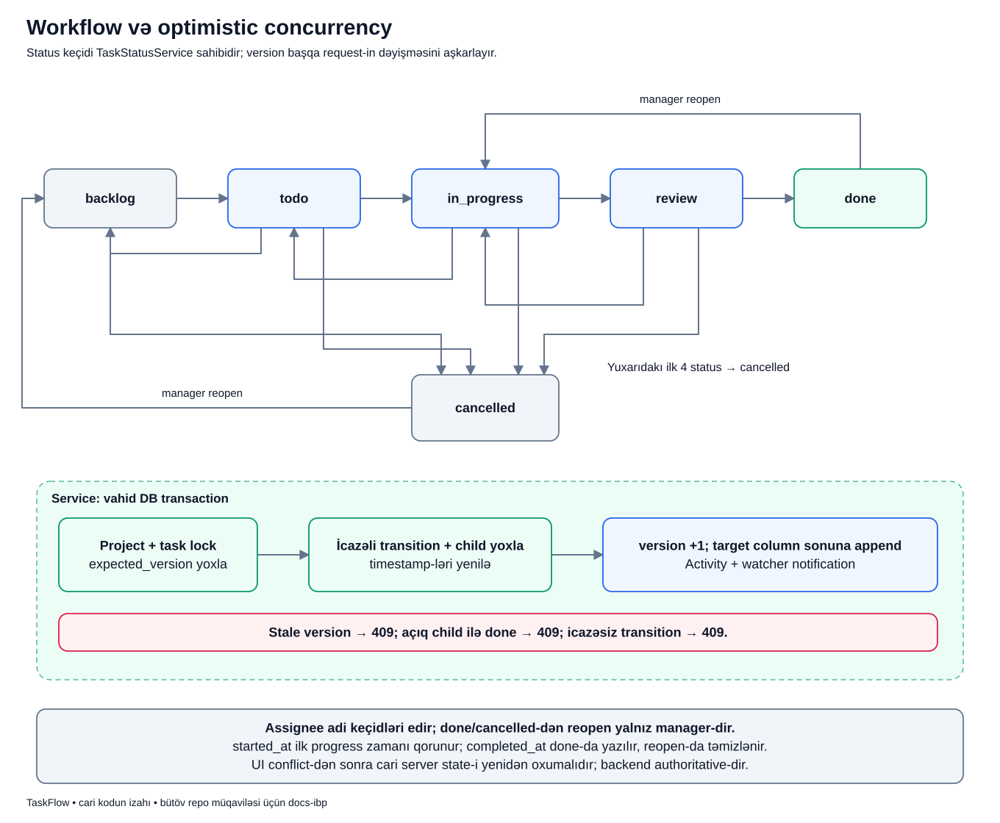

# Status dəyişməsi: yalnız bir sözün dəyişməsi deyil

## Məqsəd

İşi `todo`-dan `in_progress`-ə keçirmək «başladım», `review`-a keçirmək «yoxlanmağa hazırdır» deməkdir. Sistem bu məlumatın düzgün ardıcıllıqla, düzgün şəxs tərəfindən və köhnə state-i əzmədən yazılmasını qoruyur.

## Əvvəl terminlər

- **Workflow:** statuslar və icazəli keçidlər cədvəli.
- **Transition:** bir statusdan digərinə keçid.
- **Assignee:** işin məsul şəxsi; adi progress keçidlərini edə bilir.
- **Reopen:** done/cancelled işin yenidən açıq axına qaytarılması.
- **`version`:** serverdə task-ın cari dəyişiklik versiyası.
- **`expected_version`:** client-in oxuduğu və dəyişməmiş saydığı versiya.
- **Concurrency conflict:** request hazırlanarkən gördüyün məlumat artıq dəyişib.
- **Timestamp:** başlanma/tamamlanma vaxtı məlumatı.

## Nümunə

Bu, uydurulmuş tədris nümunəsidir. Lalə `PAY-42` assignee-sidir. Səhifəni açanda status `todo`, versiya `3` idi. Lalə işi `in_progress` etmək istəyir və `expected_version=3` göndərir.

Eyni vaxtda manager Aysel işi başqa adama assign edibsə versiya artıq `4` ola bilər. Lalənin köhnə ekranda yazdığı request bu dəyişikliyi nəzərə almır. Server «əvvəl yenidən oxu» deyərək onu rədd etməlidir.

## Diagram



Yuxarıdakı status qutuları keçid xəritəsidir. Aşağıdakı geniş transaction hissəsi isə hər icazəli keçid zamanı görülən işləri göstərir. Oxların hər biri «istənilən actor edə bilər» mənasını vermir.

## Status oxları necə oxunur?

1. `backlog -> todo` planlanan işin icraya hazırlanmasıdır; backlog-dan birbaşa done oxu yoxdur.
2. `todo -> in_progress -> review -> done` əsas irəliləyiş yoludur.
3. `todo -> backlog`, `in_progress -> todo`, `review -> in_progress` kimi geri keçidlər var.
4. İlk dörd açıq statusdan `cancelled` keçidi var. Assignee uyğun authority ilə bu açıq-status keçidlərini edə bilər.
5. `done -> in_progress` və `cancelled -> backlog` reopen keçidləridir; yalnız manager üçündür.

Manager olmaq da cədvəldən kənar hər keçidi icad etmək demək deyil. O, icazəli keçidlər arasında daha geniş authority-yə malikdir.

## Transaction hissəsini izləyək

1. **Project/task lock:** rank və status mutation-u üçün cari context repository-dən lock ilə alınır.
2. **Expected version:** client-in bildiyi versiya serverdəki ilə müqayisə edilir.
3. **Transition + child:** actor-un keçid səlahiyyəti, active layihə və parent-i done etməyə açıq subtask maneəsi yoxlanır.
4. **Timestamp:** ilk `in_progress` başlanma vaxtını yaradır; done tamamlanma vaxtını yaradır.
5. **Version + rank:** task versiyası artırılır, iş yeni status sütununun sonuna yerləşdirilir.
6. **Activity + notification:** köhnə/yeni state auditə yazılır və uyğun watcher-lər üçün bildiriş hazırlanır.
7. **Commit:** həmin DB addımları birlikdə tamamlanır; response bundan sonra uğur sayılır.

## Real koddan versiya yoxlaması

```php
$task = $this->tasks->lockForRankMutation($task);
if ($task->version !== $data->expectedVersion) {
    throw new TaskVersionConflict('This task was changed by another request.');
}
```

- Birinci sətir sadəcə köhnə controller modelinə güvənmir; repository-dən locked cari task alır.
- İkinci sətir iki versiyanın dəqiq eyni olub-olmadığını yoxlayır.
- Fərq varsa exception atılır və bu transaction davam etmir.
- Sonrakı status/rank/tarix yazıları bu yoxlamanı keçməyən request üçün edilmir.

`expected_version` «istədiyim yeni versiya» deyil. Client `100` göndərməklə serverin versiyasını `100` etmir; yalnız bildiyi state-i bildirir.

## Uğurdan sonra ekran və DB

Birinci nümunədə başqa dəyişiklik yoxdursa status `in_progress`, versiya `4` olur, iş target sütunun sonuna keçir. `started_at` ilk dəfə yazılır. Task detail və Recent activity yenilənmiş server state-i göstərməlidir.

`TaskStatusSelector` uğurlu Livewire mutation-dan sonra tam task-detail redirect edir. Bu, component xaricindəki header badge və control-ların köhnə state-də qalmamasına kömək edir. JavaScript-siz form da service-dən sonra server redirect-i istifadə edir.

## Tarixlərin mənası

`started_at` ilk başlanma tarixçəsidir. İşi todo-ya geri qaytarmaq və yenidən başlamaq onu hər dəfə sıfırlamır.

`completed_at` done-a keçəndə yazılır; done-dan reopen olanda təmizlənir. Cancelled olmaq done olmaq deyil. Dashboard completed-today hesabı da bu fərqi nəzərə alır.

## Xəta nümunələri

- Köhnə versiya: API `task_version_conflict` 409 verir; client işi yenidən oxumalıdır.
- Açıq child-ı olan parent-i done etmək: keçid rədd edilir, parent done olmur.
- Cədvəldə olmayan keçid: `invalid_task_status_transition` conflict yaranır.
- Assignee olmayan adi üzv: entry policy status əməliyyatını rədd edə bilər.
- Audit/notification write exception-u: transaction-dakı status/rank/tarix dəyişiklikləri rollback olur.

Conflict-dən sonra yeni versiyanı təxmin edib təkrar request göndərmək düzgün deyil. İstifadəçi artıq dəyişmiş assignee və statusu görməli, qərarını yeni məlumatla verməlidir.

## Tez suallar

**Task versiyası yalnız status dəyişəndə artır?** Xeyr. Detail və assignment kimi başqa əməliyyatlar da artıra bilər; buna görə status səhifəsi köhnələ bilər.

**Statusu dəyişmək eyni sütunda istədiyim yerə reorder etməkdir?** Xeyr. Status move target sonuna append edir; açıq reorder manager-only ayrı use case-dir.

**Frontend uğur göstəribsə DB authoritative deyil?** DB/server nəticəsi əsasdır. UI optimistik göstərsə belə server conflict-i nəzərə alınmalıdır.

## Özünü yoxla

1. Expected version yeni versiya seçmək üçündür? **Xeyr, köhnə state-i yoxlamaq üçündür.**
2. Done-dan assignee təkbaşına reopen edə bilər? **Xeyr.**
3. Status move yeni sütunda hara yerləşir? **Sona.**
4. Reopen completed_at-ı saxlayır? **Done-dan çıxışda təmizləyir.**

## Mənbələr

- [TaskStatusService](../../../Modules/Tasks/app/Services/TaskStatusService.php), [TaskTransitionRules](../../../Modules/Tasks/app/Support/TaskTransitionRules.php), [TaskStatusTimestamps](../../../Modules/Tasks/app/Support/TaskStatusTimestamps.php), [TaskStatus enum-u](../../../Modules/Tasks/app/Enums/TaskStatus.php).
- [Workflow testləri](../../../Modules/Tasks/tests/Feature/TaskWorkflowTest.php), [Livewire status testləri](../../../Modules/Tasks/tests/Feature/TaskStatusSelectorLivewireTest.php).
- Əsas sənədlər: [Tasks](../../modules/TASKS.md), [biznes workflow-u](../../business/BUSINESS_RULES.md), [optimistic concurrency](../../extended/optimistic-concurrency.md).
- [Diagram atlasına qayıt](../README.md).
