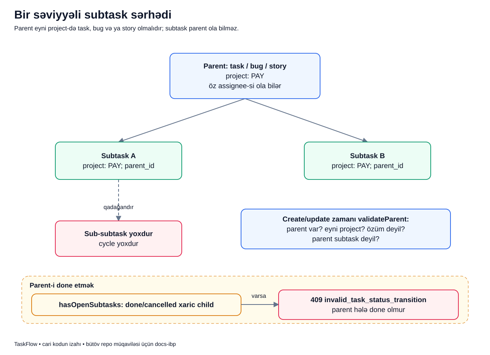

# Subtask: böyük işi bir səviyyə parçalamaq

## Məqsəd

Bir işin içində daha kiçik məsuliyyətləri ayrıca izləmək lazım ola bilər. TaskFlow bunun üçün bir səviyyəli subtask verir. Bu, sərhədsiz ağac, epic və ya işlərarası dependency sistemi deyil.

## Əvvəl terminlər

- **Parent:** subtask-ın bağlı olduğu əsas iş.
- **Child/subtask:** həmin parent-in alt işi.
- **Hierarchy:** parent-child quruluşu.
- **Cycle:** obyektlərin dolanaraq bir-birinin parent-i olması.
- **Cross-project parent:** başqa layihənin işini parent seçmək.
- **Open child:** hazırda done/cancelled olmayan, soft-delete olunmamış alt iş.
- **Invariant:** hər uyğun caller üçün qorunmalı biznes qaydası.

## Nümunə

Bu, uydurulmuş nümunədir. `PAY-42` story-si «Ödəniş qəbzini göstər» işidir. Komanda iki subtask açır: Lalə «API cavabını hazırla», Murad «Ekranı hazırla» üzərində işləyir.

Hər iki subtask PAY layihəsindədir. Parent Ayselə, child-lar başqa şəxslərə assign oluna bilər. Parent-ə baxmaq child-ların hamısının eyni adama verilməsi demək deyil.

## Diagram



Yuxarıdakı iki ox parent-child əlaqəsini göstərir. Qırmızı qadağa qutusu subtask-ın altında bir subtask səviyyəsi daha açılmadığını bildirir. Aşağıdakı yol isə parent-i done etmək cəhdini göstərir.

## Hər hissəni oxuyaq

1. **Parent qutusu:** parent yalnız `task`, `bug` və ya `story` ola bilər. «Standard parent» ifadəsinin buradakı mənası budur.
2. **İki subtask qutusu:** hər biri eyni layihəyə bağlıdır və `parent_id` ilə əsas işi göstərir.
3. **Ayrı assignee:** child və parent-in məsul şəxsləri bir-birindən asılı deyil.
4. **Sub-subtask qadağası:** parent özü subtask ola bilməz. Sistem bir səviyyə ilə sadə saxlanılır.
5. **Create/update validation:** parent mövcuddurmu, eyni project-dədir, task özü deyil və subtask deyilmi — bunlar service-də yoxlanır.
6. **Parent done cəhdi:** status service `hasOpenSubtasks()` ilə açıq child axtarır.
7. **409 budağı:** açıq child varsa parent-in done keçidi rədd edilir; parent əvvəlki statusunda qalır.

Bu yoxlama statusu dəyişmək cəhdinin invariantıdır. Child yaratmaq parent-in statusunu avtomatik irəli/geri aparmır; ayrıca progress hesablayıcısı yoxdur.

## Kiçik real kod

`TaskService::validateParent()` metodunun bu hissəsi əsas sərhədi göstərir:

```php
$parent = $this->tasks->findForProject($project, $parentId);
if ($parent === null || $parent->id === $task?->id) {
    throw new ParentTaskInvalid('The subtask parent must belong to the same project.');
}
if ($parent->type === TaskType::Subtask) {
    throw new ParentTaskInvalid('A subtask cannot have another subtask as parent.');
}
```

- Repository parent-i sərbəst global ID ilə yox, verilmiş layihənin içində tapır.
- Tapılmırsa yanlış/görünməyən project relation-u qəbul edilmir.
- Update zamanı task özünü parent göstərə bilməz.
- Parent-in type-ı subtask-dırsa ikinci hierarchy səviyyəsi rədd edilir.
- Method-un başqa hissəsində subtask üçün parent-in mütləq verilməsi, standard iş üçün parent verilməməsi də yoxlanır.

## Uğurdan sonra DB və ekran

Child ayrıca `tasks` sətridir: öz issue key-i, title-ı, statusu, version-u və assignee-si var. `parent_id` əsas işə işarə edir. Parent-in bütün məlumatı child-a kopyalanmır.

Məsələn, parent-in priority-sini dəyişmək child priority-lərini avtomatik dəyişmir. Child-ı done etmək parent-i avtomatik done etmir. Bu sistemdə avtomatik roll-up workflow-u yoxdur.

## Parent-i nə vaxt done etmək olar?

Status keçidi cədvəli və actor authority uyğun olmalıdır. Bundan əlavə açıq child qalmamalıdır. Child done və ya cancelled-dirsə açıq child sayılmır. «Bütün child-lar done olmalıdır» cümləsi cancelled halını nəzərə almadığı üçün dəqiq deyil.

Bu guard parent-i done etmə cəhdində işləyir; hər başqa use case-in parent statusunu avtomatik düzəltməsi mənasına gəlmir.

## Xəta nümunələri

- `HR` layihəsinin işini PAY subtask-ına parent seçmək: parent invariantı rədd edir.
- Subtask yaratmaq, amma parent verməmək: input/domain validation nəticəsi yaranır.
- Mövcud child-ları olan task-ı subtask-a çevirmək: əlavə hierarchy yaranmaması üçün rədd edilir.
- Review-dəki parent-i açıq child ilə done etmək: status conflict, parent done olmur.

Create/update transaction-u fail etsə yarımçıq yeni relation uğur kimi saxlanmır. Parent-in mövcud olması authorization yoxlamasını əvəz etmir.

## Tez suallar

**Subtask başqa project-də ola bilər?** Xeyr, parent ilə eyni project-də olmalıdır.

**Subtask ayrıca assignee və issue key daşıyır?** Bəli.

**Parent done olsa child statusu avtomatik done olur?** Xeyr. Avtomatik cascading status mexanizmi yoxdur.

**Bu dependency sistemi sayılır?** Xeyr. Parent-child modeli var, ümumi blocker/dependency qrafı yoxdur.

## Özünü yoxla

1. Bug parent ola bilər? **Bəli.**
2. Subtask parent ola bilər? **Xeyr.**
3. Child cancelled-dirsə açıq sayılır? **Xeyr.**
4. Child done olanda parent avtomatik done olur? **Xeyr.**

## Mənbələr

- [TaskService parent validation](../../../Modules/Tasks/app/Services/TaskService.php), [TaskStatusService](../../../Modules/Tasks/app/Services/TaskStatusService.php), [task repository](../../../Modules/Tasks/app/Repositories/Eloquent/EloquentTaskRepository.php).
- [Type/subtask testləri](../../../Modules/Tasks/tests/Feature/TaskTypeAndSubtaskTest.php), [workflow testləri](../../../Modules/Tasks/tests/Feature/TaskWorkflowTest.php).
- Əsas sənədlər: [biznes qaydaları](../../business/BUSINESS_RULES.md), [Tasks](../../modules/TASKS.md), [məlumat modeli](../../technical/DATA_MODEL.md).
- [Diagram atlasına qayıt](../README.md).
