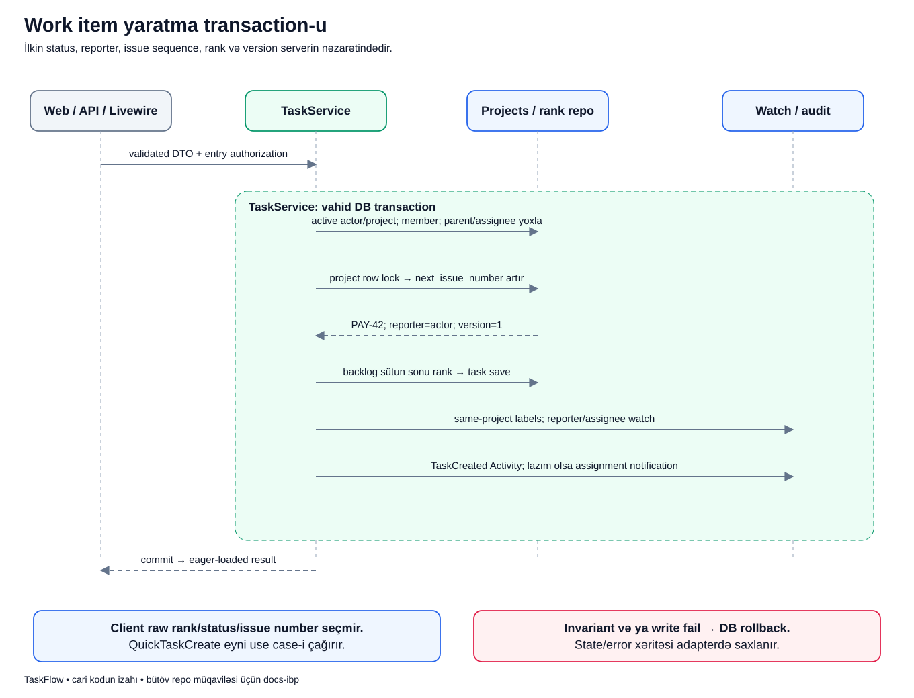

# Yeni iş yaradılarkən server nə edir?

## Məqsəd

İstifadəçi title yazıb Save basır, amma sistem təkcə title saxlamır. Layihə nömrəsini ayırır, işi düzgün sütuna yerləşdirir, reporter-i müəyyən edir, watcher və audit yazılarını hazırlayır. Bunların niyə bir use case olduğu bu flow-da görünür.

## Əvvəl terminlər

- **Task/work item:** task, bug, story və ya bir səviyyəli subtask.
- **Reporter:** işi yaradan actor; DB-də `creator_id`.
- **Assignee:** işi görməyə cavabdeh sıfır və ya bir istifadəçi.
- **Issue key:** `PAY-42` kimi layihə kodu + layihəyə məxsus nömrə.
- **Sequence:** layihənin növbəti iş nömrəsi sayğacı.
- **Rank:** bir status sütununda işin yeri; prioritet deyil.
- **DTO:** yoxlanmış input-u service-ə daşıyan məqsədli obyekt.
- **Lock:** eyni məlumatı dəyişən paralel request-lərin bir-birinə mane olmadan növbələnməsinə kömək edən DB qoruması.

## Nümunə

Bu, tədris üçün qurulmuş hekayədir. Murad aktiv `PAY` layihəsində «Ödənişdən sonra səhifə donur» adlı bug report edir. O, işi hələ heç kimə assign etmir. Layihənin növbəti issue nömrəsi nümunədə `42`-dir.

Murad client-dən `done`, `rank=1` və ya `reporter_id=Aysel` göndərib bu sahələri özü seçməməlidir. Yeni işin başlanğıc state-i server qaydasıdır.

## Diagram



Dörd sütun dörd ayrı server demək deyil. Onlar eyni tətbiqdə hansı hissənin nə etdiyini göstərir: adapter, Tasks service-i, project/rank persistence və əməkdaşlıq yan təsirləri.

## Addım-addım oxuyaq

1. **Web / API / Livewire:** giriş nöqtəsi dəyişə bilər, əsas create use case-i eynidir. Request input-u yoxlayır və uyğun giriş authorization-u edilir.
2. **Validated DTO:** yalnız lazım olan title, type, priority, assignee, parent, label və tarix məlumatı service-ə ötürülür.
3. **Active actor/project:** service actor-un aktivliyini, layihənin active olduğunu və iştirak authority-sini yoxlayır. UI-nin açıq görünməsi bu yoxlamanı əvəz etmir.
4. **Parent/assignee:** subtask parent-i uyğun layihədən olmalıdır; assignee aktiv layihə üzvü olmalıdır. Adi üzv başqasına assign edə bilməz.
5. **Project lock + sequence:** Projects layihə sətrini lock edir, nömrəni ayırır və sayğacı artırır. İki paralel create eyni nömrəni almamalıdır.
6. **Identity/state:** `PAY-42`, `creator_id=Murad`, `version=1`, `status=backlog` hazırlanır.
7. **Backlog sonu rank:** repository işi mövcud backlog sütununun sonuna yerləşdirir. Client xam rank hesablamır.
8. **Label/watch:** eyni-layihə label-ları bağlanır; reporter və ayrıca assignee varsa o da watcher olur.
9. **Audit/notification:** `TaskCreated` Activity yazılır. Create zamanı actor-dan fərqli assignee varsa uyğun assignment notification axını da çağırılır.
10. **Commit və hazır nəticə:** bütün DB mərhələləri uğurludursa transaction tamamlanır, response üçün relation-ları hazırlanmış task qaytarılır.

## Real koddan kiçik hissə

`TaskService::create()` daxilində server-owned sahələr belə qurulur:

```php
$allocatedIssue = $this->projects->allocateIssueNumber($project);
$task = new Task([
    'number' => $allocatedIssue->displayKey,
    'issue_number' => $allocatedIssue->issueNumber,
    'version' => 1,
    'project_id' => $project->id, 'creator_id' => $actor->id, 'assignee_id' => $data->assigneeId, 'type' => $data->type, 'parent_id' => $parent?->id,
    'title' => $data->title, 'description' => $data->description, 'status' => TaskStatus::Backlog,
    'priority' => $data->priority, 'due_at' => $data->dueAt,
]);
```

- Birinci sətir layihə üçün nömrə ayırır; title-dan təsadüfi ID düzəltmir.
- `number` ekranda istifadə olunan display key-dir.
- `issue_number` onun layihəyə məxsus ədədi hissəsidir.
- `version=1` yeni işin başlanğıc dəyişiklik versiyasıdır.
- `creator_id` validated request-dəki sərbəst reporter-dən yox, authenticated actor-dan gəlir.
- `status` birbaşa `Backlog` seçilir; DTO-dan ilkin status götürülmür.
- `new Task` hələ bütün write axını deyil: sonrakı rank collaborator-u task-ı saxlayır və digər əlaqələr tamamlanır.

## Uğurdan sonra DB və ekran

Muradın işi backlog-da `PAY-42` kimi görünür. Tasks sətri, watcher əlaqəsi və Activity var; label seçilibsə onun əlaqələri də var. Project sequence nümunədə növbəti nömrəyə keçib.

Rank prioritetə görə avtomatik «urgent birinci olsun» sırası deyil. Priority işin vacibliyi, rank isə həmin sütundakı əl ilə idarə olunan yerdir.

## Yarımçıq create olarsa?

Məsələn, label başqa layihəyə aiddirsə və ya DB write/Activity mərhələsi fail edirsə exception transaction-u rollback edir. Eyni transaction-dakı task, sequence və əlaqələr yarımçıq uğur kimi saxlanmır. Response istifadəçiyə uğur kimi təqdim edilmir.

Draft/completed/archived layihədə create açıq deyil. Görünməyən layihə ID-si göndərmək də actor-a access qazandırmır; API entry point görünürlük sərhədi ilə layihəni həll edir.

## Tez suallar

**QuickTaskCreate başqa, sadələşdirilmiş task yazır?** Xeyr. Eyni Tasks create use case-inə gedir.

**Niyə reporter avtomatik watcher olur?** Yaradan şəxs işi izləməyə başlayır, amma sonradan explicit unwatch edə bilər.

**Assignee boşdursa task görünməz olur?** Xeyr. Layihə üzvləri bütün layihə işlərini görə bilir.

**Eloquent model yaratmaqla iş bitirmi?** Xeyr. Persistence, rank, əlaqələr və audit tam use case-in hissələridir.

## Özünü yoxla

1. İlkin statusu kim seçir? **Server, backlog olaraq.**
2. Reporter hansı istifadəçidir? **Authenticated actor.**
3. Rank və priority eynidirmi? **Xeyr.**
4. Başqa layihənin label-ı keçərmi? **Xeyr.**
5. Activity write fail olsa create uğur sayılırmı? **Bu transaction daxilində xeyr, rollback olur.**

## Mənbələr

- [TaskService](../../../Modules/Tasks/app/Services/TaskService.php), [CreateTaskData](../../../Modules/Tasks/app/Data/CreateTaskData.php), [ProjectService](../../../Modules/Projects/app/Services/ProjectService.php), [task repository](../../../Modules/Tasks/app/Repositories/Eloquent/EloquentTaskRepository.php).
- [Issue allocation testləri](../../../Modules/Tasks/tests/Feature/ProjectLocalIssueAllocationTest.php), [visibility/mutation](../../../Modules/Tasks/tests/Feature/TaskVisibilityAndMutationTest.php), [subtask testləri](../../../Modules/Tasks/tests/Feature/TaskTypeAndSubtaskTest.php).
- Əsas sənədlər: [Tasks](../../modules/TASKS.md), [data model](../../technical/DATA_MODEL.md), [transaction sərhədləri](../../technical/TRANSACTIONS_AND_FAILURES.md).
- [Diagram atlasına qayıt](../README.md).
