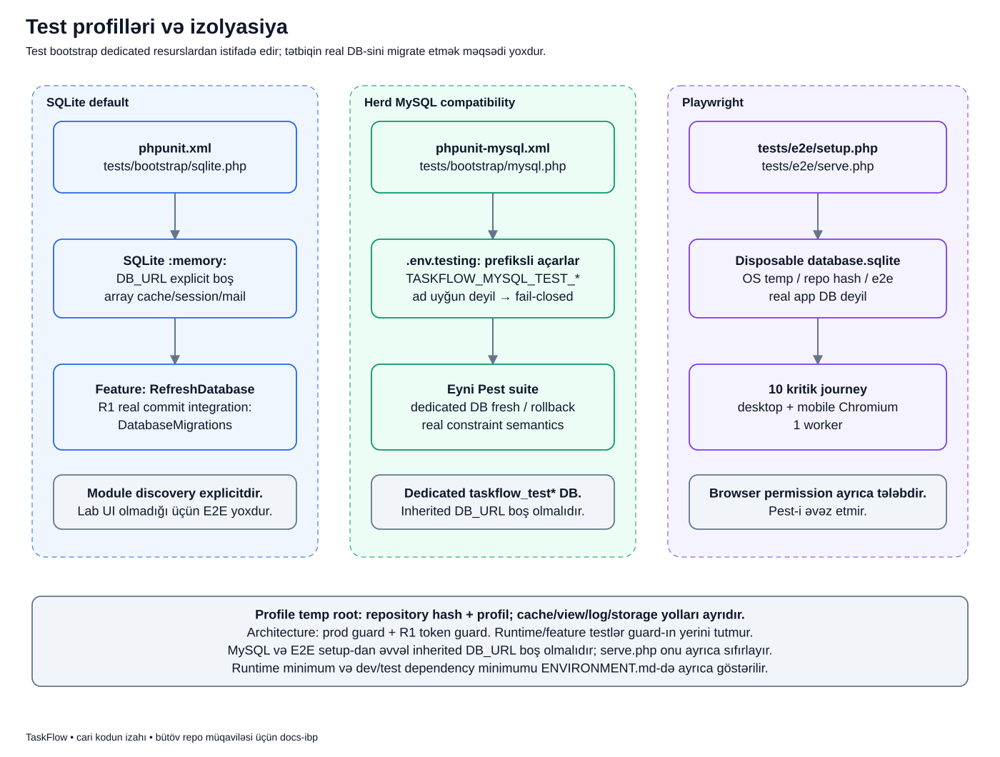

# Test işləyəndə niyə real məlumatlara toxunmamalıyıq?

[Diagram atlasına qayıt](../README.md) · [Test qaydaları](../../technical/TESTING.md)

## Məqsəd nədir?

Test bəzən istifadəçi yaradır, task silir, migration işlədərək cədvəlləri yenidən qurur.
Bunlar proqramın doğru işlədiyini yoxlamaq üçündür, real istifadəçinin məlumatını dəyişmək üçün deyil.
Ona görə testlərin ayrıca database, storage, session və cache sahəsinə ehtiyacı var.

Leyla adlı developer burada yalnız izah ssenarisidir.
Leyla öz lokal TaskFlow məlumatını saxlayaraq test suite-i öyrənmək istəyir.
Bu səhifə test mühitini izah edir; onu oxumaq real migration və ya browser automation işlətmək göstərişi deyil.

## Əvvəl terminləri anlayaq

- **Suite**: birlikdə işləyən testlər toplusudur.
- **Profile**: suite-in hansı mühit quruluşu ilə işlədiyidir; burada SQLite, MySQL və E2E ayrı yollardır.
- **Bootstrap**: test başlamazdan əvvəl mühiti hazırlayan PHP faylıdır.
- **Fixture**: yalnız test ssenarisi üçün hazırlanan müvəqqəti məlumatdır.
- **Isolation / izolyasiya**: testin real tətbiq resursundan və başqa test profilindən ayrılmasıdır.
- **SQLite `:memory:`**: database-in həmin process-in yaddaşında saxlanmasıdır.
- **Dedicated DB**: yalnız test üçün ayrılmış database-dir.
- **Fail-closed**: təhlükəsiz şərt təsdiqlənmirsə davam etməməkdir.
- **RefreshDatabase**: testlər arasında DB vəziyyətini idarə edən Laravel test mexanizmidir; adətən test transaction-undan istifadə edir.
- **Real commit**: ən xarici transaction-un həqiqətən tamamlanmasıdır.
- **E2E / journey**: istifadəçinin brauzerdə gördüyü bir işi başlanğıcdan sona yoxlamaqdır.
- **Worker**: paralel test icra edən prosesdir.

“Test keçdi” yalnız həmin testin yoxladığı davranış barədə sübutdur.
Bu, bütün security qaydalarının və bütün real istifadəçi vəziyyətlərinin avtomatik yoxlandığı demək deyil.

## Üç ayrı ssenari

Leyla əvvəl sürətli backend testlərini SQLite ilə yoxlayır.
Sonra SQLite və MySQL constraint davranışının fərqlənə biləcəyini nəzərə alıb dedicated Herd MySQL profilini istifadə edir.
Brauzerdə board/form kimi kritik journey-lər üçün isə ayrıca E2E fixture və server hazırlanır.

Üç yolun olması üç production database istifadə etdiyimiz demək deyil.
Bunlar yoxlama üçün ayrılmış mühitlərdir.
Qəbul platforması Windows + Laravel Herd-dir; ayrıca Unix/Linux gate-i bu layihənin müqaviləsi deyil.

## Şəkildə hər sütun nə göstərir?

Soldakı mavi sütun default SQLite, ortadakı yaşıl sütun Herd MySQL compatibility, sağdakı bənövşəyi sütun Playwright üçündür.
Sütunlar alternativ yoxlama yollarıdır; soldan sağa database köçürmə əməliyyatı deyil.

1. **SQLite başlanğıcı**: `phpunit.xml` və `tests/bootstrap/sqlite.php` mühiti hazırlayır.
2. **Yaddaş DB-si**: `:memory:` seçilir, `DB_URL` açıq şəkildə boş qoyulur. Cache/session/mail array, queue isə sync olur.
3. **Feature testlər**: `RefreshDatabase` istifadə edir. R1 real commit Integration testləri üçün ayrıca `DatabaseMigrations` seçilib.
4. **MySQL başlanğıcı**: `phpunit-mysql.xml` və `tests/bootstrap/mysql.php` eyni Pest suite-i başqa DB mühərrikində yoxlayır.
5. **Prefiksli config**: `.env.testing` içindəki `TASKFLOW_MYSQL_TEST_*` açarları oxunur; database adı uyğun deyilsə bootstrap dayanır.
6. **Dedicated MySQL DB**: test migration/fresh/rollback real app DB-sində yox, yalnız ayrılmış test DB-sində olmalıdır.
7. **Playwright hazırlığı**: `tests/e2e/setup.php` OS temp içində repo hash-i və `e2e` profili ilə ayrılmış `database.sqlite` hazırlayır.
8. **E2E server və journey**: `serve.php` həmin fixture DB-si ilə işləyir; 10 kritik journey desktop/mobile variantında bir worker ilə yoxlanır.

Aşağıdakı qeyd sahəsi üç yol üçün vacib məhdudiyyətləri göstərir.
Temp qovluq profil üzrə ayrıdır, amma eyni profili iki müstəqil process paralel işlədərsə toqquşma riski qalır.
“Temp-dir” sözü “hər process-ə avtomatik unikal resurs” demək deyil.

## Real kod: MySQL adının qoruyucu yoxlaması

[tests/bootstrap/mysql.php](../../../tests/bootstrap/mysql.php)-dən:

~~~php
$database = getenv('TASKFLOW_MYSQL_TEST_DATABASE');

if (! is_string($database) || preg_match('/^taskflow_test(?:_[a-z0-9_]+)?$/', $database) !== 1) {
    throw new RuntimeException(
        'MySQL compatibility tests require TASKFLOW_MYSQL_TEST_DATABASE to be a dedicated taskflow_test database.',
    );
}
~~~

- `getenv(...)` məhz prefiksli test database adını alır.
- `is_string(...)` dəyərin həqiqətən təqdim edildiyini yoxlayır.
- `preg_match(...)` adı qəbul edilən formaya uyğunlaşdırır.
- `^` başlanğıcı, `$` sonu bağlayır: ada əlavə uyğun olmayan hissə qarışa bilməz.
- `taskflow_test` qəbul edilən əsas addır.
- `(?:_[a-z0-9_]+)?` istəyə bağlı altxətli suffix-ə icazə verir.
- `!== 1` uyğunluq təsdiqlənməyibsə davam etməməkdir.
- `throw` test başlamazdan əvvəl process-i xəta ilə dayandırır.

Məsələn yalnız izah üçün `taskflow_test_local` adı formaya uyğundur; `taskflow` uyğun deyil.
Uyğun ad yazmaq database-in doğrudan ayrılmış və boş test resursu olduğunu təkbaşına sübut etmir.
Database seçimi, credential səlahiyyəti və connection config birlikdə yoxlanmalıdır.

## `DB_URL` niyə ayrıca vacibdir?

Laravel connection URL-i connection parametrlərinə təsir edə bilər.
MySQL bootstrap prefiksli açarları normal `DB_*` parametrlərinə çevirir, amma inherited `DB_URL` dəyərini özü sıfırlamır.
E2E `setup.php` da onu özü sıfırlamır.

Buna görə MySQL və E2E setup başlamazdan əvvəl prosesdən miras qalan `DB_URL` boş olmalıdır.
`.env.testing` də yalnız test üçün prefiksli MySQL açarları ilə qurulmalıdır.
`serve.php` `DB_URL`-i ayrıca boşaldır, amma bu, daha əvvəl işlənmiş setup əməliyyatına geriyə dönük müdafiə deyil.

Ad guard-ı vacib müdafiədir, “real DB-yə heç bir halda toxunmaq mümkün deyil” zəmanəti deyil.
İdentifikasiyası məlum olmayan DB-də destructive migration işlətmək olmaz.
Dedicated DB user-ə yalnız test resursu üçün səlahiyyət vermək əlavə müdafiədir.

## DB, fayl və session nəticəsi

Default SQLite testi bitəndə memory DB real tətbiq DB-si kimi qalmır.
Test storage/cache/view yolları `TaskFlowTestEnvironment` vasitəsilə profilə ayrılır.
Helper temp root-u repository hash-i və profil adından qurur; process ID-si əlavə etmir.

E2E database faylı repository-nin `tests/e2e` qovluğunda deyil.
Faktiki ünvan `TaskFlowTestEnvironment::temporaryRoot('e2e').'/database.sqlite'` ifadəsindən yaranır.
E2E file session istifadə edir; normal Pest profilinin array session-u ilə eyniləşdirmə.

Bütün testlər email göndərmək və real queue broker-i yoxlamaq üçün deyil.
Array mail və sync queue testin təsirini daraldır; queue delivery təminatını sübut etmir.

## Niyə R1 commit testi ayrıdır?

`RefreshDatabase` testi xarici transaction içində saxlaya bilər.
Service daxilindəki transaction bitəndə bu hələ real ən xarici commit olmaya bilər.
After-commit listener-i yoxlayarkən bu fərq nəticəni dəyişir.

R1 Integration suite-i buna görə `DatabaseMigrations` istifadə edir və real commit/rollback davranışını izləyir.
Sadəcə `Event::fake()` ilə “event dispatch edildi” assert etmək listener-in projection yazdığını sübut etmir.
[Publish izahı](../labs/publish.md) bu fərqi real lab axını üzərindən göstərir.

## Failure və düzgün nəticə oxuma

| Vəziyyət | Nəyi anlamalısan? |
|---|---|
| MySQL adı guard-dan keçmir | Qoruma dayanıb; guard-ı çıxarmaq yox, ayrılmış test resursunu düzgün qurmaq lazımdır. |
| MySQL və SQLite nəticəsi fərqlidir | Query/constraint/transaction fərqini source və testlə araşdır; birini avtomatik səhv elan etmə. |
| Eyni profil paralel işləyir | Temp cache/storage və DB toqquşması mümkündür. |
| Browser suite keçib | Yalnız həmin journey-lər üçün sübutdur; Pest və architecture testlərini əvəz etmir. |
| Köhnə baseline-da “PASS” var | O tarixdəki run nəticəsidir; cari dəyişiklik üçün yeni run nəticəsi deyil. |

## Tez-tez qarışan suallar

**Pest və PHPUnit iki ayrı backend suite-dir?** Pest PHPUnit üzərində qurulub; bu layihədə əsas yazım üslubu Pest-dir.

**Architecture testi runtime icazələri tam yoxlayır?** Xeyr. Statik sərhəd guard-ı ilə runtime feature/security testi ayrı sübut verir.

**PHP 8.3+ yazılıbsa dev testlər də mütləq 8.3-də işləyir?** Xeyr. Runtime minimumu və lock-dakı dev/test dependency minimumu ayrıdır; cari dev/test stack üçün PHP 8.4.1+ tələbini [ENVIRONMENT](../../technical/ENVIRONMENT.md)-də oxu.

**Bu sənəd hazırlananda testlər yenidən işlədilib?** Xeyr. Bu izah mövcud config/source əsasında yazılıb; run nəticəsi iddiası deyil.

## Özünü yoxla

1. `taskflow` MySQL adı guard-dan keçir? **Xeyr.**
2. Uyğun database adı təkbaşına tam izolyasiya zəmanətidir? **Xeyr; connection URL və səlahiyyətlər də vacibdir.**
3. E2E setup-dan əvvəl inherited `DB_URL` nə olmalıdır? **Boş.**
4. Event fake listener-in real DB nəticəsini sübut edir? **Xeyr.**
5. Eyni test profilini paralel iki process işlətmək avtomatik təhlükəsizdir? **Xeyr.**

## Mənbə və testlər

- [SQLite bootstrap](../../../tests/bootstrap/sqlite.php), [MySQL bootstrap](../../../tests/bootstrap/mysql.php), [TestEnvironment](../../../tests/bootstrap/TestEnvironment.php).
- [Default PHPUnit config](../../../phpunit.xml), [MySQL config](../../../phpunit-mysql.xml), [Pest discovery və traits](../../../tests/Pest.php).
- [E2E setup](../../../tests/e2e/setup.php), [E2E server](../../../tests/e2e/serve.php).
- [TestInfrastructureTest](../../../tests/Feature/TestInfrastructureTest.php), [R1 real flow testi](../../../Modules/LearningInsights/tests/Integration/R1LearningFlowTest.php).
- [TESTING](../../technical/TESTING.md), [ENVIRONMENT](../../technical/ENVIRONMENT.md), [tarixli RELEASE_BASELINE](../../technical/RELEASE_BASELINE.md).

