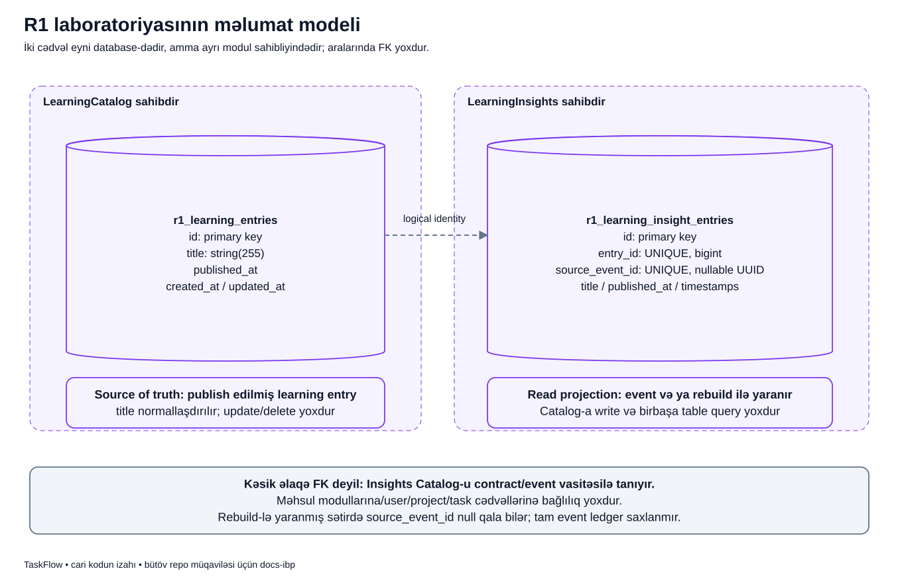

# Laboratoriyada niyə iki ayrı cədvəl var?

## Məqsəd

LearningCatalog əsas qeydi saxlayır. LearningInsights isə həmin qeydi oxumaq üçün kiçik surət saxlayır. İkisi eyni Laravel tətbiqində və eyni database-də olsa da hər modul yalnız öz məlumatına yazır.

Bu səhifə cədvəldəki ID-lərin mənasını, məlumat sahibinin kim olduğunu və şəkildəki əlaqə oxunun niyə foreign key olmadığını izah edir.

## Əvvəl gündəlik bənzətmə

Bir müəllimin əsas dərs siyahısı və tələbənin həmin siyahıdan hazırladığı şəxsi xülasəsi olduğunu düşün. Dərsin həqiqi adı əsas siyahıdadır. Xülasə itərsə əsas siyahıdan yenidən hazırlamaq olar.

Catalog əsas siyahıya, Insights xülasəyə bənzəyir. Amma burada surət əl ilə yox, event və ya public feed vasitəsilə yaranır. Bu bənzətmə modulların real insan və ya ayrı server olması demək deyil.

## Terminləri tanıyaq

- **Table ownership** hansı modulun cədvəl quruluşuna və onun yazı/oxu qaydalarına sahib olduğunu bildirir.
- **Primary key** sətrin öz cədvəlindəki əsas identity-sidir: `id`.
- **UNIQUE** təkrar dəyəri database səviyyəsində qadağan edir.
- **Nullable** sahədə dəyərin olmamasına, yəni `null`-a icazə verir.
- **Foreign key / FK** database-in başqa cədvəldə uyğun sətrin mövcudluğunu yoxladığı əlaqədir.
- **Logical identity** tətbiqin razılaşdığı ID uyğunluğudur; ayrıca FK yoxlaması olmaya bilər.
- **Source of truth** əsas məlumatın qəbul edilmiş mənbəyidir. Bu lab-da Catalog-dur.

## Şəkildə soldan sağa gedək



Soldakı çərçivə **LearningCatalog sahibdir** deyir. İçəridəki silindr database cədvəlidir: `r1_learning_entries`.

Sağdakı çərçivə **LearningInsights sahibdir** deyir. Onun cədvəli `r1_learning_insight_entries`-dir.

Aradakı kəsik ox «bu entry ID-si haqqında projection saxlanır» əlaqəsini göstərir. Burada migration ilə yaradılmış foreign key yoxdur. Ox nə birbaşa SQL join məcburiyyəti, nə də consumer-in digər cədvələ sərbəst query icazəsidir.

Aşağıdakı qutular əsas fərqi deyir: solda əsas publish edilmiş qeyd, sağda event və ya rebuild ilə yaradıla bilən oxu surəti var.

## Catalog sətrində nə saxlanır?

| Sahə | Sadə mənası |
|---|---|
| `id` | Qeydi tanıdan əsas nömrə |
| `title` | Təmizlənmiş, 1–255 simvolluq başlıq |
| `published_at` | Publish tarixi |
| `created_at`, `updated_at` | Database sətrinin yaradılma/yenilənmə tarixləri |

Cari modulda draft, update və delete use case-i yoxdur. `updated_at` sütununun olması ayrıca «entry-ni edit etmək funksiyası var» demək deyil: bu, standart timestamps sxemidir.

## Insights sətrində nə saxlanır?

| Sahə | Sadə mənası |
|---|---|
| `id` | Insights sətrinin öz nömrəsi |
| `entry_id` | Hansı Catalog qeydinə aid olduğu; UNIQUE-dir |
| `source_event_id` | İlk yazı event-dən gəlibsə onun UUID-si; nullable və UNIQUE |
| `title`, `published_at` | Həmin qeyddən alınan oxu məlumatı |
| `created_at`, `updated_at` | Projection sətrinin öz timestamps sahələri |

## ID-lərə rəqəmli nümunə

İzah üçün belə vəziyyət düşün:

```text
Catalog:  id=7, title="Module Boundary"
Insights: id=2, entry_id=7, source_event_id=E1
```

`Catalog.id=7` ilə `Insights.entry_id=7` eyni əsas qeydə işarə edir. Amma `Insights.id=2` başqa cədvəlin öz identity-sidir. Bu rəqəmlərin eyni olmasını gözləmək yanlışdır.

`E1` şəkildə və bu nümunədə UUID üçün qısa addır, real migration-a yazılacaq UUID formatı deyil. Entry ID-si «hansı qeyd?», event ID-si isə «hansı xəbər?» sualına cavab verir.

## Migration kodu nəyi qoruyur?

[Insights migration-undan](../../../Modules/LearningInsights/database/migrations/2026_10_03_000001_create_r1_learning_insight_entries_table.php):

```php
$table->id();
$table->unsignedBigInteger('entry_id')->unique();
$table->uuid('source_event_id')->nullable()->unique();
$table->string('title');
$table->timestamp('published_at');
$table->timestamps();
```

Birinci sətir projection-un öz primary key-ini yaradır. İkinci sətir eyni entry üçün iki projection-a icazə vermir. Üçüncü sətir event olmadan rebuild-i mümkün edir və saxlanmış non-null event UUID-sinin təkrarını qadağan edir.

Burada `constrained()` və ya ayrıca foreign key elan edilməyib. Deməli, database Catalog sətrinin mövcudluğunu bu əlaqə ilə avtomatik yoxlamır. Normal application axını entry ID-sini Catalog-un public event/DTO-sundan alır.

## FK yoxdursa istənilən yerdən yaza bilərikmi?

Xeyr. Database constraint-in olmaması arxitektura icazəsi deyil. Insights Catalog modelini import etməməli və Catalog cədvəlinə birbaşa query yazmamalıdır. Bu qayda [architecture testlərində](../../../tests/Architecture/R1LearningBoundaryTest.php) qorunur.

Əksinə, bu kiçik lab seçimini bütün TaskFlow cədvəllərinə yaymaq da yanlışdır. Məhsul cədvəllərinin öz real FK-ları var; onlar [DATA_MODEL.md](../../technical/DATA_MODEL.md) daxilində ayrıca göstərilir.

## Normal və bərpa axınında nə dəyişir?

Normal publish əvvəl Catalog sətrini commit edir, sonra listener Insights sətri yaradır. Listener failure olsa əsas qeyd qalır, surət çatışmaya bilər.

Rebuild feed-dən əsas qeydi oxuyur və yalnız çatışmayan surəti yaradır. Rebuild yeni event almadığı üçün `source_event_id=null` yazır. Sonradan event gəlsə `firstOrCreate` mövcud sətri dəyişdirmir; null qala bilər.

Bu cədvəl tam event tarixçəsi deyil. Bir entry üçün on xəbər gəlsə on sətir saxlamır. Məqsədi hər entry-nin bir oxu projection-unu saxlamaqdır.

## Özünü yoxla

1. Source hansıdır? **Catalog-un `r1_learning_entries` cədvəli.**
2. Insights-un `id`-si Catalog ID-si olmalıdırmı? **Xeyr, uyğunluq `entry_id` ilədir.**
3. Kəsik ox FK olduğunu göstərirmi? **Xeyr, bu diagramda logical identity-ni göstərir.**
4. Eyni database table ownership-i ləğv edirmi? **Xeyr; modulların kod sərhədi saxlanılır.**

## Real mənbələr

- [Catalog migration-u](../../../Modules/LearningCatalog/database/migrations/2026_10_03_000000_create_r1_learning_entries_table.php)
- [Catalog modeli](../../../Modules/LearningCatalog/app/Models/LearningEntry.php)
- [Insights modeli](../../../Modules/LearningInsights/app/Models/LearningEntryInsight.php)
- [İndeks və migration down/up sübutları](../../../Modules/LearningInsights/tests/Integration/R1LearningFlowTest.php)
- [Məhsul cədvəllərinin sahibliyi və FK-ların sadə izahı](../system/production-data.md)

[Publish axını](publish.md) · [Duplicate axını](duplicate.md) · [Bütün diagramlar](../README.md).
