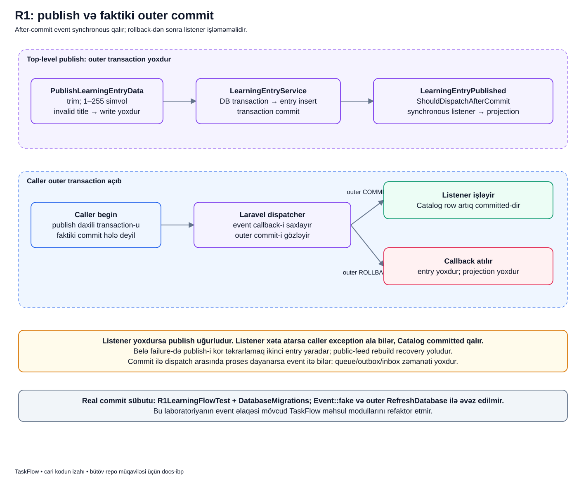

# Qeyd yarananda event necə işləyir?

## Bu axın nə üçündür?

LearningCatalog öyrənmə qeydi yaradır. LearningInsights isə həmin qeydin kiçik oxu surətini özündə saxlayır. Catalog-un işi «qeydi yaratmaq»dır; consumer-in daxili yazısını idarə etmək deyil.

Buna görə Catalog faktı elan edir: «Bu qeyd publish edildi». Laravel bu faktı dinləyən listener-i çağırır. Listener Insights-un repository-sinə müraciət edir.

Bu nümunədə queue yoxdur. Event sözünü görəndə «bu iş mütləq arxa fonda işləyir» nəticəsi çıxarma.

## Terminləri sadə dillə

- **Event** artıq baş vermiş faktı daşıyan obyektdir: `LearningEntryPublished`.
- **Dispatcher** bu obyekti qeydiyyatlı listener-lərə çatdıran Laravel mexanizmidir.
- **Listener** həmin faktla maraqlanan kod parçasıdır: `RecordPublishedLearningEntry`.
- **Commit** transaction-dakı database yazılarını təsdiqləməkdir.
- **Rollback** transaction-ın hələ təsdiqlənməmiş yazılarını geri qaytarmaqdır.
- **After-commit** event-i real commit-dən sonra dispatch etməkdir. Queue ilə eyni anlayış deyil.
- **Outer transaction** publish çağırışını əhatə edən, caller-in daha əvvəl açdığı transaction-dır.

## Şəkli üç hissədə oxu



Yuxarıdakı bənövşəyi sahə normal publish-i, ortadakı mavi sahə caller-in də transaction açdığı halı, aşağıdakı xəbərdarlıqlar isə zəmanətin sərhədini göstərir.

### 1. Caller ayrıca transaction açmayıb

1. `PublishLearningEntryData` title-ı təmizləyir və yoxlayır. Boş və ya həddindən uzun title bu mərhələdən keçmir.
2. `LearningEntryService` database transaction açır.
3. Catalog repository-si öz cədvəlinə yeni entry yazır.
4. Transaction uğurla qayıdır; bu halda entry artıq commit olunub.
5. Service `LearningEntryPublished` qurub `event(...)` çağırır.
6. Dispatcher Insights listener-ini eyni PHP prosesində çağırır.
7. Listener öz repository-si ilə projection yaradır; sonra çağırış geri qayıdır.

### 2. Caller artıq transaction açıb

Məsələn, integration testində əvvəl `DB::beginTransaction()`, sonra publish çağırılıb. Service-in daxili `DB::transaction()` çağırışının qayıtması ən xarici transaction-ın bitməsi deyil.

Şəkildə dispatcher-in «callback-i saxlayır» qutusu bunu göstərir: Laravel həmin event-in göndərilməsini outer transaction nəticəsinə saxlayır.

- Caller **commit** edirsə entry təsdiqlənir, sonra listener işləyir.
- Caller **rollback** edirsə entry silinir, gözləyən callback atılır və listener işləmir.

Bu qayda olmayan source entry üçün projection yaranmasının qarşısını alır.

### 3. Commit-dən sonrakı xəta

Aşağıdakı sarı qutu «listener xətası source-u geri qaytarmır» xəbərdarlığıdır. Database artıq commit olunubsa sonrakı exception əvvəlki commit-i ləğv etmir.

## Real service kodunu oxuyaq

[LearningEntryService::publish()](../../../Modules/LearningCatalog/app/Services/LearningEntryService.php) daxilindən:

```php
$entry = DB::transaction(fn (): LearningEntry => $this->entries->createPublished($data));

event(new LearningEntryPublished(
    eventId: (string) Str::uuid(),
    entryId: $entry->id,
    title: $entry->title,
    publishedAt: $entry->published_at->toDateTimeImmutable(),
));

return $entry;
```

Birinci sətir entry-ni transaction daxilində yaradır. Sonrakı blok **yeni entry yaratmır**: onun ID-si, başlığı və tarixi ilə xəbər obyekti hazırlayır. `eventId` bu xəbərin UUID-sidir; `entryId` isə Catalog sətrinin ID-sidir. Bunlar fərqli identity-lərdir.

`return` listener çağırışından sonradır. Synchronous listener exception atarsa normal return-a çatılmaya bilər; buna baxmayaraq source entry commit olunmuş qala bilər.

## After-commit harada elan olunub?

[Event class-ı](../../../Modules/LearningCatalog/app/Events/LearningEntryPublished.php) belə başlayır:

```php
final readonly class LearningEntryPublished implements ShouldDispatchAfterCommit
```

`ShouldDispatchAfterCommit` Laravel-ə açıq transaction varsa gözləməyi bildirən işarədir. Bu event class-ında broker, Redis və ya retry kodu yoxdur.

Listener [Insights provider-də](../../../Modules/LearningInsights/app/Providers/LearningInsightsServiceProvider.php) qeydiyyatdan keçir:

```php
Event::listen(LearningEntryPublished::class, RecordPublishedLearningEntry::class);
```

Sadə tərcümə: «Bu tip event gələndə bu listener-i çağır». Listener `ShouldQueue` implementasiya etmir, ona görə ayrıca queue worker tələb olunmur.

## Nümunədə əvvəl və sonra

İzah ssenarisi: Catalog və Insights əvvəl boşdur. `Module Boundary` title-ı ilə publish edilir.

- Normal halda Catalog-da bir entry, Insights-da ona uyğun bir projection olur.
- Title yalnız boşluqlardırsa DTO xəta verir: iki cədvəl də əvvəlki kimi qalır.
- Outer rollback olursa iki cədvəldə də bu əməliyyatdan yeni sətir qalmır.
- Listener qeydiyyatda deyilsə Catalog-da entry olur, Insights-da projection olmur.
- Listener commit-dən sonra xəta atırsa Catalog entry-si qalır, caller exception alır; çatışmayan projection ayrıca bərpa edilə bilər.

Bu, real bazanın report-u deyil; testlərin yoxladığı davranışı öyrənmək üçün kiçik nümunədir.

## Nəyi vəd etmirik?

Proses Catalog commit-i ilə event dispatch-i arasında dayansa xəbər itə bilər. After-commit callback-i davamlı message cədvəli deyil. Burada outbox, inbox, queue retry və avtomatik rebuild yoxdur.

Bu xətada publish-i təkrarlamaq eyni entry-ni bərpa etmir: ikinci entry yarada bilər. Məqsəd source-a yenidən yazmaq deyil, artıq mövcud source-un çatışmayan projection-unu [rebuild ilə tamamlamaqdır](rebuild.md).

## Özünü yoxla

**Event varsa queue olmalıdırmı?** Xeyr. Bu event synchronous local dispatcher ilə işləyir.

**Daxili transaction qayıtdısa listener mütləq işlədimi?** Xeyr. Açıq outer transaction varsa onun real commit-i gözlənilir.

**Caller exception aldısa source mütləq rollback oldumu?** Xeyr. Exception commit-dən sonrakı listener-dən gəlmiş ola bilər.

## Real sübut və davamı

- [Publish Feature testləri](../../../Modules/LearningCatalog/tests/Feature/LearningCatalogPublishSpecificationTest.php)
- [Real commit/rollback və listener failure testləri](../../../Modules/LearningInsights/tests/Integration/R1LearningFlowTest.php)
- [After-commit ayrıca sadə izah](../../extended/after-commit.md)
- [Event və queue fərqi](../../extended/event-vs-queue.md)
- [Transaction texniki müqaviləsi](../../technical/TRANSACTIONS_AND_FAILURES.md)

[Laboratoriya xəritəsi](../../labs/r1/README.md) · [Bütün diagramlar](../README.md).
