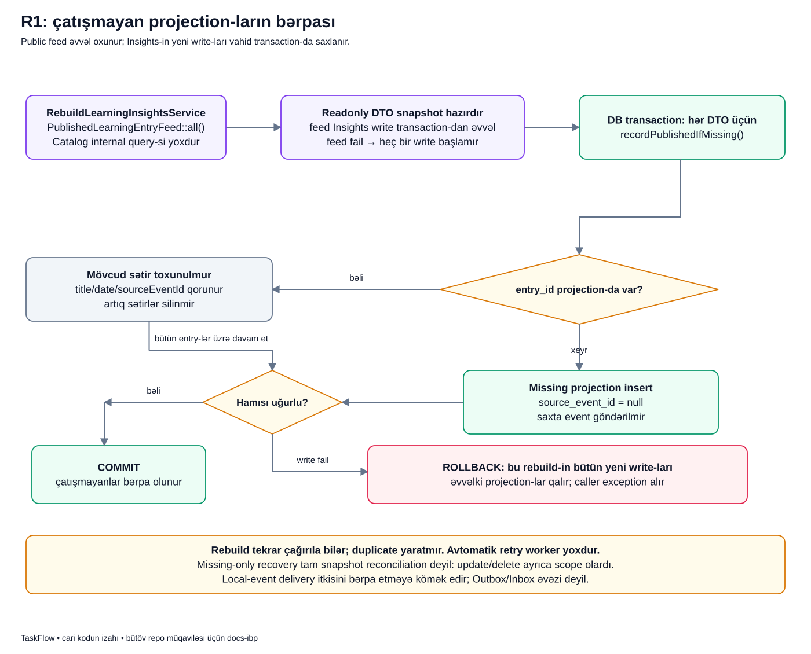

# Çatışmayan projection-u yenidən publish etmədən necə bərpa edirik?

## Əvvəl problemi başa düşək

Tutaq ki, Catalog-da qeyd yaranıb, amma Insights listener-i xəta verib. Catalog qeydi artıq commit olunub. İndi bir tərəfdə əsas məlumat var, digər tərəfdə onun oxu surəti yoxdur.

Məqsəd Catalog-da ikinci qeyd yaratmaq deyil. Məqsəd mövcud qeydin çatışmayan Insights sətrini əlavə etməkdir. `RebuildLearningInsightsService` məhz bunu edir.

Adında rebuild olsa da bu kod bütün məlumatları silib yenidən qurmur. Cari müqaviləsi **yalnız çatışmayan sətirləri tamamlamaq**dır.

## Sözlərin sadə mənası

- **Source** əsas məlumatdır: Catalog entry-si.
- **Projection** başqa məqsədlə saxlanılan, source əsasında yaradıla bilən oxu surətidir: Insights sətri.
- **Feed** Catalog-un public oxu müqaviləsidir; source qeydləri həmin sərhəddən alırıq.
- **Recovery** yarımçıq nəticədən sonra sistemin gözlənilən vəziyyətini bərpa etməkdir.
- **Missing-only** yalnız olmayanı əlavə etməkdir. Olanın title-ını dəyişmək və ya artıq sətri silmək deyil.
- **Snapshot** burada oxuma anında yaddaşa alınan DTO siyahısıdır. İki modul arasında ayrıca database snapshot isolation zəmanəti nəzərdə tutulmur.

## Şəkli addım-addım oxuyaq



1. Soldakı **RebuildLearningInsightsService** public feed-in `all()` metodunu çağırır. Catalog cədvəlinə özü query yazmır.
2. Ortadakı **Readonly DTO snapshot hazırdır** qutusu bütün siyahının artıq yaddaşda olduğunu göstərir.
3. Yalnız bundan sonra sağdakı **DB transaction** başlayır. Bu transaction Insights yazılarını birlikdə qoruyur.
4. Hər entry üçün rombdakı sual verilir: «bu `entry_id` üçün projection varmı?»
5. **Bəli** budağında mövcud sətir toxunulmadan saxlanır. Title, tarix və source event ID dəyişmir.
6. **Xeyr** budağında yeni projection yaranır. `source_event_id=null` olur, çünki bu addım yeni event-in dinlənməsi deyil.
7. Bütün elementlər uğurla işlənibsə **COMMIT** edilir.
8. Bir write fail edirsə **ROLLBACK** olur: bu rebuild-in yeni yazıları geri qayıdır; əvvəlki projection-lar qalır.

Aşağıdakı xəbərdarlıq «bu mexanizm avtomatik işləyən retry worker deyil» deyir. Service-in mövcudluğu onun scheduler tərəfindən çağırılması demək deyil.

## Üç qeydli nümunə

Bu, izah üçün ssenaridir. Catalog-da ID-si 7, 8, 9 olan üç qeyd var. Insights-da yalnız 7 var.

Rebuild belə gedir:

1. Feed 7, 8, 9 siyahısını qaytarır.
2. 7 üçün əvvəlki sətir tapılır, saxlanır.
3. 8 üçün yeni sətir hazırlanır.
4. 9 üçün yeni sətir hazırlanır.
5. İkisi də uğurludursa transaction commit edilir: Insights-da 7, 8, 9 olur.

9-un yazısı fail etsə 8-in bu run-da yazılmış sətri də rollback olur. Nəticə yenə əvvəlki 7-dir. Əks halda «rebuild uğursuzdur, amma yarısı saxlanıb» kimi çətin izlənən vəziyyət alınardı.

## Real kodun əsas hissəsi

[Rebuild service-i](../../../Modules/LearningInsights/app/Services/RebuildLearningInsightsService.php):

```php
$entries = $this->entries->all();

DB::transaction(function () use ($entries): void {
    foreach ($entries as $entry) {
        $this->recordMissingProjection($entry);
    }
});
```

Birinci sətir **oxuma**dır. Transaction blokunun içində deyil. Feed xəta verərsə aşağıdakı blok ümumiyyətlə başlamır.

`foreach` hər DTO-nu ayrıca işləyir, amma bütün dövr bir write transaction-ının içindədir. Repository əlavə gizli transaction açmır.

Private helper-in real çağırışı:

```php
$this->insights->recordPublishedIfMissing(
    entryId: $entry->id,
    sourceEventId: null,
    title: $entry->title,
    publishedAt: $entry->publishedAt,
);
```

`sourceEventId: null` vacibdir. Burada əvvəlki event-i oxumamışıq və yeni event yaratmamışıq. Ona görə UUID uydurub «bu event işlənib» demirik. Repository mövcud sətri tapsa heç bu null dəyərlə də update etmir.

## Rebuild və republish niyə ayrı şeydir?

**Rebuild:** source olduğu kimi qalır, consumer-də çatışmayan surət əlavə edilir.

**Republish:** `LearningEntryService::publish()` yenidən çağırılır; o yeni source entry yaradır. Eyni title eyni identity demək deyil. Nəticədə səhvən iki Catalog qeydi yarana bilər.

Bu səbəbdən listener xətasını «publish alınmadı, bir də göndərim» kimi qiymətləndirməzdən əvvəl commit sərhədinə baxmaq lazımdır.

## Bu bərpa nələri etmir?

- Mövcud projection-un title və tarixini yeniləmir.
- Catalog-da olmayan artıq Insights sətrini silmir.
- Köhnə event-ləri replay etmir və yeni event göndərmir.
- Null `source_event_id`-ni sonradan UUID ilə doldurmur.
- Feed oxuması ilə write-ları vahid cross-module transaction-a çevirmir.
- Özü-özünə schedule olunmur; queue, outbox və retry worker yaratmır.

Feed oxunandan sonra yeni Catalog entry-si yaransa bu siyahıda olmaya bilər. Onun event-i işləyə bilər və ya növbəti rebuild onu tamamlayar. Mövcud kiçik create-only lab bundan daha böyük sinxronizasiya protokolu vəd etmir.

## Xəta olduqda nəyə baxaq?

Feed failure üçün səbəb oxu tərəfindədir; yeni Insights yazısı başlamayıb. Write failure üçün həmin rebuild-in bütün yeni yazıları rollback olub. Listener failure üçün isə Catalog əvvəldən committed qala bilər.

Bu üç halın hamısında «exception oldu» deyilir, amma database nəticəsi fərqlidir. Debug edərkən exception-un **hansı mərhələdə** atıldığını tapmaq ona görə vacibdir.

## Özünü yoxla

1. Rebuild-i iki dəfə çağırsaq duplicate yaranarmı? **Eyni entry üçün xeyr; repository yalnız çatışmayan sətri yaradır.**
2. İkinci write fail olsa birinci yeni sətir qalarmı? **Xeyr; eyni rebuild transaction-ı rollback edir. Əvvəlki sətirlər qalır.**
3. Bu, outbox-un bütün zəmanətlərini verirmi? **Xeyr; davamlı event çatdırılması deyil, source-dan sonrakı tamamlamadır.**

## Kod və testlə davam et

- [Repository və duplicate qaydası](../../../Modules/LearningInsights/app/Repositories/Eloquent/EloquentLearningInsightRepository.php)
- [Rebuild Feature testləri](../../../Modules/LearningInsights/tests/Feature/LearningInsightsProjectionSpecificationTest.php)
- [Listener failure və ikinci write rollback testləri](../../../Modules/LearningInsights/tests/Integration/R1LearningFlowTest.php)
- [Rebuild və republish müqayisəsi](../../extended/rebuild-vs-republish.md)
- [Transaction sərhədləri](../../technical/TRANSACTIONS_AND_FAILURES.md)

[Laboratoriya xəritəsi](../../labs/r1/README.md) · [Bütün diagramlar](../README.md).
