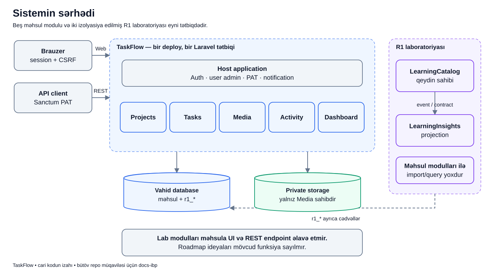

# TaskFlow-u bütöv sistem kimi anlamaq

## Bu yazı nəyi başa salır?

Layihəni ilk dəfə açanda çoxlu qovluq, class və paket görürsən. Əsas sual budur: “Bunlardan hansı istifadəçinin problemini həll edir, hansı isə sistemi işlədən ümumi hissədir?”

Bu yazı həmin böyük şəkli göstərir. Hələ bütün class adlarını əzbərləmək lazım deyil. Əvvəl kimin hansı işə cavabdeh olduğunu başa düş.

## Əvvəl bu sözləri tanıyaq

- **Tətbiq:** istifadəçinin açdığı TaskFlow sistemi.
- **Modul:** bir-birinə yaxın işlərin toplandığı hissə. Məsələn, task və comment işi Tasks modulundadır.
- **Host application:** modulların işlədiyi əsas Laravel tətbiqi. Login kimi ümumi işləri saxlayır.
- **Database:** layihə, istifadəçi və task kimi qeydlərin saxlandığı yer.
- **Private storage:** yüklənmiş faylın özünün saxlandığı, hamıya açıq olmayan yer.
- **Deploy:** hazırlanmış tətbiqin işləyəcəyi mühitə yerləşdirilməsi.
- **Modular monolith:** daxilində modullar var, amma ayrı-ayrı xidmətlər kimi yox, bir tətbiq kimi işləyir.
- **API client:** serverə proqram vasitəsilə sorğu göndərən tərəf; brauzerdə səhifə açmaqla eyni giriş üsulu deyil.
- **Metadata:** faylın adı, ölçüsü və tipi kimi fayl haqqında məlumat. **Binary** faylın öz məzmunudur.
- **Session / PAT:** brauzer girişi üçün session vəziyyəti, qorunan REST API girişi üçün şəxsi token istifadə edilir.
- **CSRF qoruması:** başqa saytdan istifadəçinin adından Web form göndərilməsinə qarşı müdafiədir.

Database-də fayl haqqında məlumat ola bilər. Faylın özünün database-də olması bununla eyni şey deyil.

## Gündəlik ssenari

Bu yazıdakı Leyla və Murad adları yalnız öyrənmə ssenarisidir; real hesab və ya real məlumat göstərilmir.

Leyla brauzerdə TaskFlow-a daxil olur. Murad isə eyni sistemin API-sini yoxlayan client istifadə edir. Hər ikisi “Ödəniş” layihəsindəki işləri görmək istəyir.

Leyla üçün yeni bir TaskFlow, Murad üçün ayrı bir TaskFlow qurulmayıb. Giriş yolları fərqlidir, məhsul qaydaları və məlumat mənbəyi eynidir.

## Şəkil



## Şəkli addım-addım oxuyaq

1. Soldakı **Brauzer** qutusu Web girişidir. Session və dəyişiklik edən formalar üçün CSRF qorumasından istifadə edir.
2. **API client** qutusu HTTP REST girişidir. Qorunan əməliyyatlar Sanctum PAT tələb edir.
3. Ortadakı böyük qutu bir Laravel tətbiqidir. Web və API bu qutunun içinə daxil olan iki fərqli qapıdır.
4. **Host** login, istifadəçi idarəsi, token, bildiriş və ümumi middleware işlərinə sahibdir.
5. Beş mavi modul məhsulun əsas işlərini bölüşür.
6. Aşağıdakı database qeydləri saxlayır. Private storage isə binary faylları saxlayır.
7. Sağdakı bənövşəyi hissə ayrıca R1 öyrənmə laboratoriyasıdır.

Web/API oxu “server bu məlumatı aldı” deməkdir. Ox özü queue və ya ayrıca server demək deyil.

## Beş məhsul modulu nə edir?

| Hissə | Gündəlik dillə işi |
|---|---|
| Projects | Layihəni, üzvləri və layihənin vəziyyətini idarə edir |
| Tasks | İşin yaradılması, təyinatı, statusu, şərhi və əməkdaşlığı |
| Media | Faylın saxlanması, metadata-sı, stream-i və fiziki təmizlənməsi |
| Activity | “Kim nə etdi?” tarixçəsinin təhlükəsiz yazılması və oxunması |
| Dashboard | Görünən məlumatdan saylar və şəxsi iş siyahıları hazırlayır |

Dashboard yeni task cədvəli yaratmır. Mövcud məlumatdan nəticə hazırlayır.

## R1 modulları niyə ayrıca rəngdədir?

LearningCatalog və LearningInsights junior praktikasını göstərmək üçün əlavə edilib. Onlar mövcud task yaratma və media axınına qoşulmayıb.

Catalog öyrənmə qeydi saxlayır. Insights həmin qeydin sadə surətini başqa cədvəldə hazırlayır. Bu iki modul arasında PHP public contract və local event praktika edilir.

Buna görə “repo-da yeddi modul var” ilə “məhsulun yeddi business modulu var” eyni cümlə deyil. Beş məhsul modulu, iki tədris modulu var.

## Real koddan kiçik nümunə

`modules_statuses.json` daxilində qeydiyyat belədir:

```json
{
    "Projects": true,
    "Tasks": true,
    "Activity": true,
    "Dashboard": true,
    "Media": true,
    "LearningCatalog": true,
    "LearningInsights": true
}
```

Hər ad modul registration-ının vəziyyətini göstərir. `true` həmin modulun aktiv qeydiyyatda olduğunu bildirir.

Bu fayl “bu modulu bütün başqa modullardan çağırmaq olar” icazəsi vermir. Hansı əlaqələrin qanuni olduğunu ayrıca architecture qaydaları və testlər qoruyur.

Eyni şəkildə, registration faylı database migration-ının real tətbiq bazasında artıq işlədildiyini sübut etmir. Kodun qeydiyyatı ilə real mühitdə migration icrası ayrı məsələdir.

## İstifadəçidə və database-də nə baş verir?

Leyla task yaradanda task qeydi, watcher əlaqəsi və audit kimi məlumatlar database-də yaranır. Fayl əlavə edəndə isə həm database metadata-sı, həm də private storage-da fayl yaranır.

Leyla login edəndə ayrıca “Auth modulu” işləmir. Bu iş host tətbiqdədir.

R1 publish əməliyyatı isə istifadəçi üçün yeni task yaratmır: öz `r1_*` cədvəlləri ilə laboratoriya çərçivəsində qalır.

## Nə alınmaya bilər?

- Login yoxdursa qorunan səhifə açılmır.
- Layihəyə çıxış yoxdursa onun task-ları görünmür; API-də məlumat sızdırmayan nəticə verilir.
- Fayl storage-ı alınmasa “database transaction hər şeyi özü geri aldı” demək olmaz; Media-nın ayrıca failure qaydaları var.
- Modulun aktiv olması onun bütün əlaqələrdən asılı olmayan, istənilən vaxt silinə bilən plugin olması demək deyil.

Bunların hərəsi ayrıca axındır; ümumi şəkil yalnız sistemin sərhədini göstərir.

## Tez-tez qarışan suallar

**Monolith olanda modul nəyə lazımdır?**  
Eyni tətbiqdə olsaq da məsuliyyətləri ayırmaq üçün. Tasks kodunun faylın fiziki yolunu özü idarə etməməsi buna nümunədir.

**Host “Core” adlı modul deməkdir?**  
Xeyr. Bu repoda host əsas Laravel tətbiqidir; ayrıca Core modulu yoxdur.

**API client üçün ayrı database var?**  
Adi məhsul istifadəsində yox. Web və API eyni application qaydalarından keçir. Test profillərinin ayrı database-ləri başqa mövzudur.

**Learning modulları varsa bütün sistem event-driven olub?**  
Xeyr. Bu, yalnız izolyasiya edilmiş praktikanın davranışıdır.

## Özünü yoxla

1. Login kodunu Projects modulunda axtarmalısan? **Xeyr, host tətbiqdə.**
2. Task attachment-in faylını hansı modul saxlayır? **Media; Tasks association və access kontekstini idarə edir.**
3. İki lab modulunun olması beş məhsul modulunu refaktor edibmi? **Xeyr.**
4. Registration faylı migration icrasının nəticəsidirmi? **Xeyr.**

## Kod və testlə davam et

- [Aktiv modul qeydiyyatı](../../../modules_statuses.json)
- [Tasks provider](../../../Modules/Tasks/app/Providers/TasksServiceProvider.php)
- [Host arxitekturası](../../modules/HOST_APPLICATION.md)
- [R1 sərhəd testləri](../../../tests/Architecture/R1LearningBoundaryTest.php)
- [Əsas arxitektura müqaviləsi](../../technical/ARCHITECTURE.md)
- Növbəti oxu: [modul asılılıqları](dependencies.md), [diagram indeksi](../README.md)
