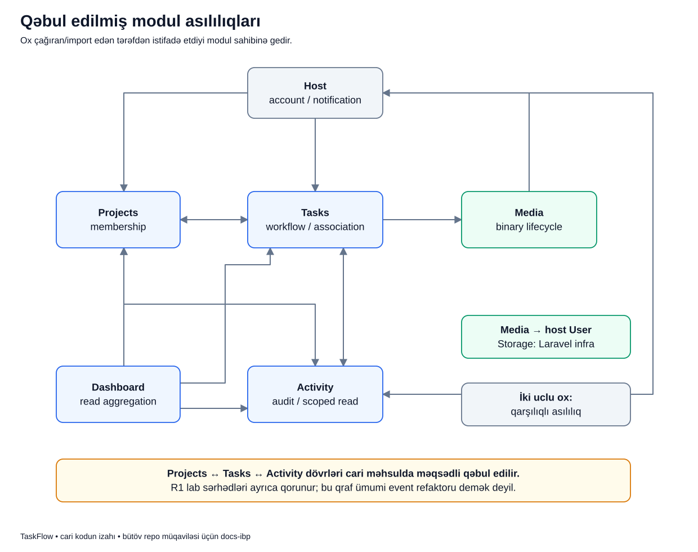

# Modul asılılığı: bir hissə başqa hissədən nə istəyir?

## Məqsəd

“Tasks Media-dan asılıdır” ifadəsi ilk baxışda abstrakt görünür. Sadə mənası budur: Tasks müəyyən işi tamamlamaq üçün Media-nın verdiyi imkandan istifadə edir.

Bu yazı oxların istiqamətini oxumağı və asılılığı təsadüfi import siyahısı ilə qarışdırmamağı öyrədir.

## Vacib sözlər

- **Dependency / asılılıq:** bir hissənin işləmək üçün başqa hissənin type və ya davranışından istifadə etməsi.
- **Caller:** çağırışı edən tərəf.
- **Collaborator:** caller-in işini tamamlamaq üçün istifadə etdiyi hissə.
- **Injection:** lazım olan obyektin class-a kənardan verilməsi; class onu öz daxilində özbaşına yaratmır.
- **Cycle / dövr:** A B-ni, B isə A-nı istifadə edir.
- **Boundary / sərhəd:** hansı hissənin nəyə cavabdeh olduğunu və nəyi istifadə edə biləcəyini ayıran qayda.
- **Metadata / binary:** fayl haqqında ad/ölçü/tip məlumatı və faylın öz məzmunu ayrı şeylərdir.
- **MIME:** faylın məzmun tipinin texniki adı; məsələn PDF tipi. Server client-in dediyini kor-koranə qəbul etmir.
- **Stream:** fayl məzmununu response ilə client-ə ötürməkdir.
- **Synchronous / direct çağırış:** caller həmin metodun nəticəsini gözləyir; işi ayrıca queue worker-ə göndərmək deyil.

Asılılıq həmişə HTTP request deyil. PHP class import-u, constructor type-ı və bir service çağırışı da əlaqə yarada bilər.

## Kiçik həyat ssenarisi

Adlar yalnız izah üçündür.

Murad bir task-a PDF əlavə edir. Tasks onun həmin layihədə fayl əlavə edə bildiyini yoxlayır. Amma PDF-i hansı random yola yazmaq, MIME-ni necə tanımaq və sonra necə stream etmək Media-nın işidir.

Deməli, Tasks müəyyən mərhələdə Media ilə işləməlidir. “Modullar var, aralarında heç əlaqə olmamalıdır” tələbi real işi izah etmir. Əsas məsələ əlaqənin məqsədinin və sərhədinin aydın olmasıdır.

## Şəkil



## Oxları necə izləməli?

1. **Tasks → Media:** Tasks authorized attachment işi üçün Media xidmətindən istifadə edir.
2. **Tasks → Projects:** task yaratmaq və dəyişmək üçün project membership/lifecycle konteksti lazımdır.
3. **Projects → Tasks:** üzv silinərkən açıq assignment-ları yoxlamaq və watcher təmizliyi kimi işlər var.
4. **Projects/Tasks → Activity:** baş vermiş əməliyyatların auditi yazılır.
5. **Activity → Projects/Tasks:** tarixçəni oxuyan actor-un hansı məlumatı görə bildiyi müəyyən edilir.
6. **Dashboard → Projects/Tasks/Activity:** hazır saylar, queue-lar və son tarixçə hazırlanır.
7. **Host → Tasks/Activity:** hesab suspend ediləndə responsibility/subscription təmizliyi və audit var.
8. **Media → host User:** uploader istifadəçi modelidir; faylı saxlayan ayrıca “Media user” yoxdur.

İki uclu ox iki istiqamətin də mövcud olduğunu göstərir. Bu, event-in hər iki tərəfə avtomatik yayıldığı mənasına gəlmir.

## Real kodun iki hissəsi

`TaskAttachmentService.php` Media type-larını tanıyır:

```php
use Modules\Media\Services\MediaMetadataService;
use Modules\Media\Services\MediaStorageService;
```

- Birinci sətir metadata ilə işləyən service-in adını gətirir.
- İkinci sətir binary və stream işinə cavabdeh service-in adını gətirir.
- `use` özü fayl saxlamır və metod işə salmır. Sadəcə istifadə edilən type-ın tam adını göstərir.

Eyni fayldakı real download metodu:

```php
public function download(Task $task, TaskAttachment $attachment, User $actor): StreamedResponse
{
    return $this->storage->download($this->visibleMedia($task, $attachment, $actor));
}
```

Burada əvvəl daxili `visibleMedia(...)` task, actor və association kontekstini yoxlayıb Media obyektini alır. Sonra `$this->storage->download(...)` binary stream işini Media-ya verir.

`return` həmin hazır stream response-u yuxarıdakı adapterə qaytarır. Tasks bu metodda disk yolu qurub `Storage` ilə birbaşa fayl oxumur.

## Injection burada nəyi dəyişir?

`$this->storage` obyektini controller özü yaratmır. Laravel lazım olan service-ləri constructor-lara verir.

Bu, obyektin haradan gəldiyini nizama salır və testdə collaborator-u əvəz etməyə imkan verir. Amma təkcə injection etmək modullar arasında asılılığı yox etmir: Tasks hələ də Media service type-ını tanıyır.

Bu fərq vacibdir. “Interface inject etmişik, deməli heç asılılıq yoxdur” nəticəsi də düzgün deyil. Interface-ə də asılılıq var, sadəcə onun sərhədi fərqlidir.

## Database-də və istifadəçidə nəticə

Muradın download əməliyyatı adətən yeni task və media qeydi yaratmır. Tasks access kontekstini həll edir, Media mövcud faylı stream edir.

Upload isə başqa use case-dir: Media metadata və Tasks association yazısı yarana bilər. Hansı əlaqənin oxu, hansının yazı olduğu qrafın tək oxundan yox, çağırılan konkret metoddan aydın olur.

## Qəbul edilmiş dövrlər nə deməkdir?

Hazırkı məhsulda Projects, Tasks və Activity arasında qarşılıqlı əlaqələr var. Sənədlər bunu gizlətmir və bütün əlaqələrin yalnız contract/event olduğunu iddia etmir.

Bu qərar yeni, istənilən əlaqənin sərbəst əlavə edilə bilməsi demək deyil. Architecture test-lərində icazəli istiqamətlər var.

R1 laboratoriyası daha məhdud qaydanı öyrədir: Insights yalnız Catalog-un üç public type-ını tanıyır. Bu qaydanı bütün məhsulun hazırkı vəziyyəti kimi göstərmək olmaz.

## Failure və risk tərəfi

Əgər download zamanı Media storage error atarsa, onu çağıran Tasks use case-i də uğurlu stream qaytara bilməz. Direct çağırış zamanı caller collaborator-un nəticəsini həmin çağırışda gözləyir.

Dövrü asılılıq çoxalarsa bir modulu dəyişmək başqalarına da təsir edə bilər. Cari qrafın məqsədi bunu görünən etməkdir, bütün dövrləri “əla dizayn” adlandırmaq yox.

Sənədləşmə işi mövcud asılılıqları səssiz refaktor etməyə icazə vermir. Belə qərar ayrıca scope, davranış və test işi tələb edir.

## Tez-tez qarışan suallar

**Ox “data kimdə saxlanır?” deməkdir?**  
Bu qrafda yox; istifadə edən tərəfin kimdən istifadə etdiyini göstərir. Cədvəl sahibliyi ayrıca data diagramındadır.

**Import dependency-ni göstərirsə hər import işləyən çağırışdır?**  
Xeyr. `use` ad tanıdır; real davranışı metod çağırışı göstərir.

**Event asılılığı tam yox edir?**  
Xeyr. Consumer event type və payload müqaviləsini tanıyır. Sadəcə producer consumer service-ini birbaşa çağırmır.

**Architecture testləri runtime təhlükəsizlik sandbox-ıdır?**  
Xeyr. Məqsədli qadağan reference-ləri yoxlayır; real davranış testlərini əvəz etmir.

## Özünü yoxla

1. Tasks faylı özü saxlamalıdır? **Xeyr, Media-dan istifadə etməlidir.**
2. Constructor injection asılılığı yox edir? **Xeyr, onun verilməsini nizama salır.**
3. Cari məhsul qrafında bütün dövrlər aradan qaldırılıbmı? **Xeyr.**
4. R1 consumer Catalog-un daxili modelini import edə bilər? **Xeyr.**

## Mənbə və davamı

- [TaskAttachmentService](../../../Modules/Tasks/app/Services/TaskAttachmentService.php)
- [ProjectMemberService](../../../Modules/Projects/app/Services/ProjectMemberService.php)
- [Activity repository](../../../Modules/Activity/app/Repositories/Eloquent/EloquentActivityRepository.php)
- [Production architecture testləri](../../../tests/Architecture/ControllerBoundaryGuardTest.php)
- [R1 architecture testləri](../../../tests/Architecture/R1LearningBoundaryTest.php)
- [Əsas arxitektura sənədi](../../technical/ARCHITECTURE.md)
- [Məlumat sahibliyi izahı](production-data.md), [diagram indeksi](../README.md)
