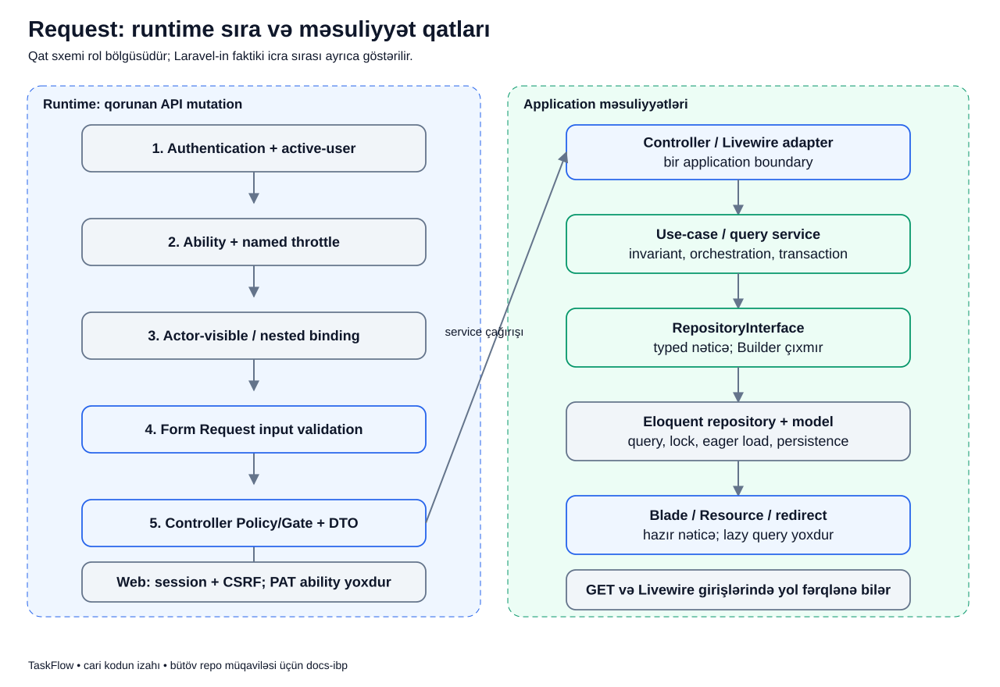

# Bir request kodun içində necə yol gedir?

## Məqsəd

İstifadəçi düyməni basır, sonra səhifədə nəticə görünür. Arada nə baş verdiyini bilməsək, bütün işi controller-ə yazmaq asan görünür.

Bu yazı bir request-i qatlar boyunca izləyir. Məqsəd class adlarını əzbərləmək deyil, “bu qərarı kim verməlidir?” sualına cavab tapmaqdır.

## Lazım olan sözlər

- **Request:** client-in serverə göndərdiyi sorğu.
- **Middleware:** əsas action-dan əvvəl request-i yoxlayan giriş qatı.
- **Route binding:** URL-dəki ID-ni uyğun, görünən obyektə çevirmək.
- **Validation:** input-un qəbul edilən formada olub-olmadığını yoxlamaq.
- **Authorization:** bu actor-un bu əməliyyata icazəsinin olub-olmadığı.
- **DTO:** yoxlanmış input-u məqsədli field-lərlə daşıyan obyekt.
- **Service:** use case-in qaydalarını və ardıcıllığını idarə edən hissə.
- **Repository:** query, lock, eager load və database yazısının sahibi.
- **Resource:** hazır nəticənin hansı sahələrinin JSON-a çıxacağını seçən adapter.
- **Query / lock / eager load:** DB-dən məlumat istəmək, paralel yazılar üçün kilid almaq və lazım olan əlaqələri əvvəlcədən yükləməkdir.
- **Mutation:** məlumatı dəyişən əməliyyatdır; sadə oxuma request-i ilə eyni deyil.
- **Transaction:** əlaqəli DB yazılarını birlikdə qəbul etmək və ya xəta olsa geri almaqdır.
- **Rank / version:** board-dakı sıra dəyəri və task dəyişdikcə artırılan versiya sayıdır.

Actor əməliyyatı edən istifadəçidir. Eloquent model isə database qeydi ilə işləyən obyektidir; DTO ilə eyni şey deyil.

## Ssenari

Leyla və “Ödəniş” task-ı yalnız izah ssenarisidir.

Leyla ona təyin edilmiş task-ın statusunu `todo`-dan `in_progress`-ə dəyişir. API client serverə status və gördüyü son `expected_version` dəyərini göndərir.

Server yalnız “status bir string-dir” yoxlaması etmir. Leylanın kim olduğu, hansı layihəyə çıxdığı və həmin keçidi edə bildiyi də vacibdir.

## Şəkil



## Soldakı və sağdakı hissə niyə ayrıdır?

Solda qorunan API mutation-un faktiki giriş sırası göstərilir. Sağda class-ların məsuliyyət bölgüsü var.

“Controller → Form Request → service” kimi öyrədici qat sxemi Form Request-in controller metodundan sonra işə düşdüyü mənasına gəlmir. Laravel action-a keçməzdən əvvəl onun Form Request dependency-sini resolve və validate edir.

GET, Web və Livewire girişləri eyni metod imzasına malik deyil. Ona görə bu şəkli bütün endpoint-lər üçün dəyişməz call stack kimi oxuma.

## Runtime girişini izləyək

1. **Authentication + active-user:** token actor-u müəyyən edir; suspended actor davam etmir.
2. **Ability + throttle:** token həmin route ailəsini açırmı, request limiti dolubmu?
3. **Binding:** URL-dəki task ID-si actor-visible repository query-si ilə tapılır.
4. **Form Request:** status enum-u və müsbət integer version kimi input forması yoxlanır.
5. **Controller:** Policy/Gate access qərarı verilir; validated input DTO-ya çevrilir.
6. **Service:** versiya, icazəli transition, project state və child qaydaları yoxlanır.
7. **Repository:** uyğun lock/query və persistence aparılır.
8. **Resource:** hazır task nəticəsini təhlükəsiz JSON formasına çevirir.

Ability denial binding-dən əvvəl 403 verir. Tokenin kifayət etmədiyi route-da task-ın mövcud olub-olmadığını öyrənməyə ehtiyac yoxdur.

## Controller-dən real nümunə

API `TaskController::changeStatus()`:

```php
public function changeStatus(ChangeTaskStatusRequest $request, Task $task): TaskResource
{
    $this->authorize('changeStatus', $task);
    $task = $this->statuses->change(
        $task,
        ChangeTaskStatusData::fromArray($request->validated()),
        $request->user(),
    );

    return new TaskResource($task);
}
```

Əhəmiyyətli sətirlər:

- `ChangeTaskStatusRequest`: input qaydaları action-a daxil olmamışdan əvvəl işləyir.
- `Task $task`: ID artıq binding-dən keçmiş task-dır; controller özü Eloquent query qurmur.
- `authorize(...)`: həmin actor-un status əməliyyatına giriş icazəsini yoxlayır.
- `validated()`: bütün request dump-u yox, validation-dan keçmiş sahələr alınır.
- `fromArray(...)`: həmin sahələr məqsədli status DTO-suna çevrilir.
- `statuses->change(...)`: controller bir status use-case boundary-sini çağırır.
- `TaskResource`: response-u qurur; service-in işini təkrar etmir.

Bu kiçik metodda SQL, transaction, rank hesabı və notification dövrü yoxdur. Onlar yoxa çıxmayıb, öz qatındadır.

## Service və repository niyə ikisi də lazımdır?

Service “bu status keçidi indi qanunidirmi?” sualına cavab verir. Repository isə “task və project row-unu lock ilə necə alım?” sualını həll edir.

Məsələn, `TaskStatusService` `expected_version`-ı yoxlayır. `EloquentTaskRepository::lockForRankMutation()` isə query və lock-u tətbiq edir.

Controller service ilə yanaşı repository-ni də çağırsa, use case-in yarısı controller-də, yarısı service-də qalar. Web/API/Livewire üçün fərqli davranış yaratmaq riski yaranar.

## Database-də və Leylada nəticə

Uğurda task statusu, version-u və rank-ı dəyişir; uyğun timestamp, Activity və notification yazılır. Leyla canonical server nəticəsini görür.

Controller-də authorization keçməsi DB write-ın avtomatik uğurlu olması deyil. Service son vəziyyəti yoxlamalı, transaction isə əlaqəli DB write-larını birlikdə saxlamalıdır.

## Alternativ yollar

| Harada dayanır? | Mənası |
|---|---|
| Authentication | Actor yoxdur və ya hesab bağlıdır |
| Ability / Policy | Actor/token bu əməliyyatı edə bilməz |
| Binding | Task yoxdur, görünmür və ya parent uyğun deyil |
| Input validation | Status/version forması yanlışdır |
| Service | Input düzgündür, amma cari state/version əməliyyata uyğun deyil |
| Gözlənilməz storage/DB error | Opaque failure; raw daxili mesaj user-ə çıxmır |

Input forması ilə domain state-i qarışdırma: `expected_version=3` düzgün integer ola bilər, amma DB-də version 4-dürsə yenə conflict-dir.

## Tez-tez qarışan suallar

**Form Request həmişə DB-dən tam xəbərsizdir?**  
Bu repoda bəzi project key və admin email uniqueness presence rule-ları DB oxuyur. Bu, service workflow-nu request-ə daşımaq icazəsi deyil.

**Policy keçirsə service invariantına ehtiyac qalmır?**  
Qalır. Service HTTP-dən kənar caller tərəfindən də çağırıla bilər və state dəyişmiş ola bilər.

**Resource-a relation load yazsam nə olar?**  
Presentation daxilində gizli query yaradar. Nəticəni query/use-case service və repository hazır etməlidir.

## Özünü yoxla

1. Controller rank hesablamalıdır? **Xeyr.**
2. `validated()` ilə `all()` eynidirmi? **Xeyr; validated qəbul edilmiş input-u verir.**
3. Binding-in tapdığı task üzərində bütün mutasiyalar icazəlidirmi? **Xeyr, Policy və invariantlar ayrıca qalır.**
4. Qat sxemi bütün request-lərin dəqiq runtime sırasıdırmı? **Xeyr.**

## Kod və test

- [API TaskController](../../../Modules/Tasks/app/Http/Controllers/Api/V1/TaskController.php)
- [ChangeTaskStatusRequest](../../../Modules/Tasks/app/Http/Requests/ChangeTaskStatusRequest.php)
- [TaskStatusService](../../../Modules/Tasks/app/Services/TaskStatusService.php)
- [EloquentTaskRepository](../../../Modules/Tasks/app/Repositories/Eloquent/EloquentTaskRepository.php)
- [Runtime middleware priority](../../../bootstrap/app.php)
- [Request security testləri](../../../tests/Feature/Security/RequestBoundarySecurityTest.php)
- [Controller boundary testləri](../../../tests/Architecture/ControllerBoundaryGuardTest.php)
- [Əsas arxitektura müqaviləsi](../../technical/ARCHITECTURE.md)
- [Authorization dərsi](../flows/authorization.md), [diagram indeksi](../README.md)
