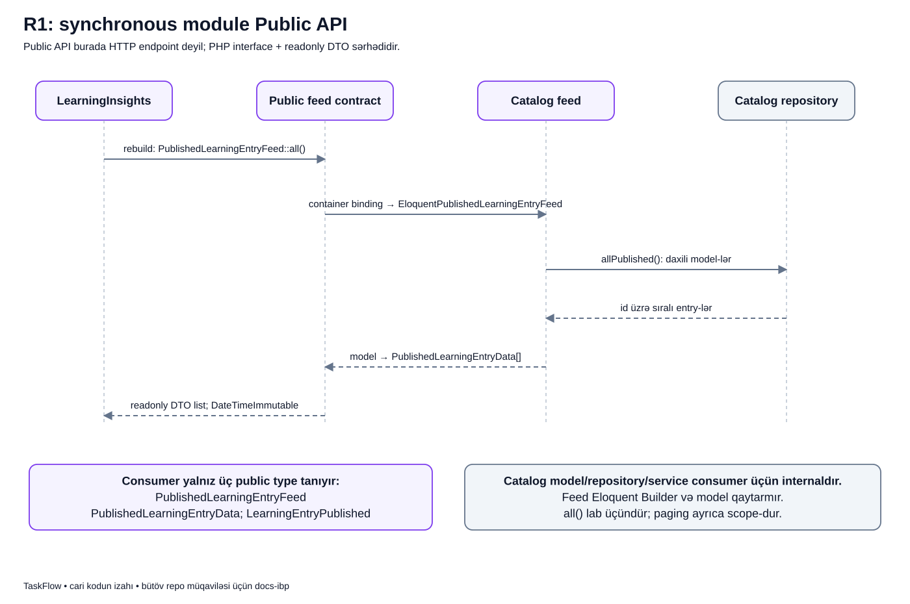
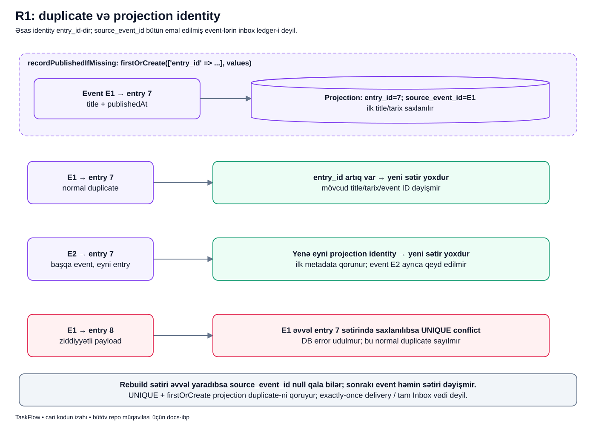

# R1 laboratoriyası — iki modulun əlaqəsi

## Bu hissə nəyi təsvir edir?

**Vəziyyət: kodda implementasiya edilmiş tədris laboratoriyası.** `LearningCatalog` və `LearningInsights` eyni Laravel tətbiqində işləyir, amma beş məhsul modulunun biznes axınlarına qoşulmur. Yeni səhifə, REST endpoint, istifadəçi icazəsi və navigation elementi yoxdur.

Məqsəd iki fərqli əlaqəni kiçik nümunədə görməkdir:

1. nəticə indi lazımdırsa typed PHP contract ilə birbaşa oxuma;
2. fakt artıq baş veribsə local Laravel event ilə consumer-i məlumatlandırma.

Bu laboratoriya bütöv [`ROADMAP.md` R1](../../../ROADMAP.md) işinin tamamlanması deyil. Məhsul modullarının qəbul edilmiş birbaşa asılılıqları saxlanılıb.

## Junior üçün: iki modulun kiçik hekayəsi

Catalog-u öyrənmə başlıqlarının əsas dəftəri kimi düşün. Orada «Module Boundary» adlı qeyd publish edilir. Insights isə həmin qeydin oxu xülasəsini öz dəftərində saxlayır. İkisi bir tətbiqdədir, amma biri digərinin daxili cədvəlinə özbaşına yazmır.

İki fərqli ehtiyac var. Insights «indi bütün qeydləri ver» deyirsə public PHP feed-i birbaşa çağırır və nəticəni gözləyir. Catalog «bir qeyd artıq publish edildi» deyirsə event göndərir; qeydiyyatlı listener həmin faktı alır. Bu ikisi rəqib pattern deyil, fərqli sualların cavabıdır.

Listener synchronous olduğuna görə queue lazım deyil. Amma commit-dən sonrakı xəta və proses dayanması mümkündür. Ona görə burada yalnız projection duplicate qorunması və missing-only rebuild var; dayanıqlı event delivery varmış kimi oxunmamalıdır.

### Şəkilləri tək deyil, bu dərslərlə birlikdə oxu

1. [İki cədvəl, ID-lər və sahibliyi](../../diagrams/labs/lab-data.md).
2. [Public feed ilə soruşub cavab almaq](../../diagrams/labs/public-feed.md).
3. [Publish, event və real commit](../../diagrams/labs/publish.md).
4. [Eyni xəbər təkrar gəldikdə duplicate qorunması](../../diagrams/labs/duplicate.md).
5. [Çatışmayan surəti rebuild ilə tamamlamaq](../../diagrams/labs/rebuild.md).

Hər dərsdə həmin SVG qalır, amma yanında addımlar, kiçik kod, xəta və özünüyoxlama sualları açılır. Aşağıdakı hissələr laboratoriyanın qısa texniki müqaviləsini saxlayır.

## Hansı modul nə edir?

| Modul | Sahib olduğu məlumat | İşi |
|---|---|---|
| LearningCatalog | `r1_learning_entries` | Title-ı yoxlayır, qeyd yaradır, public read feed və public event təqdim edir |
| LearningInsights | `r1_learning_insight_entries` | Event-dən projection yaradır, public feed ilə çatışmayan projection-ları tamamlayır |

Catalog consumer-i import etmir. Insights Catalog-un modelini, repository-sini və publish service-ini import etmir. `entry_id` iki cədvəl arasında məntiqi uyğunluqdur; lab migration-unda foreign key yoxdur.


## Birinci axın — publish və event

```text
PublishLearningEntryData: trim və 1–255 simvol
  → LearningEntryService::publish()
  → Catalog repository INSERT, DB transaction
  → daxili transaction çağırışı qayıdır
  → LearningEntryPublished dispatch cəhdi
  → açıq outer transaction varsa commit gözlənilir
  → RecordPublishedLearningEntry::handle()
  → Insights repository: yalnız yoxdursa INSERT
```

`ShouldDispatchAfterCommit` listener-i queue-ya göndərmir. Listener commit-dən sonra eyni PHP prosesində synchronous işləyir. Outer rollback-də event callback-i icra edilmir.


## İkinci axın — public feed və recovery

```text
RebuildLearningInsightsService::rebuild()
  → PublishedLearningEntryFeed::all()
  → Catalog repository → readonly DTO siyahısı
  → Insights write transaction-u
  → hər entry üçün çatışmayan projection-u əlavə et
  → hamısı alınırsa commit, bir write alınmırsa rollback
```

Rebuild mövcud title/tarixi yeniləmir, artıq sətirləri silmir, yeni event yaratmır. Bu, tam sinxronizasiya deyil; create-only laboratoriyada **çatışmayan sətirlərin tamamlanmasıdır**.



## Xəta olduqda nə qalır?

| Hadisə | Faktiki nəticə |
|---|---|
| Title boşdur və ya 255 simvoldan uzundur | DTO exception atır; INSERT və event başlamır |
| Catalog INSERT-dən sonra transaction daxilində xəta | Catalog write rollback olur; event yaranmır |
| Outer transaction rollback olur | Catalog write və gözləyən event ləğv olunur |
| Listener qeydiyyatda deyil | Catalog publish uğurludur; projection yoxdur |
| Listener commit-dən sonra exception atır | Catalog committed qalır; caller exception alır |
| Rebuild-in ikinci write-ı alınmır | Həmin rebuild-in yeni projection-ları rollback olur; əvvəlki sətirlər qalır |

Listener xətasında publish-i kor-koranə təkrarlamaq ikinci Catalog entry yarada bilər. Doğru recovery çatışmayan projection-u public feed ilə bərpa etməkdir. Avtomatik retry, worker, outbox və inbox yoxdur.

## Duplicate qorunması

Projection-un identity-si `entry_id`-dir. `firstOrCreate` mövcud sətirin metadata-sını dəyişmir. `source_event_id` nullable və unikal olsa da bütün emal olunmuş event-lərin jurnalı deyil. Rebuild ilə yaranmış sətirdə null qala bilər.



## Sərhədlər necə qorunur?

- [R1 architecture testləri](../../../tests/Architecture/R1LearningBoundaryTest.php) exact public type allowlist-i, import alias-ləri, table ownership və route/UI qadağasını yoxlayır.
- [Source helper](../../../tests/Architecture/Support/LearningBoundaryGuard.php) bu laboratoriya üçün məqsədli literal PHP yoxlamasıdır; ixtiyari dinamik PHP-ni tam analiz etdiyini iddia etmir.
- [Real inteqrasiya testləri](../../../Modules/LearningInsights/tests/Integration/R1LearningFlowTest.php) dispatcher, commit/rollback və recovery-ni event fake olmadan yoxlayır.
- [Pest konfiqurasiyası](../../../tests/Pest.php) real commit testlərini `DatabaseMigrations`, Feature testlərini `RefreshDatabase` ilə ayırır.

## Oxuma ardıcıllığı

1. [LearningCatalog](LEARNING_CATALOG.md).
2. [LearningInsights](LEARNING_INSIGHTS.md).
3. [REST API və modul Public API fərqi](../../extended/rest-api-vs-module-public-api.md).
4. [Birbaşa çağırış və event](../../extended/direct-call-vs-event.md).
5. [After-commit](../../extended/after-commit.md), [rebuild və republish](../../extended/rebuild-vs-republish.md).

[Əsas sənəd mərkəzinə qayıt](../../README.md).
